 

# Rituals Datapack/Mod


Introducing Rituals—a datapack that brings mystical totems and ritual magic into your world. Craft totems, display items, and trigger powerful effects through immersive rituals. Designed for builders, modpack creators, and lore lovers alike.  
  
🔮 **Features**  
• Unique totem tiers with visual item displays  
• Automatic ritual activation based on placement  
• Custom textures, animations, and guidebook integration  
• Fully configurable and ready for expansion  
  
Built with care for the Minecraft community—open source, tweakable, and ready to enchant your next adventure.

## Version Information

- **Minecraft Version**: 1.21+ (Pack Format 48)
- **Datapack Version**: 1.0.0
- **Author**: Created with care for the Minecraft community by [strixun](https://www.twitch.tv/strixun)

## Table of Contents

- [Installation](#installation)
- [Getting Started](#getting-started)
- [Ritual System](#ritual-system)
- [Ritual Progression System](#ritual-progression-system)
- [Totem Tiers](#totem-tiers)
- [How to Use Totems](#how-to-use-totems)
- [Ritual Types](#ritual-types)
- [Coming Soon Rituals](docs/COMING_SOON_RITUALS.md) ✨
- [Crafting Recipes](#crafting-recipes)
- [Commands](#commands)
- [Configuration](#configuration)
- [Technical Details](#technical-details)
- [Full Documentation](docs/README.md) 📚

## Installation

<details>
<summary><b>📦 Step-by-Step Installation Guide (Click to Expand)</b></summary>

This guide assumes you have no prior experience with Minecraft datapacks. A datapack is a special folder that adds new features to your Minecraft world.

### 1. Download the Datapack
- If you received this as a ZIP file, you're ready to go
- If you have the folder structure, compress it into a ZIP file first

### 2. Locate Your World Save Folder
- Open Minecraft and note which world you want to add this to
- Close Minecraft (important!)
- Find your Minecraft saves folder:
  - **Windows**: Press `Win + R`, type `%appdata%\.minecraft\saves` and press Enter
  - **Mac**: Press `Cmd + Space`, type `~/Library/Application Support/minecraft/saves` and press Enter
  - **Linux**: Navigate to `~/.minecraft/saves`

### 3. Install the Datapack
- Find the folder with your world's name
- Open the `datapacks` folder inside (create it if it doesn't exist)
- Place the datapack ZIP file (or folder) into this `datapacks` folder

### 4. Enable the Datapack
- Launch Minecraft and open your world
- You should see a message in chat: "[Rituals] Datapack loaded successfully!"
- If you don't see the message, type `/reload` in the chat and press Enter

### 5. Get Started
- Type `/function rituals:give/all` to receive all totem items
- You're now ready to perform rituals!

</details>

## Getting Started

### Quick Start Guide

This datapack adds a new item category called "Totems" which can be crafted and placed in your world. When you place totems with specific items displayed on them, you can activate powerful rituals. Single-totem mode is enabled by default!

**Basic Workflow:**
1. Craft totems (see [Crafting Recipes](#crafting-recipes))
2. Right-click on the ground to place a totem
3. Right-click a placed totem with an item to display it
4. Drop 4 catalyst items around the totem (N/S/E/W)
5. Light fire at the totem base - the ritual activates!

**Note**: Rituals now require a **Fire Sacrifice** to activate! See [Ritual System](#ritual-system) below.

## Ritual System

**NEW!** Rituals now require a fire sacrifice to activate, making them more immersive and balanced.

### How It Works

1. **Place your totem** and add a ritual item (Diamond, Emerald, etc.)
2. **Drop 4 catalyst items** on the ground around your totem (North, South, East, West)
3. **Light a fire** at the totem's base using flint & steel
4. **The offerings are consumed** and your ritual begins!

### Catalyst Costs by Tier

- 🪵 **Wood**: 4× Coal
- 🟠 **Copper**: 4× Copper Ingot  
- ⚙️ **Iron**: 4× Iron Ingot
- 🟡 **Gold**: 4× Gold Ingot
- 💎 **Diamond**: 4× Diamond
- 🟣 **Netherite**: 4× Netherite Ingot

**Why this system?**
- Makes rituals feel more magical and intentional
- Balanced resource cost encourages totem upgrades
- Prevents "set and forget" infinite rituals
- You control when rituals activate

**📖 See [`docs/FIRE_SACRIFICE_GUIDE.md`](docs/FIRE_SACRIFICE_GUIDE.md) for complete instructions!**

<details>
<summary><b>🥝 Want Easy Mode? Enable Kiwi Mode! (Click to Expand)</b></summary>

**Kiwi Mode** is a user-friendly setting that disables fire sacrifice for automatic ritual activation - perfect for new players, teaching servers, or casual play!

**In-Game (Super Easy!):**
Just click the link when you join the world, or run:
```mcfunction
/function rituals:admin/enable_kiwi_mode
```

**Manual Config (Advanced):**
```mcfunction
/data modify storage rituals:config kiwi_mode set value true
/function rituals:config/reload
```

**Kiwi Mode is perfect for:**
- 🆕 New players learning the ritual system
- 🎮 Casual gameplay without resource costs
- 🏫 Teaching servers or tutorial worlds
- 🧪 Testing and experimenting with rituals

</details>

## Totem Tiers

<details>
<summary><b>⚡ View All Totem Tiers (Click to Expand)</b></summary>

There are six tiers of totems, each with increasing effect power. All totems use tier-based ranges, with higher tiers providing stronger effects and larger areas.

### Tier 1 - Wood Totem
- **Material**: Oak Planks + Sticks
- **Range**: 2×2 horizontal, 3 up, 3 down
- **Effect Power**: Basic
- **Visual**: Oak fence post with item display on top

### Tier 2 - Copper Totem
- **Material**: Copper Ingots
- **Range**: 3×3 horizontal, 4 up, 4 down
- **Effect Power**: Improved
- **Visual**: Copper-colored post

### Tier 3 - Iron Totem
- **Material**: Iron Ingots
- **Range**: 4×4 horizontal, 5 up, 5 down
- **Effect Power**: Strong
- **Visual**: Iron bars with particles

### Tier 4 - Gold Totem
- **Material**: Gold Ingots
- **Range**: 5×5 horizontal, 6 up, 6 down
- **Effect Power**: Very Strong
- **Visual**: Golden post with particles

### Tier 5 - Diamond Totem
- **Material**: Diamonds
- **Range**: 6×6 horizontal, 7 up, 7 down
- **Effect Power**: Powerful
- **Visual**: Diamond post with cyan particles

### Tier 6 - Netherite Totem
- **Material**: Netherite Ingots
- **Range**: 7×7 horizontal, 8 up, 8 down
- **Effect Power**: Maximum
- **Visual**: Netherite post with purple particles

### Range Visualization

```
      [item]  ← Item display on top
        |     ← Totem pole (fence post)
    ███████   ← 5×5×6 effect zone
    ███████     (3 blocks up, 3 down)
    ███████
```


*Visual comparison of effect ranges for all totem tiers*

See [`docs/RANGE_DIAGRAM.md`](docs/RANGE_DIAGRAM.md) for detailed range specifications.

</details>

## How to Use Totems

### Placing a Totem

1. Hold a totem item in your hand
2. Look at the ground where you want to place it
3. Right-click on the ground
4. The totem will appear as a vertical pole

### Adding Items to Totems

1. Hold the item you want to display
2. Right-click the totem
3. The item will appear floating above the totem
4. Only one item can be displayed per totem

### Removing Items from Totems

1. Right-click a totem that has an item displayed
2. The item will drop and can be picked up
3. The totem remains in place

### Breaking Totems

1. Punch (left-click or attack) the totem
2. The totem and any displayed item will drop
3. All visual effects will be removed

## Ritual Types

<details>
<summary><b>✨ View All Ritual Types (Click to Expand)</b></summary>

Rituals activate automatically when you have 1 or more totems displaying the same item type within range of each other. Each ritual lasts for 30 seconds and provides unique effects. Higher tier totems provide stronger effects and larger ranges.

### Growth Ritual
- **Required Item**: Emerald
- **Effect**: Accelerates crop and plant growth nearby by 30% chance per check
- **Frequency Scaling**: 
  - Tier 1: Every 15 seconds
  - Tier 2: Every 12 seconds
  - Tier 3: Every 9 seconds
  - Tier 4: Every 6.75 seconds
  - Tier 5: Every 4.5 seconds
  - Tier 6: Every 3 seconds
- **Range**: Tier-based (see Totem Tiers)
- **Visual**: Green happy villager particles

### Strength Ritual
- **Required Item**: Diamond
- **Effect**: Grants Strength and Resistance to nearby players
- **Duration**: 10-30 seconds based on tier
- **Frequency**: Every 2 seconds to 0.75 seconds based on tier
- **Range**: Tier-based (see Totem Tiers)
- **Visual**: Critical hit particles

### Prosperity Ritual
- **Required Item**: Netherite Block
- **Effect**: Attracts nearby items to the totem and grants Luck effect to players
- **Pull Speed**: 0.3 to 1.0 blocks/tick based on tier
- **Luck Effect**: Level 0-2 based on tier (helps with loot drops)
- **Range**: Tier-based (see Totem Tiers)
- **Visual**: Golden dust particles
- **Note**: For XP generation, use the XP Harvester pattern ritual

### Protection Ritual
- **Required Item**: Iron Ingot
- **Effect**: Damages hostile mobs in range periodically
- **Damage**: 2-8 half-hearts per hit based on tier
- **Frequency**: Every 9 seconds to 1.5 seconds based on tier
- **Range**: Tier-based (see Totem Tiers)
- **Visual**: Blue dust particles and magic damage

### Healing Ritual
- **Required Item**: Nether Star
- **Effect**: Applies regeneration to nearby players and animals
- **Duration**: 10-120 seconds based on tier
- **Frequency**: Every 3 seconds to 1.25 seconds based on tier
- **Range**: Tier-based (see Totem Tiers)
- **Visual**: Pink/purple dust particles

### Sentry Ritual
- **Required Item**: Arrow
- **Effect**: Fires homing magical projectiles at hostile mobs
- **Damage**: 1.5-12 half-hearts based on tier
- **Fire Rate**: Every 9 seconds to 1.5 seconds based on tier
- **Projectile Speed**: 0.4-1.2 blocks/tick based on tier
- **Range**: 2× the normal tier range
- **Visual**: Glowing projectile with trail particles

### Ritual Requirements

- **Minimum Totems**: 1 totem by default (configurable to require more)
- **Maximum Distance**: 32 blocks between totems (for multi-Rituals)
- **Single-Totem Mode**: Enabled by default! Each totem works independently
- **Duration**: 30 seconds (600 ticks)
- **Activation Cost**: Requires fire sacrifice (4× catalyst items based on tier)
- **Interruption**: Removing an item from any participating totem stops the ritual

**💡 Tip**: Each ritual activation consumes the catalyst items, so higher-tier totems cost more to run but provide much better effects!

</details>

## Ritual Progression System

### Advancement Tree Overview

Your journey with Rituals follows a structured progression system. You must craft each totem tier to unlock the next tier's recipes and access more powerful rituals.


### Ritual Unlock Progression

Different rituals become available as you progress through totem tiers. Higher tiers don't just provide more power and range—they also unlock new ritual types!


### Implemented vs Planned Rituals


#### ✅ Currently Implemented Rituals

| Ritual | Item | Minimum Tier | Min Totems | Effect |
|--------|------|--------------|------------|--------|
| Growth | Emerald | Wood (Tier 1) | 1+ | Accelerates crop and plant growth with bonemeal effect |
| Protection | Iron Ingot | Wood (Tier 1) | 1+ | Damages hostile mobs periodically |
| Sentry | Arrow | Wood (Tier 1) | 1+ | Fires homing magical projectiles at enemies |
| Strength | Diamond | Iron (Tier 3) | 1+ | Grants Strength and Resistance to players |
| Prosperity | Netherite Block | Gold (Tier 4) | 1+ | Attracts items and grants Luck |
| Healing | Nether Star | Diamond (Tier 5) | 1+ | Applies Regeneration to players and animals |
| **Auto-Farming** | **Diamond Hoe** | **Wood (Tier 1)** | **5** | **Automatically harvests and replants fully grown crops** |
| **Auto-Breeding** | **Wheat** | **Wood (Tier 1)** | **5** | **Automatically breeds animals in range** |
| **XP Harvester** | **Experience Bottle** | **Wood (Tier 1)** | **6** | **Generates 1-6 XP/second based on tier (requires redstone power)** |

#### 🚧 Planned Rituals (Coming Soon)

These rituals are defined in the advancement system but not yet implemented. They come in two types:

**Standard Rituals** - Place ritual item on totem, trigger with fire sacrifice
**Crafting Rituals** - Place special item on central totem with specific totem pattern

---

### Standard Area Effect Rituals

| Ritual | Item | Min Totems | Pattern | Effect |
|--------|------|------------|---------|--------|
| **Flight Zone** | Elytra | 7+ | Tower pattern (vertical stack) | Grant levitation and slow falling to players |
| **Weather Control** | Lightning Rod | 7+ | Storm pattern (hexagon + center) | Control weather (clear/rain/thunder) |
| **Time Warp** | Clock | 9+ | Clock pattern (circle) | Accelerate time itself in area |
| **Mining Haste** | Netherite Pickaxe | 5+ | Underground cross pattern | Grant Haste III to nearby players |
| **Forcefield** | End Crystal | 8+ | Circle pattern (8 totems) | Create impenetrable barrier around area |
| **Mob Repellent** | Zombie Head | 8+ | Barrier pattern (octagon) | Prevent hostile mob spawns in area |

---

### ⚠️ Planned Rituals (Not Yet Implemented)

The following are ideas for future rituals:
- **Flight Zone** (Elytra) - Grant levitation/slow falling
- **Weather Control** (Lightning Rod) - Control weather
- **Time Warp** (Clock) - Accelerate time
- **Mining Haste** (Netherite Pickaxe) - Grant Haste effect
- **Forcefield** (End Crystal) - Create barriers
- **Mob Repellent** (Zombie Head) - Prevent mob spawns

**🎯 NEW: Visual Pattern Guides!** Power your central totem with redstone (place redstone block/torch/lever next to it) to see colored particle markers showing exactly where each surrounding totem should be placed and what item it needs!

**📖 See [`docs/PATTERN_RITUALS_GUIDE.md`](docs/PATTERN_RITUALS_GUIDE.md) for complete pattern ritual guide!**  
**📐 See [`docs/MULTI_TOTEM_PATTERNS.md`](docs/MULTI_TOTEM_PATTERNS.md) for detailed ASCII diagrams!**

### Recipe Unlock Flow

```mermaid
stateDiagram-v2
    [*] --> GatherMaterials: Game Start
    GatherMaterials --> WoodTier: Craft Wood Totem
    WoodTier --> CopperTier: Unlock Copper Recipe
    CopperTier --> IronTier: Unlock Iron Recipe
    IronTier --> GoldTier: Unlock Gold Recipe
    GoldTier --> DiamondTier: Unlock Diamond Recipe
    DiamondTier --> NetheriteTier: Unlock Netherite Recipe
    NetheriteTier --> [*]: Master Ritualist
    
    note right of WoodTier
        Basic rituals unlocked
        2×2 range
    end note
    
    note right of IronTier
        Strength ritual unlocked
        4×4 range
    end note
    
    note right of DiamondTier
        Healing ritual unlocked
        6×6 range
    end note
```



**Key Points:**
- You cannot skip tiers - each totem tier must be crafted in sequence
- Basic rituals (Growth, Protection, Sentry) are available from the start with any totem tier
- Advanced rituals require higher tier totems to unlock
- Higher tier totems provide the same rituals but with better stats (range, power, frequency)

## Crafting Recipes

All totems come in two variants: **Tall** (2 blocks high) and **Short** (1 block high, walkable). Short variants use the same recipe but **without the top ingredient**.

<details>
<summary><b>🪵 Wood Totem Recipes</b></summary>

### Wood Totem (Tall)


### Wood Totem (Short)


</details>

<details>
<summary><b>🟠 Copper Totem Recipes</b></summary>

### Copper Totem (Tall)


### Copper Totem (Short)


</details>

<details>
<summary><b>⚙️ Iron Totem Recipes</b></summary>

### Iron Totem (Tall)


### Iron Totem (Short)


</details>

<details>
<summary><b>🟡 Gold Totem Recipes</b></summary>

### Gold Totem (Tall)


### Gold Totem (Short)


</details>

<details>
<summary><b>💎 Diamond Totem Recipes</b></summary>

### Diamond Totem (Tall)


### Diamond Totem (Short)


</details>

<details>
<summary><b>🟣 Netherite Totem Recipes</b></summary>

### Netherite Totem (Tall)


### Netherite Totem (Short)


</details>

**Tip**: Higher tier totems provide larger ranges and more powerful effects!

## Commands

<details>
<summary><b>⌨️ Available Commands (Click to Expand)</b></summary>

### Give Commands

These commands give you totem items. They can only be used by players with operator permissions (or in creative mode).

- `/function rituals:give/all` - Gives you one of each totem tier
- `/function rituals:give/totem_basic` - Gives you a Wood Totem (tall)
- `/function rituals:give/totem_basic_short` - Gives you a Wood Totem (short)
- `/function rituals:give/totem_copper` - Gives you a Copper Totem (tall)
- `/function rituals:give/totem_copper_short` - Gives you a Copper Totem (short)
- `/function rituals:give/totem_gold` - Gives you a Gold Totem (tall)
- `/function rituals:give/totem_gold_short` - Gives you a Gold Totem (short)
- `/function rituals:give/totem_advanced` - Gives you a Diamond Totem (tall)
- `/function rituals:give/totem_advanced_short` - Gives you a Diamond Totem (short)
- `/function rituals:give/totem_master` - Gives you a Netherite Totem (tall)
- `/function rituals:give/totem_master_short` - Gives you a Netherite Totem (short)
- `/function rituals:give/guidebook` - Gives you the Rituals Guidebook

### System Commands

- `/reload` - Reloads all datapacks (use if the datapack isn't working)
- `/function rituals:help` - Shows the in-game help menu
- `/function rituals:config/reload` - Reloads configuration changes

</details>

## Technical Details

<details>
<summary><b>🛠️ For Server Administrators (Click to Expand)</b></summary>

### Performance Considerations
- The datapack uses interaction entities for totem placement (Minecraft 1.19.4+)
- Rituals check for activation every 20 ticks (once per second)
- Effects apply at intervals (20-40 ticks) to maintain performance
- Each totem uses 3-4 entities: 1 interaction, 1-2 block displays, 1 item display
- Item displays have smooth animations (rotation + bobbing) with 10-tick interpolation

### Compatibility
- Should work with most other datapacks
- Uses custom scoreboard objectives (all prefixed with "rituals.")
- Uses storage namespace "rituals:config" and "rituals:temp"
- Custom tags are all in the "rituals" namespace

</details>

<details>
<summary><b>💻 For Datapack Developers (Click to Expand)</b></summary>

### Architecture
- **Main Loop**: `rituals:tick` runs from `minecraft:tick`
- **Initialization**: `rituals:load` runs from `minecraft:load`
- **Entity System**: Uses interaction entities for hitbox/data, display entities for visuals
- **ID System**: Each totem gets a unique ID for linking its entities

### Scoreboards
- `rituals.data` - Constants and global data
- `rituals.timer` - Tick counters for cooldowns/durations
- `rituals.distance` - Totem range values
- `rituals.tier` - Totem tier (1-6)
- `rituals.effect` - Active ritual effect type
- `rituals.temp` - Temporary calculations
- `rituals.id` - Entity linking system

### Entity Tags
- `rituals.totem` - Main totem interaction entities
- `rituals.short_totem` - Short variant totems (1 block tall)
- `rituals.totem_visual` - Block display entities for totem visuals
- `rituals.totem_display` - Item display entities for held items
- `rituals.totem_barrier` - Barrier block displays for collision
- `rituals.has_item` - Totems with items displayed
- `rituals.active_ritual` - Totems participating in a ritual
- `rituals.[ritual_type]_ritual` - Specific ritual type tags

### File Structure
```
data/
├── rituals/
│   ├── advancement/      # Achievement system
│   ├── function/
│   │   ├── load.mcfunction
│   │   ├── tick.mcfunction
│   │   ├── give/        # Item give commands
│   │   ├── totem/       # Totem placement/interaction
│   │   ├── ritual/      # Ritual effects
│   │   ├── config/      # Configuration system
│   │   └── admin/       # Admin utilities
│   ├── recipe/          # Crafting recipes
│   ├── predicate/       # Random chance predicates
│   ├── item_modifier/   # Item modification
│   └── tags/            # Custom tags
├── minecraft/
│   └── tags/
│       └── function/
└── pack.mcmeta
```

See [`docs/SYSTEM_OVERVIEW.md`](docs/SYSTEM_OVERVIEW.md) for detailed technical documentation.

</details>

## Configuration

<details>
<summary><b>⚙️ Configuration Options (Click to Expand)</b></summary>

You can customize various datapack settings using the config storage system.

### Viewing Current Config
```
/data get storage rituals:config
```

### Modifying Settings
```
/data modify storage rituals:config <key> set value <value>
/function rituals:config/reload
```

### Available Settings
- `min_totems_required` - Minimum number of totems needed for a ritual (default: 1)
- `max_totem_distance` - Maximum distance between totems in blocks (default: 32)
- `ritual_duration` - How long rituals last in ticks (default: 600 = 30 seconds)

See [`docs/CONFIG_GUIDE.md`](docs/CONFIG_GUIDE.md) for complete configuration documentation.

</details>

## Redstone Range Display

<details>
<summary><b>🔴 Redstone Range Visualization (Click to Expand)</b></summary>

You can visualize a totem's effect range by powering it with redstone!

### How to use:
1. Place a **lever**, **redstone torch**, **redstone block**, or powered **redstone wire** next to or below your totem
2. Red particles will show the exact ritual range (varies by tier)
3. Turn off the redstone to hide the display

### Supported redstone sources:
- Redstone torch (always on)
- Redstone block (always on)
- Lever (toggle on/off)
- Button (temporary)
- Powered redstone wire

See `RANGE_DIAGRAM.md` for detailed range specifications!

</details>

## Troubleshooting

<details>
<summary><b>🔧 Common Issues & Solutions (Click to Expand)</b></summary>

### Totems won't place:
- Make sure you're **right-clicking** with the totem item
- Ensure there's empty space (air block) where you're trying to place the totem
- Check that you have the actual totem item (should have custom name and colored text)

### Items won't display on totems:
- Make sure you're right-clicking the totem, not the ground near it
- The totem can only hold one item at a time
- Try removing the current item first (right-click empty-handed)

### Rituals won't activate:
- By default, only 1 totem is needed (check config if changed)
- Totems work individually by default (configurable to require multiple)
- Items must be placed ON the totems (floating above them)
- Wait 1 second after placing the last item (system checks every 20 ticks)

### Datapack not working:
- Type `/reload` in chat
- Check that the datapack is in the correct folder (world/datapacks/)
- Ensure the folder structure is correct (pack.mcmeta should be at the root)
- Make sure you're using Minecraft 1.21 or later

### Resource Pack Issues:
- The resource pack is **optional** but provides custom textures
- Place it in your `resourcepacks` folder and enable it in-game
- If textures don't appear, make sure the pack is above other resource packs in the list

</details>

## Related Documentation

- 🔥 **[`docs/FIRE_SACRIFICE_GUIDE.md`](docs/FIRE_SACRIFICE_GUIDE.md)** - Complete fire sacrifice tutorial
- 📐 **[`docs/RANGE_DIAGRAM.md`](docs/RANGE_DIAGRAM.md)** - Detailed range specifications
- 🔧 **[`docs/CONFIG_GUIDE.md`](docs/CONFIG_GUIDE.md)** - All configuration options
- 📦 **[`docs/INSTALLATION.md`](docs/INSTALLATION.md)** - Detailed installation guide
- 🛠️ **[`docs/SYSTEM_OVERVIEW.md`](docs/SYSTEM_OVERVIEW.md)** - Technical architecture
- 📝 **[`docs/CRAFTING_RECIPES.md`](docs/CRAFTING_RECIPES.md)** - All crafting recipes
- 📖 **[`docs/README.md`](docs/README.md)** - Documentation index

## Future Enhancements

Planned features for future versions:
- Ritual upgrade system to extend range
- More ritual types and effects
- Ritual combinations for unique effects
- Multi-totem ritual networks
- Integration with advancement system
- Multi-item rituals requiring different items
- Ritual altars and structures

## Credits

Created with expertise in Minecraft datapack development and a passion for magical gameplay mechanics.

## License

This datapack is provided as-is for use in Minecraft worlds. Feel free to modify it for personal use or server use, but please provide credit if you redistribute or share modifications.

---

## 🔗 Quick Navigation

### Documentation Hub
- **[📚 Full Documentation](docs/README.md)** - Complete documentation index with all guides

### Essential Guides
- **[📦 Installation](docs/INSTALLATION.md)** - Setup instructions for datapack and resourcepack
- **[🔥 Fire Sacrifice System](docs/FIRE_SACRIFICE_GUIDE.md)** - How to activate rituals
- **[⚙️ Configuration](docs/CONFIG_GUIDE.md)** - Customize ranges, costs, and more
- **[🎨 Crafting Recipes](docs/CRAFTING_RECIPES.md)** - All totem crafting recipes with images

### Advanced Topics
- **[🔮 Pattern Rituals](docs/PATTERN_RITUALS_GUIDE.md)** - Multi-totem pattern system
- **[✨ Coming Soon](docs/COMING_SOON_RITUALS.md)** - Future features and planned rituals
- **[🛠️ System Overview](docs/SYSTEM_OVERVIEW.md)** - Technical architecture details
- **[📖 In-Game Guidebook](docs/GUIDEBOOK_CONTENT.md)** - Complete guidebook reference

### Resources
- **[🎨 Resource Pack](resourcepack/README.md)** - Custom textures and models
- **[📝 Changelog](docs/CHANGELOG.md)** - Version history and updates
- **[🏗️ Build Guide](docs/BUILD_GUIDE.md)** - Compile the Fabric mod version
- **[🌱 Growth Ritual Guide](docs/GROWTH_RITUAL_GUIDE.md)** - How to add new crops/plants

---

**Enjoy your mystical journey with Rituals!** 🔮

For issues, questions, or suggestions, please contact the datapack maintainer.
