# Ritual Badge System Guide (Team-Free Edition!)

## Overview

The Ritual Badge System is a **conflict-free** progression tracker that displays a player's ritual mastery. The badge shows:
- **Highest Totem Tier** acquired (Wood → Netherite)
- **Number of Unique Rituals** completed (0-8)

**✅ NO TEAM CONFLICTS!** This system uses scoreboards, not teams, so it plays nice with:
- PvP team systems
- Faction plugins
- Other prefix/suffix systems
- Any other team-based features

## Display Modes

Choose how badges appear to players:

### 1. **Manual Mode** (Default)
- Players check badge via command: `/function rituals:badges/check_status`
- No automatic display
- Best for: Servers with lots of other UI elements

### 2. **Tab Mode** ⭐ RECOMMENDED
- Shows ritual count (0-8) next to player name in tab list
- Format: `PlayerName    ⚡ Rituals: 8`
- Clear, intuitive, always visible
- Best for: Most servers - easy to understand!

### 3. **Action Bar Mode** ⭐ RECOMMENDED
- Displays full badge above hotbar every 5 seconds
- Format: `⚡ Rituals: 8/8 | Netherite`
- Most detailed and readable
- Best for: Immersive, in-game display with full context

### 4. **Sidebar Mode**
- Shows badge on right side of screen
- ⚠️ May conflict with other sidebar scoreboards
- Best for: Dedicated ritual servers

### 5. **Both Mode**
- Tab + Action bar combined
- Maximum visibility with clear info
- Best for: Showcasing progression

## How Badge Values Work

Badge displays are clear and intuitive:

- **Tab/Sidebar**: Shows ritual count (0-8)
  - Example: `8` = 8 rituals completed
  - Example: `3` = 3 rituals completed
  - Header shows "⚡ Rituals" so players know what the number means

- **Action Bar**: Full text format with tier and count
  - Example: `⚡ Rituals: 8/8 | Netherite`
  - Example: `⚡ Rituals: 3/8 | Iron`

## Badge Progression System

```mermaid
stateDiagram-v2
    direction LR
    
    [*] --> NoTotem: Start Game
    
    state "No Badge" as NoTotem {
        [*] --> Tier0
        Tier0: Tier 0 | 0 Rituals
        note right of Tier0
            Craft your first
            totem to begin!
        end note
    }
    
    state "Wood Badge" as WoodTier {
        Wood0: Tier 1 | 0 Rituals
        Wood1: Tier 1 | 1 Ritual
        Wood2: Tier 1 | 2 Rituals
        Wood8: Tier 1 | 8 Rituals
        
        Wood0 --> Wood1: Activate Ritual
        Wood1 --> Wood2: Activate Ritual
        Wood2 --> Wood3: Activate Ritual
        Wood3 --> Wood4: Activate Ritual
        Wood4 --> Wood5: Activate Ritual
        Wood5 --> Wood6: Activate Ritual
        Wood6 --> Wood7: Activate Ritual
        Wood7 --> Wood8: Activate Ritual
    }
    
    state "Copper Badge" as CopperTier {
        Copper0: Tier 2 | 0+ Rituals
        CopperX: Tier 2 | X Rituals
        Copper0 --> CopperX: Complete Rituals
    }
    
    state "Iron Badge" as IronTier {
        Iron0: Tier 3 | 0+ Rituals
        IronX: Tier 3 | X Rituals
        Iron0 --> IronX: Complete Rituals
    }
    
    state "Gold Badge" as GoldTier {
        Gold0: Tier 4 | 0+ Rituals
        GoldX: Tier 4 | X Rituals
        Gold0 --> GoldX: Complete Rituals
    }
    
    state "Diamond Badge" as DiamondTier {
        Diamond0: Tier 5 | 0+ Rituals
        DiamondX: Tier 5 | X Rituals
        Diamond0 --> DiamondX: Complete Rituals
    }
    
    state "Master Badge" as NetheriteTier {
        Neth0: Tier 6 | 0+ Rituals
        NethX: Tier 6 | X Rituals
        Neth8: MASTER RITUALIST
        
        Neth0 --> NethX: Complete Rituals
        NethX --> Neth8: Complete All 8!
        
        note right of Neth8
            🎉 Maximum Achievement!
            All totems + All rituals
        end note
    }
    
    NoTotem --> WoodTier: Craft Wood Totem
    WoodTier --> CopperTier: Craft Copper Totem
    CopperTier --> IronTier: Craft Iron Totem
    IronTier --> GoldTier: Craft Gold Totem
    GoldTier --> DiamondTier: Craft Diamond Totem
    DiamondTier --> NetheriteTier: Craft Netherite Totem
```



### Progression Paths

**Two dimensions of progress:**
1. **Vertical (Tiers)**: Craft higher-tier totems → Wood → Copper → Iron → Gold → Diamond → Netherite
2. **Horizontal (Rituals)**: Activate unique ritual types → 0/8 → 1/8 → 2/8 → 3/8 → 4/8 → 5/8 → 6/8 → 7/8 → 8/8

**Your badge reflects BOTH!**

## Totem Tiers

| Tier | Material | How to Unlock |
|------|----------|---------------|
| 0 | None | Start of game |
| 1 | Wood | Craft wood totem |
| 2 | Copper | Craft copper totem |
| 3 | Iron | Craft iron totem |
| 4 | Gold | Craft gold totem |
| 5 | Diamond | Craft diamond totem |
| 6 | Netherite | Craft netherite totem (Master Ritualist!) |

## Ritual Completion Tracking


The system tracks these 8 unique ritual types:

### Standard Rituals (6)
1. **Growth** 🌱 - Emerald (bonemeal crops)
2. **Strength** 💪 - Diamond (combat buffs)
3. **Prosperity** 💰 - Netherite Block (item attraction)
4. **Protection** ⚔️ - Iron Ingot (damages hostiles)
5. **Healing** 💖 - Nether Star (regeneration)
6. **Sentry** 🏹 - Arrow (projectile defense)

### Pattern Rituals (2)
7. **Auto-Farming** 🚜 - Diamond Hoe + Square pattern (4 totems)
8. **Auto-Breeding** 🐄 - Wheat + Star pattern (4 totems)

A ritual counts as "completed" when you successfully activate it for the first time. All players within 32 blocks of the activation receive credit.

## Badge Updates

```mermaid
sequenceDiagram
    participant P as Player
    participant S as System
    participant D as Display
    
    Note over P,D: Badge Update Triggers
    
    P->>S: Craft Higher Tier Totem
    activate S
    S->>S: Check Advancement
    S->>S: Update badge_tier
    S->>D: Update Display
    deactivate S
    D-->>P: Badge Updated! ⚡
    
    P->>S: Activate Ritual (First Time)
    activate S
    S->>S: Mark ritual_done
    S->>S: Increment ritual_count
    S->>D: Update Display
    deactivate S
    D-->>P: Badge Updated! ⚡
    
    P->>S: Join/Rejoin Server
    activate S
    S->>S: Detect join
    S->>S: Recalculate badge
    S->>D: Update Display
    deactivate S
    D-->>P: Welcome Back! ⚡
    
    Note over P,D: All updates are automatic!
```



Badges automatically update when:
- ✅ You craft a higher-tier totem
- ✅ You activate a ritual for the first time
- ✅ You join/rejoin the server
- ✅ An admin runs `/function rituals:admin/refresh_all_badges`

## Player Commands

### View Badge Status
```mcfunction
/function rituals:badges/check_status
```
View your current badge status, tier, and which rituals you've completed. Includes clickable show/hide buttons.

### Hide Badge
```mcfunction
/function rituals:badges/hide_badge
```
Hide your badge from all displays (progress is saved, you can show it again anytime).

### Show Badge
```mcfunction
/function rituals:badges/show_badge
```
Show your badge again after hiding it.

## Admin Commands

### Change Display Mode
```mcfunction
/function rituals:admin/badges/set_mode_manual
/function rituals:admin/badges/set_mode_tab_simple     # RECOMMENDED - Clear ritual count in tab
/function rituals:admin/badges/set_mode_actionbar      # RECOMMENDED - Full text in action bar
/function rituals:admin/badges/set_mode_sidebar
/function rituals:admin/badges/set_mode_both
```
Switch between display modes. Players are notified when the mode changes.

**Recommended Modes:**
- **Tab mode**: Clear, always-visible count in tab list
- **Action Bar mode**: Full text with tier name and count
- Both are intuitive and require no explanation!

### Refresh All Badges
```mcfunction
/function rituals:admin/refresh_all_badges
```
Recalculates and updates all online players' badges.

## Technical Details

### Scoreboards Used
- `rituals.badge_tier` - Stores player's current tier (0-6)
- `rituals.ritual_count` - Stores number of completed ritual types (0-8)
- `rituals.badge_display` - Calculated display value (tier*10 + count)
- `rituals.join_detect` - Detects player joins/rejoins
- `rituals.action_bar_timer` - Timer for action bar updates
- `rituals.{ritual}_done` - Tracks individual ritual completions

### Display Values
- **Tab/Sidebar**: Simple ritual count (0-8)
- **Action Bar**: Uses macro system to display formatted text with tier name

### Configuration Storage
Badge config is stored in `rituals:config` under `badge_config`:
```json
{
  "display_mode": "manual",
  "show_in_tab": true,
  "action_bar_frequency": 100,
  "show_tier_only": false
}
```

### Advancement Integration
The system reads advancement progress to determine totem tier:
- `rituals:guide/craft_totem` → Tier 1 (Wood)
- `rituals:guide/craft_copper_totem` → Tier 2 (Copper)
- `rituals:guide/craft_iron_totem` → Tier 3 (Iron)
- `rituals:guide/craft_gold_totem` → Tier 4 (Gold)
- `rituals:guide/craft_diamond_totem` → Tier 5 (Diamond)
- `rituals:guide/master_ritualist` → Tier 6 (Netherite)

## Multiplayer Features

- **Shared Credit**: All players within 32 blocks of a ritual activation receive completion credit
- **Cooperative Progress**: Encourages teamwork in ritual setup
- **Individual Display Control**: Each player can hide/show their own badge
- **Server-Wide Display Modes**: Admins control how badges appear for everyone
- **Server Persistence**: Progress is tied to player UUID and persists across sessions

## Troubleshooting

### Badge not showing?
1. Make sure you haven't hidden it with `/function rituals:badges/hide_badge`
2. Run `/function rituals:badges/show_badge` to re-enable it
3. Check display mode with `/function rituals:help` (admin commands section)
4. Run `/function rituals:badges/check_status` to verify your stats
5. Try rejoining the server
6. Ask an admin to run `/function rituals:admin/refresh_all_badges`

### Wrong tier displayed?
Check your advancement progress with `L` key. The badge reflects the **highest tier you've crafted**, not what you're currently holding.

### Ritual not counting?
You must successfully **activate** a ritual (complete fire sacrifice or auto-activation in Kiwi mode). Simply placing items on totems doesn't count.

### Display conflicts with other scoreboards?
- **Sidebar mode**: May conflict with other sidebar displays. Use Tab or ActionBar mode instead.
- **Tab list mode**: Generally safe, shows as a number next to names.
- **Action bar mode**: May conflict with other action bar displays. Adjust `action_bar_frequency` to reduce overlap.

## Why No Teams?

The previous version used Minecraft's team system, which caused conflicts with:
- PvP/faction systems
- Other prefix/suffix plugins
- Team-based game modes
- Bedwars/Skyblock team systems

This **team-free version** uses scoreboards instead, which:
- ✅ Never conflicts with other systems
- ✅ Multiple scoreboards can coexist
- ✅ More flexible display options
- ✅ Better performance

## Integration with Existing Systems

The badge system is fully integrated with:
- ✅ **Advancement System** - Tier detection
- ✅ **Fire Sacrifice System** - Ritual completion tracking
- ✅ **Pattern Rituals** - Multi-totem ritual tracking
- ✅ **Kiwi Mode** - Works in both fire sacrifice and auto modes
- ✅ **Player Tags** - Uses `rituals.badge_hidden` tag for hide/show

### Does NOT Interfere With
- ✅ Team systems (we don't use teams!)
- ✅ Other scoreboard systems (ours is namespaced)
- ✅ Prefix/suffix plugins
- ✅ PvP mechanics
- ✅ Other datapacks

---

## Configuration Examples

### For PvP Servers
Use **Manual** or **Tab** mode to avoid action bar clutter during combat:
```mcfunction
/function rituals:admin/badges/set_mode_tab
```

### For Roleplay Servers
Use **Action Bar** mode for immersive, in-world display:
```mcfunction
/function rituals:admin/badges/set_mode_actionbar
```

### For Competition/Events
Use **Both** mode for maximum visibility:
```mcfunction
/function rituals:admin/badges/set_mode_both
```

### For Minimal UI
Use **Manual** mode (default), let players check when they want:
```mcfunction
/function rituals:admin/badges/set_mode_manual
```

---

## Hidden Advancements System

The badge system includes **76 hidden advancements** that unlock automatically as you progress! These are completely secret until you unlock them.

### Unique Type Progression (8 advancements)
These track how many **different ritual types** you've completed:

- **First Steps** - Complete your first ritual type
- **Halfway There** - Complete 4 different ritual types
- **Ritual Savant** - Complete 6 different ritual types
- **Ritual Expert** - Complete all 8 ritual types
- **Starting Strong** - Complete all 8 types with only Wood/Copper totems (tier 1-2)
- **Ultimate Ritualist** - Complete all 8 types with Netherite totems (tier 6)
- **Speed Runner** - Complete 3 different types before reaching Iron tier
- **Pattern Master** - Complete both pattern rituals (Auto-Farming + Auto-Breeding)

### Specific Ritual Completion (8 advancements)
Unlock these by completing each ritual type at least once:

- **Growth Master** - Complete the Growth Ritual
- **Strength Master** - Complete the Strength Ritual
- **Prosperity Master** - Complete the Prosperity Ritual
- **Protection Master** - Complete the Protection Ritual
- **Healing Master** - Complete the Healing Ritual
- **Sentry Master** - Complete the Sentry Ritual
- **Farming Master** - Complete the Auto-Farming Ritual
- **Breeding Master** - Complete the Auto-Breeding Ritual

### Total Activations (4 advancements)
Based on your **total ritual activations** across all types:

- **Novice Ritualist** - 10 total activations
- **Adept Ritualist** - 25 total activations
- **Expert Ritualist** - 50 total activations
- **Legendary Ritualist** - 100 total activations

### Per-Ritual Type Mastery (56 advancements)
Each of the 8 ritual types has 7 milestones based on **how many times you've performed that specific ritual**:

**Milestone Tiers:**
- **Apprentice** - 25 activations
- **Adept** - 50 activations
- **Expert** - 75 activations
- **Virtuoso** - 100 activations (Goal frame)
- **Legend** - 200 activations (Challenge frame)
- **Grandmaster** - 500 activations (Challenge frame, announced in chat)
- **Transcendent** - 1000 activations (Challenge frame, announced in chat)

**Available for:**
- Growth Ritual (25, 50, 75, 100, 200, 500, 1000)
- Strength Ritual (25, 50, 75, 100, 200, 500, 1000)
- Prosperity Ritual (25, 50, 75, 100, 200, 500, 1000)
- Protection Ritual (25, 50, 75, 100, 200, 500, 1000)
- Healing Ritual (25, 50, 75, 100, 200, 500, 1000)
- Sentry Ritual (25, 50, 75, 100, 200, 500, 1000)
- Auto-Farming Ritual (25, 50, 75, 100, 200, 500, 1000)
- Auto-Breeding Ritual (25, 50, 75, 100, 200, 500, 1000)

### Tracking Your Progress

All advancement progress is tracked automatically via scoreboards:
- `rituals.ritual_count` - Tracks unique ritual types completed
- `rituals.total_activations` - Tracks total ritual activations
- `rituals.growth_count`, `rituals.strength_count`, `rituals.healing_count`, `rituals.prosperity_count`, `rituals.damage_count`, `rituals.turret_count`, `rituals.harvest_count`, `rituals.breeding_count` - Tracks per-ritual activations
- `rituals.badge_tier` - Tracks your highest totem tier

Check your progress anytime with:
```mcfunction
/function rituals:badges/check_status
```

---

**Note**: This system requires Minecraft Java Edition 1.20.5+ with support for custom data components and display entities.

---

## Migration from Team-Based Version

If you were using the old team-based badge system:

1. **No action needed!** The new system automatically replaces the old one
2. Player progress is **preserved** (all ritual completions and tier data)
3. Teams are **no longer used** - players will be removed from badge teams
4. Choose a new display mode with the admin commands above
5. Default mode is **Manual** (check command only)

The migration is seamless - just `/reload` and you're good to go! ⚡
