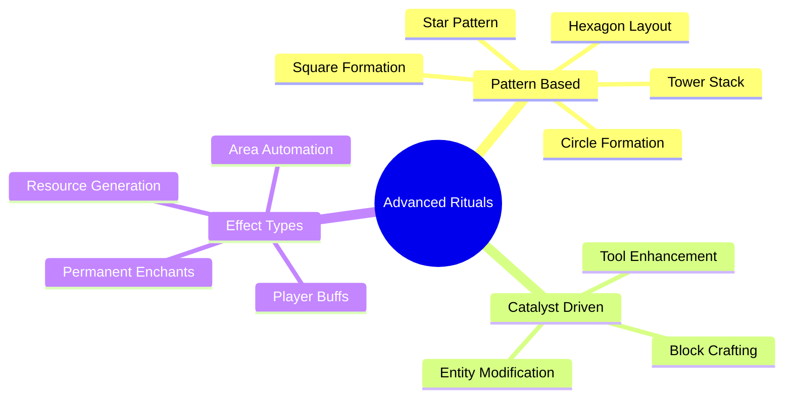
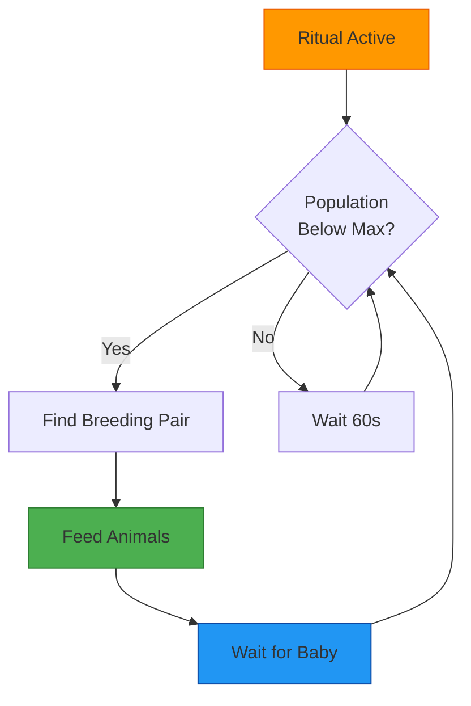
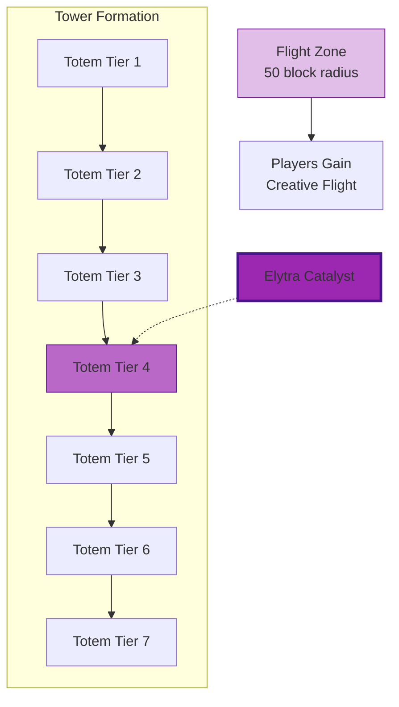
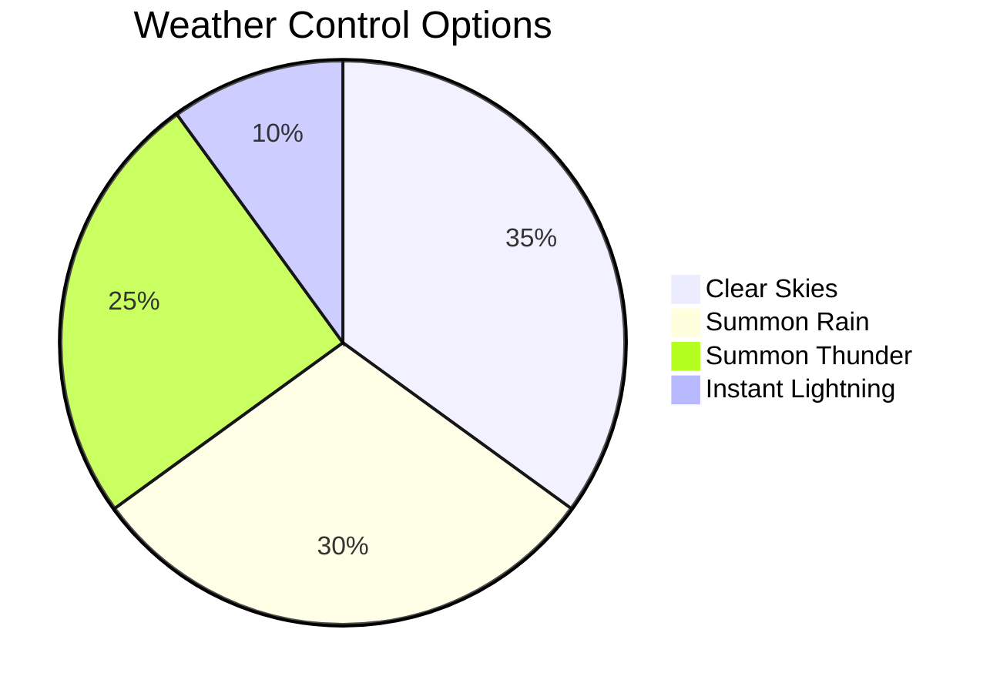
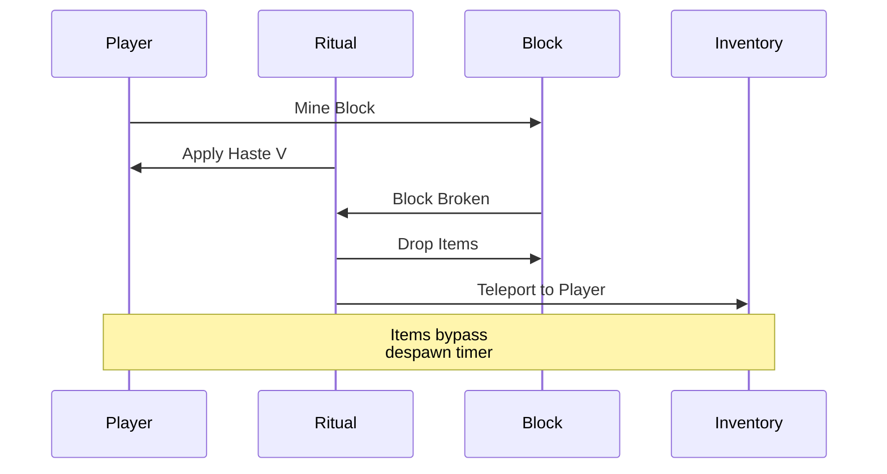
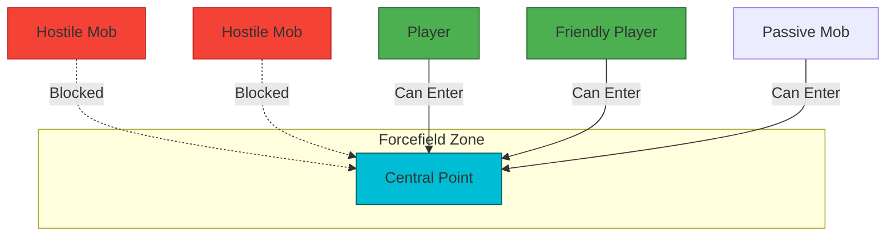
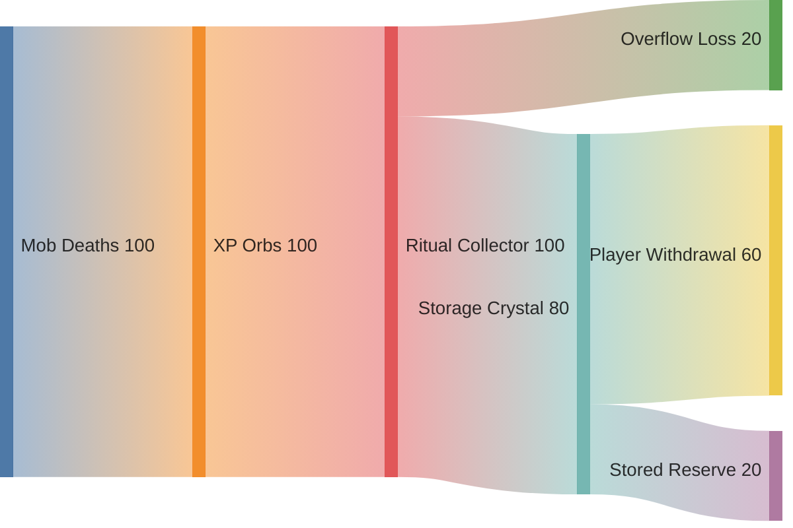
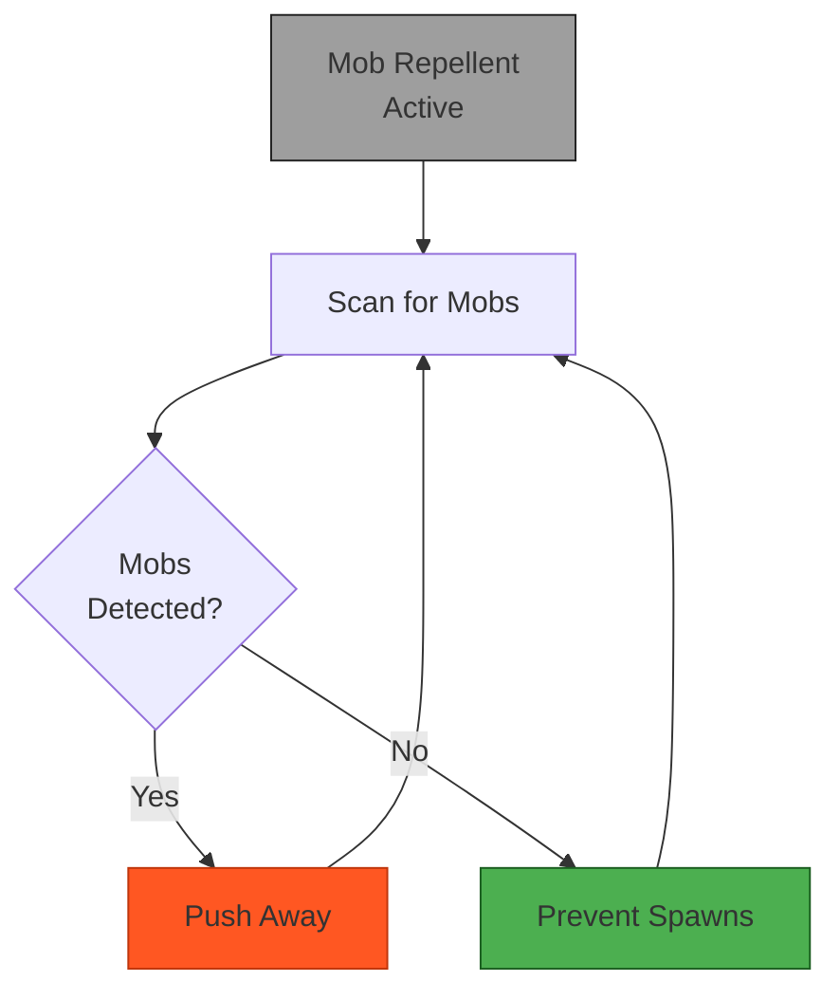
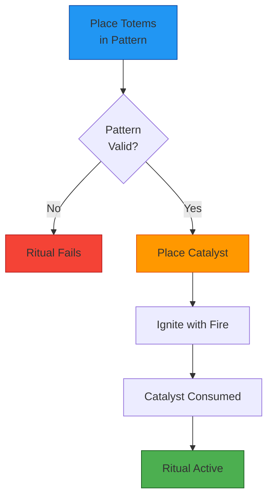

# Coming Soon: Advanced Multi-Totem Rituals

This document outlines the planned advanced ritual system that will be added in future updates. These rituals will require specific multi-totem patterns and specialized catalysts to create powerful custom enchantment and crafting effects.

---

## Overview

Advanced rituals represent the pinnacle of totem magic, requiring careful planning and significant resource investment. Unlike standard single-totem rituals, these require specific geometric patterns and act more like custom enchantments or crafting stations.

> **✅ Already Implemented**: Auto-Farming (Diamond Hoe, 4+ totems, fire sacrifice)  
> See main README for usage instructions!

---

## Ritual Categories

### 🔧 Automation Rituals
These rituals create persistent automation zones that perform tasks continuously.

### ⚡ Enhancement Rituals  
These rituals permanently modify items placed within them, acting as custom enchanting stations.

### 🛡️ Zone Control Rituals
These rituals create special zones with unique properties and protections.

### 🌟 Resource Generation Rituals
These rituals generate resources over time within their influence.

---

## Planned Rituals

> **⚠️ Note**: Auto-Farming with Diamond Hoe is ALREADY IMPLEMENTED! Use 4+ totems with Diamond Hoe and fire sacrifice. See main README for details.

The following rituals are planned for future updates:

### 🐄 Auto-Breeding Ritual
**Pattern**: 5+ totems in star pattern  
**Catalyst**: Wheat (or appropriate breeding item)  
**Effect**: Automatically breeds nearby animals when population is low

**Mechanics**:
- Monitors animal population within zone
- Maintains population at configurable level (default: 12 animals)
- Consumes breeding items from nearby chests
- Works with: Cows, Sheep, Pigs, Chickens, Horses, Llamas
- Higher tiers support more animals and faster breeding

---

### 🕊️ Flight Zone Ritual
**Pattern**: 7+ totems in tower pattern (vertical stack)  
**Catalyst**: Elytra  
**Effect**: Grants creative-like flight within zone boundaries

**Mechanics**:
- Creates a spherical zone of creative flight
- Players can fly as if in creative mode
- Zone size based on totem tiers
- Elytra is consumed to activate (lasts 24 in-game hours)
- Requires at least Diamond-tier totems

---

### ⛈️ Weather Control Ritual
**Pattern**: 7+ totems in storm pattern (circle with center)  
**Catalyst**: Lightning Rod  
**Effect**: Controls weather within local area

**Mechanics**:
- Right-click center totem to cycle weather modes
- Clear: Prevents rain in area
- Rain: Forces rain in area
- Thunder: Summons thunder storms
- Lightning: Strikes nearest hostile mob periodically
- Affects only ritual zone, not entire world

---

### ⏰ Time Warp Ritual
**Pattern**: 9+ totems in clock pattern (circle of 8 + center)  
**Catalyst**: Clock  
**Effect**: Accelerates time for entities/blocks in zone

```mermaid
gantt
    title Time Acceleration Effect
    dateFormat X
    axisFormat %S
    
    section Normal Time
    1 Second :0, 20
    
    section With Time Warp (Tier 6)
    1 Second Becomes 5 Seconds :0, 20
```

**Mechanics**:
- Accelerates crop growth (equivalent to multiple bonemeal per tick)
- Speeds up furnace smelting
- Accelerates baby animal growth
- Faster villager breeding/trading refresh
- Multiplier based on totem tier (2x to 10x)
- **Does NOT affect player movement or combat**

---

### ⛏️ Mining Haste Ritual
**Pattern**: 5+ totems underground in pentagon  
**Catalyst**: Netherite Pickaxe  
**Effect**: Grants extreme Mining Haste and auto-pickup in zone

**Mechanics**:
- Grants Mining Haste V to all players in zone
- Mined blocks auto-pickup (no item entities)
- Works with any tool
- Increased ore drop rates (Fortune III equivalent)
- Pickaxe durability reduced by 1% per hour
- Higher tiers increase zone size and Haste level

---

### 🛡️ Forcefield Ritual
**Pattern**: 8+ totems in circle pattern  
**Catalyst**: End Crystal  
**Effect**: Creates protective barrier blocking hostile entities

**Mechanics**:
- Creates invisible barrier to hostile mobs
- Players and friendly mobs can pass freely
- Projectiles from inside can exit; projectiles from outside are blocked
- Barrier strength based on totem tier
- Strong mobs (Wither, Warden) may slowly damage barrier
- Consumes End Crystal over time (lasts 1 week)

---

### 💎 XP Harvester Ritual
**Pattern**: 5+ totems in pentagon  
**Catalyst**: Bottle o' Enchanting  
**Effect**: Collects and stores XP from kills in zone

**Mechanics**:
- Automatically collects XP orbs in ritual zone
- Stores XP in ethereal "XP Bank"
- Right-click center totem to withdraw XP
- Maximum storage based on totem tier (1000-10000 XP)
- Can set auto-distribution to nearby players
- Great for mob farms and grinding areas

---

### 🧟 Mob Repellent Ritual
**Pattern**: 8+ totems in barrier pattern (octagon)  
**Catalyst**: Zombie Head (or other mob head)  
**Effect**: Prevents mob spawning and drives away existing mobs

**Mechanics**:
- Completely prevents hostile mob spawning within zone
- Existing hostile mobs are slowly pushed out of zone
- Does NOT affect mob spawners (use separate ritual)
- Passive mobs are unaffected
- Zone size based on totem tier (20-100 block radius)
- Different mob heads affect different mob types:
  - Zombie Head: Affects undead (zombies, skeletons, etc.)
  - Creeper Head: Affects all hostiles
  - Dragon Head: Affects ALL mobs including bosses

---

## Activation Requirements

All advanced rituals share these requirements:

1. **Correct Pattern**: Totems must be placed in exact geometric pattern
2. **Minimum Tier**: Most require Diamond or Netherite totems
3. **Catalyst Placement**: Central catalyst must be specific item
4. **Fire Sacrifice**: Use flint & steel near catalyst to activate
5. **Catalyst Consumption**: Catalyst is consumed permanently

---

## Pattern Validation

When placing the final totem in a pattern:
- ✅ Green particles indicate valid pattern
- ❌ Red particles indicate invalid pattern
- 💡 Yellow particles show where next totem should go

Power a totem with redstone to visualize the full pattern with particle effects.

---

## Future Updates

Additional rituals planned for future releases:
- **Spawner Control Ritual** - Modify mob spawner behavior
- **Nether Portal Network** - Link multiple portals with specific destinations  
- **Resurrection Altar** - Return to death point with items
- **Crop Mutation Station** - Crossbreed plants for new varieties
- **Beast Taming Circle** - Tame normally untameable creatures

---

## Technical Notes

- All advanced rituals persist through server restarts
- Rituals are chunk-loaded (within spawn chunks or manually loaded)
- Multiple rituals can overlap with careful planning
- Some rituals are mutually exclusive in the same area
- Ritual data stored in world NBT (no performance impact)

---

## Feedback Welcome

These rituals are in planning stages. Have suggestions or balance concerns? The community feedback shapes future development!

**Note**: Implementation timeline depends on technical feasibility and community interest.

---

## 🔗 Navigation

- **[← Back to Documentation Index](README.md)** - All guides and references
- **[← Back to Main README](../README.md)** - Project overview and current rituals
- **[🔮 Pattern Rituals Guide](PATTERN_RITUALS_GUIDE.md)** - Partially implemented pattern rituals
- **[📚 Implementation Summary](IMPLEMENTATION_SUMMARY.md)** - Technical details of pattern system
- **[📦 Installation Guide](INSTALLATION.md)** - Get started with current features

---

*Last Updated: October 2025*  
*Status: Planning Phase - Subject to Change*

