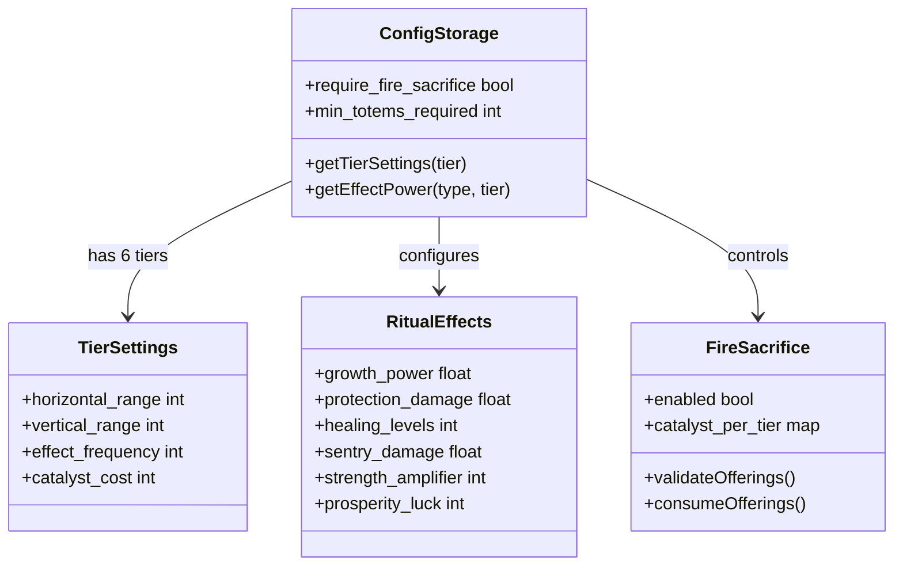
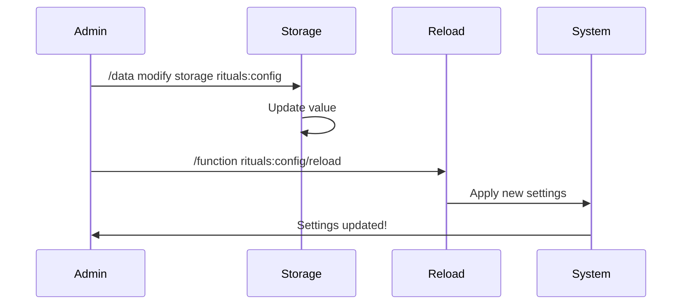

# Configuration Guide

Welcome to the Rituals Datapack Configuration system, you absolute legend! ༼ つ ◕_◕ ༽つ

## Overview

All ritual effects now use a **centralized, tier-based configuration system**. No more hardcoded bullshit scattered across different files!

### Configuration System Architecture



## Configuration Location

All settings are stored in: `rituals:config` storage

## How to Modify Settings

### Configuration Flow



### In-Game Commands

You can modify ANY config value in-game using Minecraft commands:

```mcfunction
/data modify storage rituals:config <setting_name> set value <new_value>
```

After modifying, reload the configuration:
```mcfunction
/function rituals:config/reload
```

## Configuration Values

### Fire Sacrifice System

#### `kiwi_mode` (User-Friendly Easy Mode) 🥝
- **Default**: `false`
- **Description**: **Easy mode for new players!** When enabled, rituals activate automatically when you place items on totems - no fire sacrifice needed! Perfect for learning the system or casual play.
- **Valid Values**: `true` (easy mode) or `false` (fire sacrifice required)
- **Example**: 
  ```mcfunction
  # EASY WAY - Just run this command (or click the chat link on world join!)
  /function rituals:admin/enable_kiwi_mode
  
  # To disable it later
  /function rituals:admin/disable_kiwi_mode
  
  # MANUAL WAY - Direct config modification (advanced)
  /data modify storage rituals:config kiwi_mode set value true
  /function rituals:config/reload
  ```

**Kiwi Mode is perfect for:**
- 🆕 New players learning the ritual system
- 🎮 Casual gameplay without resource costs
- 🏫 Teaching servers or tutorial worlds
- 🧪 Testing and experimenting with rituals

#### `require_fire_sacrifice` (Advanced Setting)
- **Default**: `true`
- **Description**: Technical setting that controls fire sacrifice requirement. **Note:** Kiwi Mode automatically manages this setting - use Kiwi Mode instead for easier configuration!
- **Valid Values**: `true` or `false`
- **Example**: 
  ```mcfunction
  # Enable fire sacrifice mode (default)
  /data modify storage rituals:config require_fire_sacrifice set value true
  
  # Disable fire sacrifice (revert to auto-activation)
  /data modify storage rituals:config require_fire_sacrifice set value false
  
  # Apply changes
  /function rituals:config/reload
  ```

**See `FIRE_SACRIFICE_GUIDE.md` for complete instructions on the fire sacrifice system!**

---

### Tier-Based Range Settings

Each tier has its own horizontal and vertical range values:

| Setting | Default | Description |
|---------|---------|-------------|
| `tier1_horizontal_range` | 2 | Wood tier - horizontal radius in blocks |
| `tier2_horizontal_range` | 3 | Copper tier - horizontal radius in blocks |
| `tier3_horizontal_range` | 4 | Iron tier - horizontal radius in blocks |
| `tier4_horizontal_range` | 5 | Gold tier - horizontal radius in blocks |
| `tier5_horizontal_range` | 6 | Diamond tier - horizontal radius in blocks |
| `tier6_horizontal_range` | 7 | Netherite tier - horizontal radius in blocks |
| `tier1_vertical_range` | 3 | Wood tier - vertical range (up/down from totem) |
| `tier2_vertical_range` | 4 | Copper tier - vertical range |
| `tier3_vertical_range` | 5 | Iron tier - vertical range |
| `tier4_vertical_range` | 6 | Gold tier - vertical range |
| `tier5_vertical_range` | 7 | Diamond tier - vertical range |
| `tier6_vertical_range` | 8 | Netherite tier - vertical range |

### Tier-Based Effect Frequency

How often effects apply (in ticks, 20 ticks = 1 second):

| Setting | Default | Description |
|---------|---------|-------------|
| `tier1_frequency` | 20 | Wood tier - apply effect every 20 ticks (1 second) |
| `tier2_frequency` | 15 | Copper tier - apply effect every 15 ticks |
| `tier3_frequency` | 10 | Iron tier - apply effect every 10 ticks (0.5 seconds) |
| `tier4_frequency` | 8 | Gold tier - apply effect every 8 ticks |
| `tier5_frequency` | 5 | Diamond tier - apply effect every 5 ticks (0.25 seconds) |
| `tier6_frequency` | 3 | Netherite tier - apply effect every 3 ticks |

### General Ritual Settings

| Setting | Default | Description |
|---------|---------|-------------|
| ~~`ritual_duration`~~ | N/A | **REMOVED:** All rituals are permanent |
| `min_totems_required` | 1 | Minimum totems needed to activate a ritual |
| `ritual_range` | 32 | Maximum distance between totems for multi-Rituals |

### Sentry Totem Settings

| Setting | Default | Description |
|---------|---------|-------------|
| `sentry_range_multiplier` | 2.0 | Multiplier for sentry range vs normal totems |
| `sentry_fire_rate` | 40 | Ticks between projectile fires |
| `sentry_base_damage` | 1.0 | Base damage per projectile (scales with tier) |
| `sentry_damage_per_tier` | 0.5 | Additional damage per tier level |
| `sentry_projectile_speed` | 0.3 | Projectile motion speed |

## Example Modifications

### Make All Totems Have Huge Range

```mcfunction
/data modify storage rituals:config tier1_horizontal_range set value 10
/data modify storage rituals:config tier2_horizontal_range set value 15
/data modify storage rituals:config tier3_horizontal_range set value 20
/data modify storage rituals:config tier4_horizontal_range set value 25
/data modify storage rituals:config tier5_horizontal_range set value 30
/data modify storage rituals:config tier6_horizontal_range set value 40
/reload
```

### Make Effects Apply Faster

```mcfunction
/data modify storage rituals:config tier1_frequency set value 10
/data modify storage rituals:config tier2_frequency set value 8
/data modify storage rituals:config tier3_frequency set value 5
/data modify storage rituals:config tier4_frequency set value 3
/data modify storage rituals:config tier5_frequency set value 2
/data modify storage rituals:config tier6_frequency set value 1
/reload
```

### Enable Multi-Totem Mode (Require 3 Totems)

```mcfunction
/data modify storage rituals:config min_totems_required set value 3
/reload
```

### Make Sentry Totems More Powerful

```mcfunction
/data modify storage rituals:config sentry_base_damage set value 2.0d
/data modify storage rituals:config sentry_damage_per_tier set value 1.0d
/data modify storage rituals:config sentry_fire_rate set value 20
/reload
```

## System Architecture

All ritual effects now use a **generic, reusable system**:

1. **`get_tier_settings.mcfunction`** - Loads tier-specific range and frequency from config into temp scoreboards
2. **`apply_in_tier_range.mcfunction`** - Calculates box coordinates for dx/dy/dz selectors
3. **Individual effect files** (growth, strength, healing, prosperity, damage, turret) - Call the generic functions, then apply their specific effects

This means:
- ✅ All effects scale with tier automatically
- ✅ All effects use the same configuration system
- ✅ Easy to add new effects
- ✅ Easy to modify behavior without touching code
- ✅ No more hardcoded magic numbers

## Viewing Current Config

To see all current config values:

```mcfunction
/data get storage rituals:config
```

## Resetting to Defaults

Simply reload the datapack:

```mcfunction
/reload
```

The `config/load.mcfunction` will reset all values to their defaults.

---

## 🔗 Navigation

- **[← Back to Documentation Index](README.md)** - All guides and references
- **[← Back to Main README](../README.md)** - Project overview
- **[🔥 Fire Sacrifice Guide](FIRE_SACRIFICE_GUIDE.md)** - Core ritual mechanics
- **[📏 Range Diagram](RANGE_DIAGRAM.md)** - Visual range specifications
- **[🛠️ System Overview](SYSTEM_OVERVIEW.md)** - Technical architecture

---

Now go forth and customize your rituals, you magnificent bastard! ᕙ(⇀‸↼‶)ᕗ

