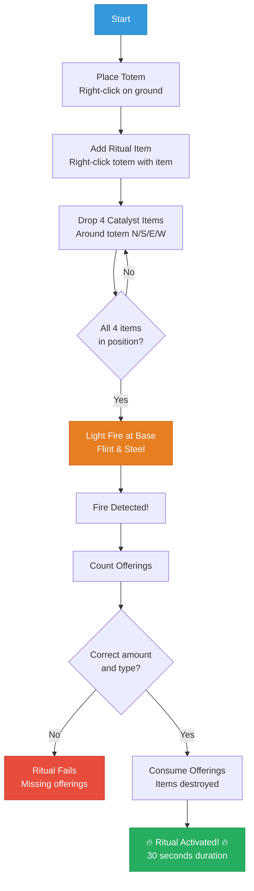
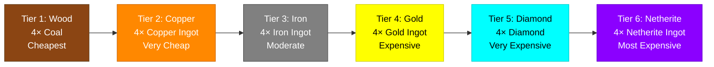

# Fire Sacrifice Ritual Guide

## Overview


As of the latest version, **Totem Rituals now require a Fire Sacrifice** to activate! This replaces the automatic activation system and makes rituals more immersive, costly, and rewarding.

Instead of rituals starting automatically when you place items on totems, you must now perform a sacred fire sacrifice by offering catalyst items to the flames.

---

## How Fire Sacrifice Works

### Fire Sacrifice Flowchart



### Basic Steps

1. **Place your totem** (right-click)
2. **Add your ritual item** to the totem (e.g., Diamond, Emerald, Arrow, etc.)
3. **Drop 4 catalyst items** on the ground in the 4 cardinal directions around the totem (N, S, E, W)
4. **Light a fire** at the totem's base using flint & steel or other fire source
5. **Watch the magic!** The offerings are consumed, and the ritual activates

---

## Catalyst Requirements by Tier

Each totem tier requires different catalyst items for the fire sacrifice. Higher tiers require more valuable materials:

### Catalyst Cost Progression



### 🪵 Tier 1 - Wood Totem
- **Required**: 4× Coal
- **Cost**: Very cheap - perfect for early game
- **Range**: 2×2 horizontal, 3 up/down

### 🟠 Tier 2 - Copper Totem
- **Required**: 4× Copper Ingot
- **Cost**: Cheap - easy to farm
- **Range**: 3×3 horizontal, 4 up/down

### ⚙️ Tier 3 - Iron Totem
- **Required**: 4× Iron Ingot
- **Cost**: Moderate - standard resource
- **Range**: 4×4 horizontal, 5 up/down

### 🟡 Tier 4 - Gold Totem
- **Required**: 4× Gold Ingot
- **Cost**: Moderate-High - gold farms help
- **Range**: 5×5 horizontal, 6 up/down

### 💎 Tier 5 - Diamond Totem
- **Required**: 4× Diamond
- **Cost**: High - 4 diamonds per activation
- **Range**: 6×6 horizontal, 7 up/down

### 🟣 Tier 6 - Netherite Totem
- **Required**: 4× Netherite Ingot
- **Cost**: Very High - most powerful rituals
- **Range**: 7×7 horizontal, 8 up/down

---

## Detailed Instructions

### 1. Placement of Catalyst Items

The catalyst items must be dropped **on the ground** in the 4 cardinal directions (North, South, East, West) around your totem, approximately **2 blocks away**:

```
         [North Item]
              |
              |
[West Item] - TOTEM - [East Item]
              |
              |
         [South Item]
```

**Tips:**
- You don't need to be super precise - within 2 blocks in each direction works
- Items can be at any Y-level near the totem base
- Drop all 4 items BEFORE lighting the fire
- The items must match your totem's tier (see table above)

### 2. Lighting the Fire

Once all 4 catalyst items are in position:

1. Use **Flint & Steel** to light fire at the totem's base
2. You can light fire:
   - Directly at the totem position
   - One block below the totem
   - Adjacent to the totem (any cardinal direction)
3. You can use **regular fire** or **soul fire** - both work!

### 3. The Ritual Activation

When fire is detected and all 4 offerings are present:

**Visual Effects:**
- 🔥 Dramatic flame and particle effects
- ✨ Rising pillar of energy at the totem
- 🌟 Soul fire particles at each offering location
- 💀 The fire is **extinguished** (consumed by the ritual)

**Audio:**
- Portal and blaze sounds for dramatic effect
- Enchantment sounds as ritual activates

**Confirmation:**
- Chat message: *"Fire sacrifice accepted! (consumed 4x [item])"*
- Ritual-specific activation message
- Ritual timer begins (default: 30 seconds)

---

## Configuration

Server administrators can toggle between **Fire Sacrifice Mode** and **Legacy Auto-Activation Mode**.

### Disable Fire Sacrifice (Revert to Auto-Activation)

If you prefer the old automatic activation system:

```mcfunction
/data modify storage rituals:config require_fire_sacrifice set value false
/function rituals:config/reload
```

### Enable Fire Sacrifice (Default)

To re-enable fire sacrifice mode:

```mcfunction
/data modify storage rituals:config require_fire_sacrifice set value true
/function rituals:config/reload
```

---

## Tips & Strategies

### Early Game
- Start with **Wood Totems** (4× Coal per ritual) - very affordable
- Coal is abundant, making wood totems perfect for learning the system
- Use Growth Ritual (Emerald) to boost your farms

### Mid Game
- Upgrade to **Iron** or **Copper Totems** as you expand
- Iron golems and copper farms make these tiers sustainable
- Protection Ritual (Iron Ingot) becomes more viable at higher tiers

### Late Game
- **Diamond** and **Netherite Totems** for permanent setups
- The high cost is offset by:
  - Larger effect ranges
  - More powerful effects
  - Better frequency/duration scaling
- Consider the 4× catalyst cost when choosing where to place these

### Automation Ideas
- Build item storage near totems for quick access to catalysts
- Create a "ritual chamber" with pre-placed fire sources
- Use droppers/dispensers for precise item placement (advanced)
- Keep flint & steel in a convenient chest

---

## Troubleshooting

### "Ritual won't activate!"

**Check:**
1. ✅ Do you have exactly **4 items** of the correct catalyst type?
2. ✅ Are the items **on the ground** (not in your inventory)?
3. ✅ Are they positioned around the totem (within ~2 blocks in each direction)?
4. ✅ Is there **fire** at or adjacent to the totem base?
5. ✅ Does the totem already have a **ritual item** displayed on it?
6. ✅ Is the totem already **running a ritual**? (wait for it to complete)

### "Items disappeared but ritual didn't start!"

- Fire consumed the items before the ritual could detect them
- **Solution**: Drop items first, THEN light fire immediately after
- Items must be present when fire is detected

### "Can I use other fire sources?"

Yes! These work:
- Flint & Steel ✅
- Fire Charge ✅
- Flame enchantment ✅
- Lava (sets blocks on fire) ✅
- Blaze fireballs ✅
- Soul Fire ✅

---

## Why Fire Sacrifice?

The fire sacrifice system adds:
- **🎭 Immersion**: Performing rituals feels more mystical and intentional
- **💰 Resource Sink**: Balanced cost-vs-benefit encourages totem upgrades
- **⚖️ Game Balance**: Prevents "set and forget" infinite rituals
- **🎯 Player Agency**: You choose when rituals activate, not automatic
- **📈 Progression**: Higher tiers become more valuable as you automate resource production

---

## Related Guides

- See `CRAFTING_RECIPES.md` for totem crafting
- See `README.md` for ritual types and effects
- See `RANGE_DIAGRAM.md` for detailed range specifications
- See `CONFIG_GUIDE.md` for all configuration options

---

## 🔗 Navigation

- **[← Back to Documentation Index](README.md)** - All guides and references
- **[← Back to Main README](../README.md)** - Project overview
- **[📦 Installation Guide](INSTALLATION.md)** - Setup instructions
- **[⚡ Quick Reference Card](FIRE_SACRIFICE_QUICK_REFERENCE.md)** - Printable reference
- **[⚙️ Configuration Guide](CONFIG_GUIDE.md)** - Disable fire sacrifice or adjust settings

---

**May your offerings burn bright and your rituals be ever powerful!** 🔥✨

