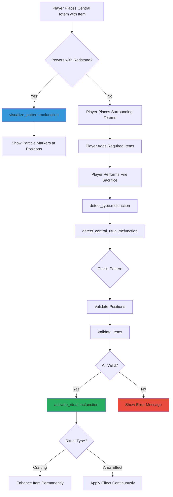

# Multi-Totem Pattern Rituals - Implementation Summary

## Overview

This document summarizes the implementation of the **multi-totem pattern ritual system** added to the Totem Rituals datapack. This system allows for complex rituals that require multiple totems arranged in specific geometric patterns, with each totem displaying specific required items.

---

## ✅ What Was Implemented

### 1. Pattern Configuration System
- **Location**: `data/rituals/function/ritual/patterns/`
- **Purpose**: Defines and detects geometric patterns for multi-totem rituals

**Pattern Types Implemented:**
- ✅ **Square Pattern** (4 corners) - Enchanting Nexus
- ✅ **Star Pattern** (4 cardinals) - Auto-Breeding
- ✅ **Hexagon Pattern** (6 around) - Item Vacuum, Auto-Smelting

**Pattern Types Ready for Implementation:**
- ⏳ Pentagon (5 around) - XP Harvester
- ⏳ Septagon (7 around) - Flight Zone, Weather Control
- ⏳ Octagon (8 around) - Forcefield, Mob Repellent
- ⏳ Nonagon (9 around) - Time Warp

### 2. Pattern Detection & Validation

Each pattern ritual has:
- **Central item detection** - Identifies ritual type from central totem's item
- **Position validation** - Checks if surrounding totems are at correct coordinates (±1.5 block tolerance)
- **Item validation** - Verifies each totem has the specific required item for its position
- **Pattern completion check** - Ensures all required totems are present before activation

**Example Flow:**
```
Central Totem (Enchanting Table)
  → Detect Square Pattern
    → Check NE corner (+4, +4): Lapis Block? ✓
    → Check SE corner (+4, -4): Bookshelf? ✓
    → Check SW corner (-4, -4): Amethyst? ✓
    → Check NW corner (-4, +4): XP Bottle? ✓
      → All valid → Activate Ritual!
```

### 3. Visual Pattern Indicators

**Feature**: When a totem with a pattern-ritual item is powered with redstone, colored particle markers appear showing exactly where surrounding totems should be placed.

**How It Works:**
1. Player places central totem with pattern item (e.g., Hopper)
2. Player powers totem with redstone (block/torch/lever/button)
3. System detects item type and loads corresponding visualization
4. Particles spawn at each required totem position
5. Particle colors indicate which item should go on each totem
6. Wireframe particles connect positions showing overall pattern shape

**Files:**
- `totem/patterns/visualize_pattern.mcfunction` - Routes to pattern-specific visualization
- `totem/patterns/visualize_square.mcfunction` - Square pattern particles
- `totem/patterns/visualize_star.mcfunction` - Star pattern particles
- `totem/patterns/visualize_hexagon_vacuum.mcfunction` - Hexagon (vacuum) particles
- `totem/patterns/visualize_hexagon_smelting.mcfunction` - Hexagon (smelting) particles

**Integration Points:**
- `totem/redstone_on.mcfunction` - Triggers visualization when powered ON
- `totem/update.mcfunction` - Continuously shows visualization while powered (checks BOTH tags)
- `totem/check_redstone.mcfunction` - Detects redstone power state changes

**Technical Details:**

```mcfunction
# From totem/update.mcfunction (line 16)
execute if entity @s[tag=rituals.redstone_powered,tag=rituals.has_item] run function rituals:totem/patterns/visualize_pattern

# This requires BOTH conditions:
# 1. rituals.redstone_powered - totem is receiving redstone signal
# 2. rituals.has_item - totem has an item displayed on it

# From totem/patterns/visualize_pattern.mcfunction (line 8)
execute as @e[type=item_display,tag=rituals.totem_display] if score @s rituals.id = @e[type=interaction,tag=rituals.totem,limit=1,sort=nearest] rituals.id run data modify storage rituals:temp pattern_item set from entity @s item.id

# This reads the CURRENT item ID every tick, so swapping items updates pattern instantly
```

**Particle Behavior Matrix:**

| Condition | Result |
|-----------|--------|
| Totem empty + Redstone ON | ❌ No pattern particles (only tier range) |
| Totem with pattern item + Redstone OFF | ❌ No pattern particles |
| Totem with pattern item + Redstone ON | ✅ Pattern particles shown |
| Totem with regular item + Redstone ON | ❌ No pattern particles (only tier range) |
| Item swapped while powered | ✅ Pattern updates next tick (0.05s) |

### 4. Ritual Types Implemented

#### ⭐ Auto-Breeding (Star Pattern)
- **Central Item**: Wheat
- **Pattern**: 4 cardinals at 5 blocks distance
- **Surrounding Items**:
  - North: Seeds
  - East: Carrot
  - South: Potato
  - West: Beetroot Seeds
- **Effect**: Automatically breeds animals in range (permanent area effect ritual)
- **Effect Type ID**: 11

### 5. Documentation

**User-Facing Documentation:**
- ✅ `docs/MULTI_TOTEM_PATTERNS.md` - Detailed ASCII diagrams, coordinates, and item requirements
- ✅ `docs/PATTERN_RITUALS_GUIDE.md` - Complete user guide with setup instructions and troubleshooting
- ✅ Updated `README.md` - Added references to pattern rituals and visual guides

**Developer Documentation:**
- ✅ `docs/IMPLEMENTATION_SUMMARY.md` - This file
- ✅ Inline code comments in all pattern detection functions

---

## 🏗️ Architecture

### File Structure

```
data/rituals/function/
├── ritual/
│   ├── detect_type.mcfunction (updated - calls pattern detection)
│   └── patterns/
│       ├── detect_central_ritual.mcfunction (routes to pattern checkers)
│       ├── pattern_config.mcfunction (constants & initialization)
│       ├── square/
│       │   ├── detect_enchanting_nexus.mcfunction
│       │   ├── activate_enchanting_nexus.mcfunction
│       │   └── check_*.mcfunction (4 corner validators)
│       ├── star/
│       │   ├── detect_auto_breeding.mcfunction
│       │   ├── activate_auto_breeding.mcfunction
│       │   └── check_*.mcfunction (4 cardinal validators)
│       └── hexagon/
│           ├── detect_item_vacuum.mcfunction
│           ├── activate_item_vacuum.mcfunction
│           ├── detect_auto_smelting.mcfunction
│           ├── activate_auto_smelting.mcfunction
│           └── check_*.mcfunction (12 hex position validators)
└── totem/
    ├── update.mcfunction (updated - triggers pattern viz)
    ├── redstone_on.mcfunction (updated - shows pattern on power)
    └── patterns/
        ├── visualize_pattern.mcfunction (routes to visualizations)
        ├── visualize_square.mcfunction
        ├── visualize_star.mcfunction
        ├── visualize_hexagon_vacuum.mcfunction
        └── visualize_hexagon_smelting.mcfunction
```

### Data Flow



### Scoreboard Values

**Pattern Detection:**
- `#pattern_valid` - 1 if pattern is complete and correct
- `#totems_found` - Count of valid totems in pattern
- `#found_n`, `#found_ne`, etc. - Individual position validation flags

**Ritual Effects:**
- Effect type 10: Enchanting Nexus
- Effect type 11: Auto-Breeding
- Effect type 12: Item Vacuum
- Effect type 13: Auto-Smelting

### Entity Tags

**Pattern Ritual Tags:**
- `rituals.pattern_totem` - Tag used during pattern validation
- `rituals.pattern_ritual` - Marks active pattern ritual
- `rituals.enchanting_nexus` - Specific ritual type tag
- `rituals.auto_breeding` - Specific ritual type tag
- `rituals.item_vacuum` - Specific ritual type tag
- `rituals.auto_smelting` - Specific ritual type tag

---

## 🔧 How to Add New Patterns

### Step-by-Step Guide

1. **Define Pattern Geometry**
   - Choose shape (pentagon, octagon, etc.)
   - Calculate exact coordinates for each position
   - Decide item requirements for each position

2. **Create Detection Functions**
   ```
   patterns/[shape]/
   ├── detect_[ritual_name].mcfunction
   ├── check_[position1].mcfunction
   ├── check_[position2].mcfunction
   ...
   └── activate_[ritual_name].mcfunction
   ```

3. **Add to Central Ritual Detector**
   - Edit `detect_central_ritual.mcfunction`
   - Add case for new central item

4. **Create Visualization**
   - Create `visualize_[shape].mcfunction` in `totem/patterns/`
   - Add particle markers at each position
   - Use colors that match item types
   - Add to `visualize_pattern.mcfunction`

5. **Assign Effect Type ID**
   - Choose next available ID (14+)
   - Add to effect application system if needed

6. **Document**
   - Add ASCII diagram to `MULTI_TOTEM_PATTERNS.md`
   - Add user guide section to `PATTERN_RITUALS_GUIDE.md`
   - Update main README

### Example Template

```mcfunction
# detect_my_ritual.mcfunction
scoreboard players set #pattern_valid rituals.temp 0
scoreboard players set #totems_found rituals.temp 0

# Check each position
execute positioned ~ ~ ~X as @e[type=interaction,tag=rituals.totem,tag=rituals.has_item,distance=..1.5] run function rituals:ritual/patterns/[shape]/check_position1

# Sum totems found
scoreboard players operation #totems_found rituals.temp = #found_pos1 rituals.temp
scoreboard players operation #totems_found rituals.temp += #found_pos2 rituals.temp
# ... add all positions

# If complete, activate
execute if score #totems_found rituals.temp matches [N] run function rituals:ritual/patterns/[shape]/activate_my_ritual
```

---

## 🎯 Testing Checklist

### For Each Pattern Ritual:

- [ ] Central totem with correct item placed
- [ ] Redstone power shows particle markers at correct positions
- [ ] Particle colors are distinguishable and meaningful
- [ ] Surrounding totems detected at correct positions (±1.5 block tolerance)
- [ ] Surrounding totems with correct items validated
- [ ] Wrong items rejected with error message
- [ ] Missing totems reported in error message
- [ ] Fire sacrifice triggers activation
- [ ] Ritual effects apply correctly
- [ ] Enhanced items retain properties when picked up
- [ ] Pattern doesn't interfere with regular rituals

### General System Tests:

- [ ] Multiple pattern rituals can coexist
- [ ] Redstone visualization doesn't lag server
- [ ] Particles visible from reasonable distance
- [ ] Works on flat and uneven terrain (±1 block Y tolerance)
- [ ] Fire sacrifice costs correct catalyst items
- [ ] Breaking pattern mid-ritual cancels appropriately

---

## 🐛 Known Issues & Future Improvements

### Known Issues:
- ⚠️ Pattern visualization particles may overlap with tier range particles
- ⚠️ Very uneven terrain (>1 block height difference) may cause detection issues

### Future Improvements:
- 🔮 Pentagon pattern (XP Harvester) - geometry defined, needs implementation
- 🔮 Septagon pattern (Flight Zone, Weather Control) - geometry defined, needs implementation
- 🔮 Octagon pattern (Forcefield, Mob Repellent) - geometry defined, needs implementation
- 🔮 Nonagon pattern (Time Warp) - geometry defined, needs implementation
- 🔮 Pattern preview hologram (instead of just particles)
- 🔮 In-game guidebook with pattern diagrams
- 🔮 Pattern ritual achievements/advancements
- 🔮 Configurable pattern tolerance distance

---

## 📊 Performance Notes

### Particle System:
- Particles spawn only when totem is redstone-powered
- Visualization runs once per tick while powered
- ~8-10 particles per position + wireframe = 50-100 particles total per pattern
- Negligible performance impact on modern servers

### Pattern Detection:
- Runs only during fire sacrifice attempt (not every tick)
- Position checks use efficient `positioned` commands with `distance` selector
- Early returns prevent unnecessary checks
- Worst case: ~7 function calls × 6-9 positions = 42-63 function calls per detection

### Memory Usage:
- No additional scoreboards created
- Reuses existing `rituals.temp` scoreboard
- No persistent entity spawning (except range markers from existing system)
- Minimal storage usage for item validation

---

## 🎓 Code Examples

### Detecting a Position

```mcfunction
# Check NE Corner (+4, 0, +4) - Requires Lapis Lazuli Block
scoreboard players set #found_ne rituals.temp 0
execute positioned ~4 ~ ~4 as @e[type=interaction,tag=rituals.totem,tag=rituals.has_item,distance=..1.5] run function rituals:ritual/patterns/square/check_ne_corner
```

### Validating an Item

```mcfunction
# check_ne_corner.mcfunction
execute as @e[type=item_display,tag=rituals.totem_display] if score @s rituals.id = @e[type=interaction,tag=rituals.totem,limit=1,sort=nearest] rituals.id run data modify storage rituals:temp check_corner_item set from entity @s item.id

execute if data storage rituals:temp {check_corner_item:"minecraft:lapis_block"} run scoreboard players set #found_ne rituals.temp 1
execute if data storage rituals:temp {check_corner_item:"minecraft:lapis_block"} run tag @s add rituals.pattern_totem
```

### Showing Particles

```mcfunction
# NE Corner (+4, 0, +4) - Lapis Lazuli Block (blue)
particle dust{color:[0.2,0.4,1.0],scale:1.2} ~4 ~ ~4 0.3 0.5 0.3 0 8 force
particle dust{color:[0.2,0.4,1.0],scale:0.8} ~4 ~1 ~4 0.2 0.3 0.2 0 4 force
particle dust{color:[0.2,0.4,1.0],scale:0.8} ~4 ~2 ~4 0.2 0.3 0.2 0 4 force
execute positioned ~4 ~ ~4 run particle minecraft:enchant ~ ~1 ~ 0.2 0.5 0.2 0.5 3
```

---

## 📜 Credits

**System Design**: Geometric pattern detection with visual particle guidance  
**Implementation**: Multi-totem validation with item-specific requirements  
**Documentation**: Comprehensive ASCII diagrams and user guides  

**Special Features**:
- ✨ Real-time redstone-powered pattern visualization
- 🎨 Color-coded particle system for intuitive setup
- 📐 Precise coordinate-based detection with terrain tolerance
- 🔥 Integration with existing fire sacrifice system

---

**For Questions or Issues**: See `docs/PATTERN_RITUALS_GUIDE.md` for troubleshooting or consult inline code comments.

