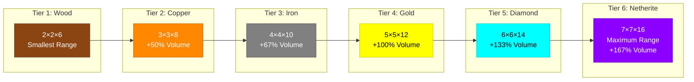
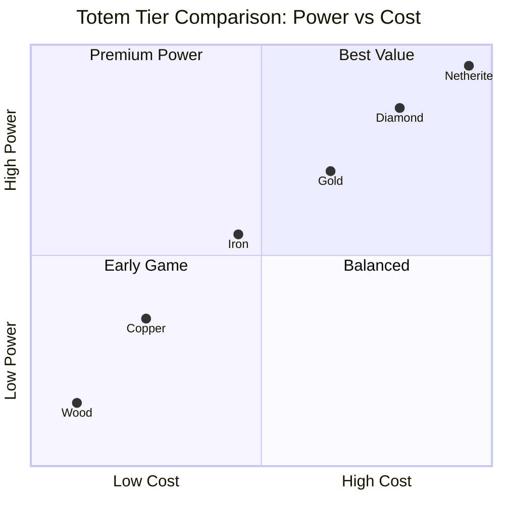

# Ritual Range Diagram

This document explains the exact range mechanics for Rituals

## Range Specifications

Totem ranges are **tier-based** and use a box-shaped area:
- **Tier 1 (Wood)**: 2×2 horizontal, 3 up/3 down (2×2×6)
- **Tier 2 (Copper)**: 3×3 horizontal, 4 up/4 down (3×3×8)
- **Tier 3 (Iron)**: 4×4 horizontal, 5 up/5 down (4×4×10)
- **Tier 4 (Gold)**: 5×5 horizontal, 6 up/6 down (5×5×12)
- **Tier 5 (Diamond)**: 6×6 horizontal, 7 up/7 down (6×6×14)
- **Tier 6 (Netherite)**: 7×7 horizontal, 8 up/8 down (7×7×16)

### Range Comparison Chart



### Visual Representation

```
-------------
|           |  <- not in range
|           |  <- in range (3 above)
|           |  <- in range (2 above)
|    [o]    |  <- in range (1 above) - Item display
|     |     |  <- totem fence post (ground level)
| [-][-][-] |  <- in range (1 below)
| [-][-][-] |  <- in range (2 below)
| [-][-][-] |  <- in range (3 below)
|           |  <- not in range
-------------
```

## Components

- `|` = Totem pole (fence post visual)
- `[o]` = Item displayed on top (mob head or any item)
- `[-]` = Example solid blocks showing range extent
- The 5×5 horizontal range extends 2 blocks in each direction from the totem

## Tier Differences

Higher tiers have **both larger ranges AND stronger effects**:

| Tier | Material | Range | Effect Frequency |
|------|----------|-------|------------------|
| 1 | Wood | 2×2×6 | Slowest |
| 2 | Copper | 3×3×8 | Slow |
| 3 | Iron | 4×4×10 | Moderate |
| 4 | Gold | 5×5×12 | Fast |
| 5 | Diamond | 6×6×14 | Faster |
| 6 | Netherite | 7×7×16 | Fastest |

### Effect Power Scaling



### Effect Frequency Examples

**Growth Ritual:**
- Tier 1: Every 15 seconds
- Tier 6: Every 3 seconds

**Protection Ritual:**
- Tier 1: 2 damage every 9 seconds
- Tier 6: 8 damage every 1.5 seconds

**Sentry Ritual:**
- Tier 1: Fires every 9 seconds, 1.5 damage
- Tier 6: Fires every 1.5 seconds, 12 damage
- **Note**: Sentry has 2× the normal range!

## Positioning Tips

For optimal ritual placement:

1. **Farm Rituals (Growth)**: Place totem at center of 5×5 farm plot
2. **Combat Rituals (Strength/Protection)**: Place in battle arena or base entrance
3. **Collection Rituals (Prosperity)**: Place above item drop zone with 3 blocks clearance
4. **Healing Zones**: Place in animal pens or safe houses

## Technical Notes

- The range uses Minecraft's `dx`, `dy`, `dz` volume selectors
- Box is centered on the totem's position
- Effects apply to all valid targets within the volume
- Particles spawn at the corners of the range for visual feedback

---

**Remember**: Range is fixed, power scales with tier! 🔮

