# Soul Embodiment Ritual - Technical Documentation

---

> 📖 **Looking for the Player Guide?**
> 
> If you're a player wanting to learn how to use the Soul Embodiment system, check out the **[Player-Friendly Guide](SOUL_EMBODIMENT_PLAYER_GUIDE.md)** instead! It has step-by-step instructions, examples, and FAQs.
> 
> This document is the **technical specification** for developers, server admins, and contributors.

---

## 🌟 Executive Summary

The **Soul Embodiment Ritual** transforms ordinary tools and weapons into **living items** that grow with their wielder. Think fantasy tropes: swords that hunger, pickaxes that remember every ore they've tasted, axes that thirst for wood! These awakened items gain experience through use and level up, dynamically updating their tooltips to reflect their progression.

---

## 📋 Core Concept

### What is a Living Weapon?

A **Living Weapon** (or Living Tool) is any tool that has undergone the Soul Embodiment Ritual. Once awakened:

1. **Gains Experience** - The wielder's soul absorbs XP from their deeds (mining, attacking, chopping, etc.), channeled into the weapon via totem conduit
2. **Levels Up** - Thresholds unlock new visual tiers and potentially bonuses
3. **Dynamic Tooltip** - Lore updates in real-time showing level, XP, and personality
4. **Persists Across Sessions** - All data stored in item's `custom_data` component
5. **Unique Identity** - Each awakened item has a soul with a generated name

---

## 🎯 System Architecture

### High-Level Overview

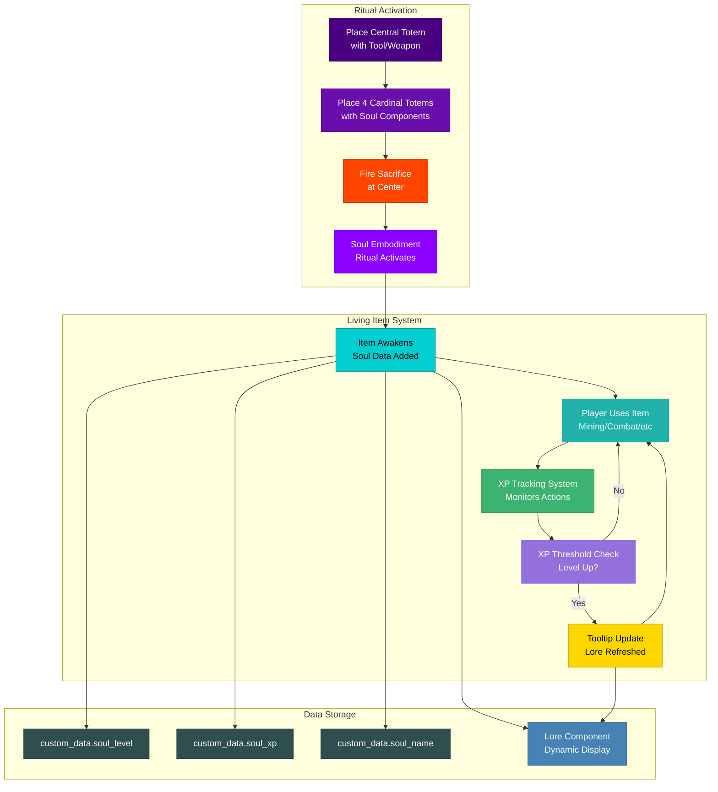

---

## 🔮 Ritual Design

### Pattern: Star (4 Cardinals) - Reused

We'll reuse the existing **Star Pattern** (same as Auto-Breeding) but with different supplemental items themed around soul/spirit magic.

```
         N (Soul Sand)
         ↑
         |
         |
    W ← TOOL → E
 (Amethyst)   (Ender Pearl)
         |
         |
         ↓
         S (Nether Star Fragment)
           (Glowstone Dust)
```

### Totem Positions & Required Items

| Position | Coordinates | Required Item | Thematic Purpose |
|----------|-------------|---------------|------------------|
| **Center** | (0, 0, 0) | **Any Tool/Weapon** | The item to awaken |
| **North** | (0, 0, +5) | Soul Sand | Soul container/anchor |
| **East** | (+5, 0, 0) | Ender Pearl | Dimensional binding |
| **South** | (0, 0, -5) | Glowstone Dust | Life essence/energy |
| **West** | (-5, 0, 0) | Amethyst Shard | Crystal resonance |

### Central Item Detection

The central item must be a **tool or weapon**. We'll use item tag detection:

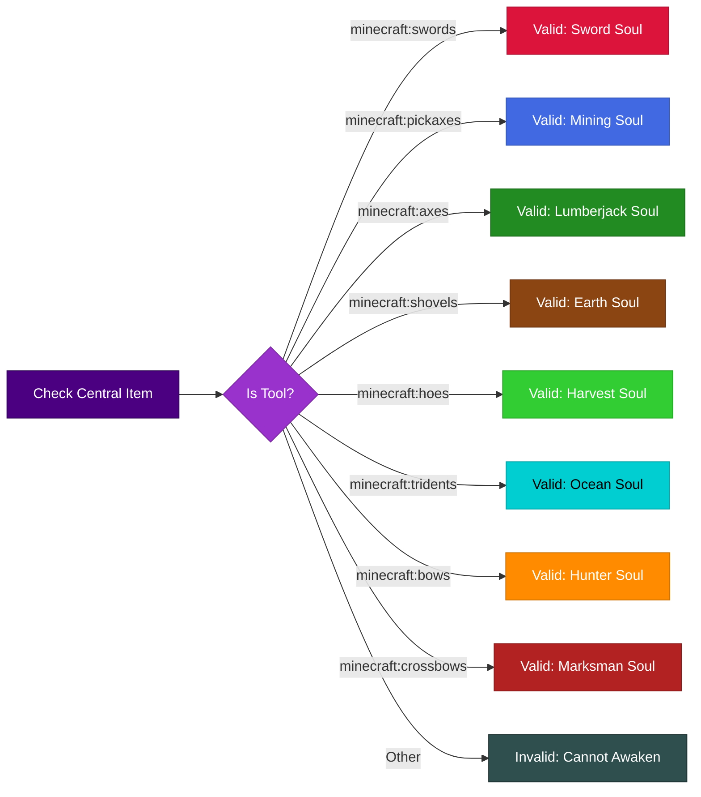

---

## 📊 Experience & Leveling System

### Core Design Philosophy

The Soul Embodiment system is designed for **long-term progression** spanning hundreds of hours of gameplay. Rather than a quick 10-level grind, souls evolve through **100 levels** with periodic **Ascension Rituals** required to unlock higher level caps.

### XP Sources by Tool Type

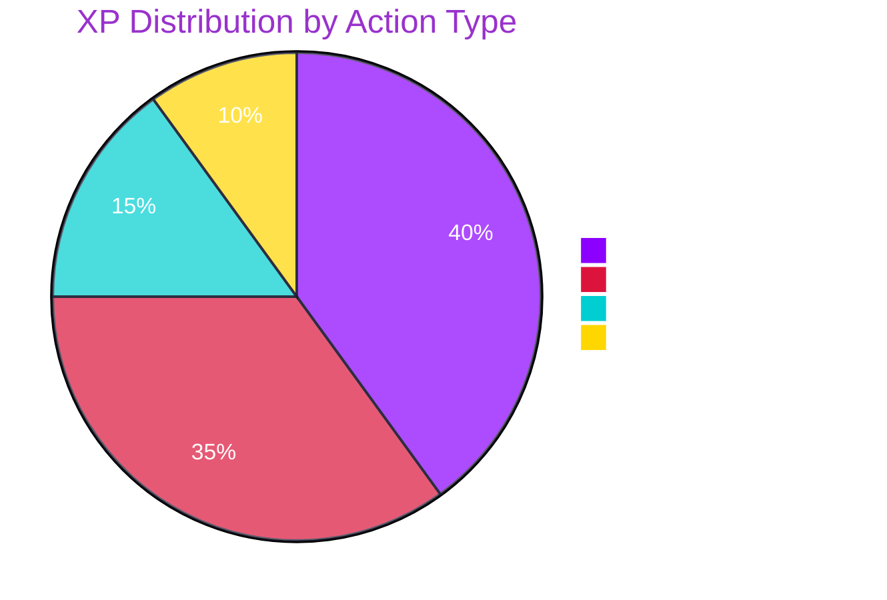

### Tool-Specific XP Actions

| Tool Type | Primary XP Source | Secondary XP | Bonus XP |
|-----------|-------------------|--------------|----------|
| **Sword** | Damage dealt to mobs | Killing blows | Boss kills |
| **Pickaxe** | Stone/ore mined | Diamond/Netherite ore | Ancient Debris |
| **Axe** | Logs chopped | Mob damage | Stripping logs |
| **Shovel** | Dirt/sand/gravel dug | Path creation | Extinguishing campfires |
| **Hoe** | Crops harvested | Tilling soil | Bone meal used nearby |
| **Bow/Crossbow** | Arrows that hit | Critical hits | Long-range shots |
| **Trident** | Damage dealt | Riptide uses | Lightning strikes |

---

## 🔄 Ascension Ritual System

### The Level Cap Mechanic

Souls don't simply level to 100 immediately. They must undergo **Ascension Rituals** to break through level caps:

```mermaid
%%{init: {'theme': 'base', 'themeVariables': { 'primaryColor': '#8b00ff', 'primaryTextColor': '#ffffff', 'primaryBorderColor': '#6a0dad', 'lineColor': '#00CED1', 'secondaryColor': '#4B0082', 'tertiaryColor': '#FFD700', 'textColor': '#ffffff'}}}%%
flowchart LR
    subgraph "Tier 1: Awakening"
        A1[First Ritual] --> A2[Levels 1-15]
    end
    
    subgraph "Tier 2: Ascension I"
        B1[Second Ritual] --> B2[Levels 16-20]
    end
    
    subgraph "Tier 3-18"
        C1[Each +5 Levels] --> C2[Up to Level 100]
    end
    
    A2 -->|Max Level Hit| B1
    B2 -->|Max Level Hit| C1
    
    style A1 fill:#4B0082,stroke:#2E0854,color:#fff
    style A2 fill:#6a0dad,stroke:#4B0082,color:#fff
    style B1 fill:#8b00ff,stroke:#6a0dad,color:#fff
    style B2 fill:#9932CC,stroke:#8b00ff,color:#fff
    style C1 fill:#00CED1,stroke:#008B8B,color:#000
    style C2 fill:#FFD700,stroke:#DAA520,color:#000
```

### Ascension Tier Progression

| Ascension | Ritual # | Level Cap | Cumulative Rituals | Notes |
|-----------|----------|-----------|-------------------|-------|
| **Awakening** | 1st | 15 | 1 | Initial soul binding |
| **Ascension I** | 2nd | 20 | 2 | First breakthrough |
| **Ascension II** | 3rd | 25 | 3 | Growing bond |
| **Ascension III** | 4th | 30 | 4 | Deepening connection |
| **Ascension IV** | 5th | 35 | 5 | Soul resonance |
| **Ascension V** | 6th | 40 | 6 | Spiritual harmony |
| **Ascension VI** | 7th | 45 | 7 | Ethereal fusion |
| **Ascension VII** | 8th | 50 | 8 | Half-transcendence |
| **Ascension VIII** | 9th | 55 | 9 | Beyond mortal |
| **Ascension IX** | 10th | 60 | 10 | Legendary status |
| **Ascension X** | 11th | 65 | 11 | Mythical awakening |
| **Ascension XI** | 12th | 70 | 12 | Ancient power |
| **Ascension XII** | 13th | 75 | 13 | Timeless essence |
| **Ascension XIII** | 14th | 80 | 14 | Immortal spark |
| **Ascension XIV** | 15th | 85 | 15 | Divine touch |
| **Ascension XV** | 16th | 90 | 16 | Godlike presence |
| **Ascension XVI** | 17th | 95 | 17 | Near perfection |
| **Transcendence** | 18th | 100 | 18 | Ultimate form |

### Ascension Ritual Flow

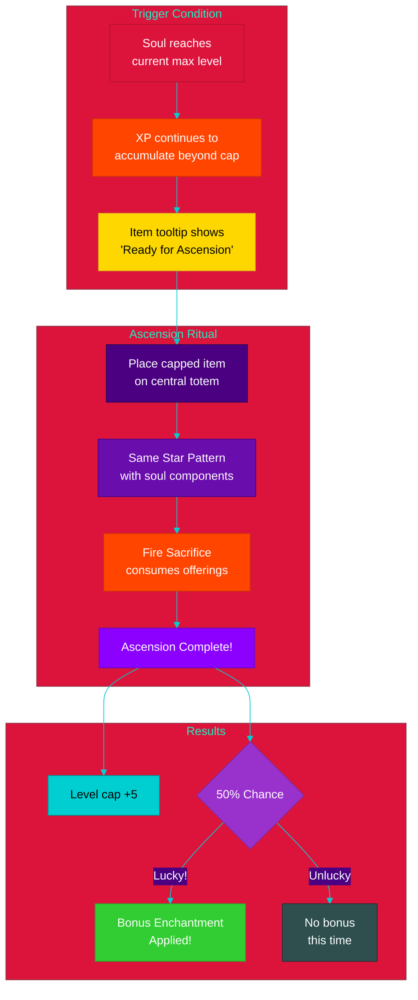

### Bonus Enchantment System

Each Ascension Ritual has a **50% chance** to grant a small bonus enchantment to the item. This encourages players to:
1. Keep using their soul weapon
2. Perform the ritual repeatedly
3. Feel rewarded for long-term investment

#### Possible Bonus Enchantments

| Tool Type | Possible Bonuses | Max Stacks |
|-----------|------------------|------------|
| **Sword** | Sharpness +1, Looting +1, Sweeping Edge +1 | 3 each |
| **Pickaxe** | Efficiency +1, Fortune +1, Unbreaking +1 | 3 each |
| **Axe** | Efficiency +1, Sharpness +1, Unbreaking +1 | 3 each |
| **Shovel** | Efficiency +1, Silk Touch (once), Unbreaking +1 | 3/1/3 |
| **Hoe** | Efficiency +1, Fortune +1, Unbreaking +1 | 3 each |
| **Bow** | Power +1, Punch +1, Infinity (once) | 3/2/1 |
| **Crossbow** | Quick Charge +1, Piercing +1, Multishot (once) | 3/3/1 |
| **Trident** | Loyalty +1, Riptide +1, Channeling (once) | 3/3/1 |

#### Bonus Roll Mechanics

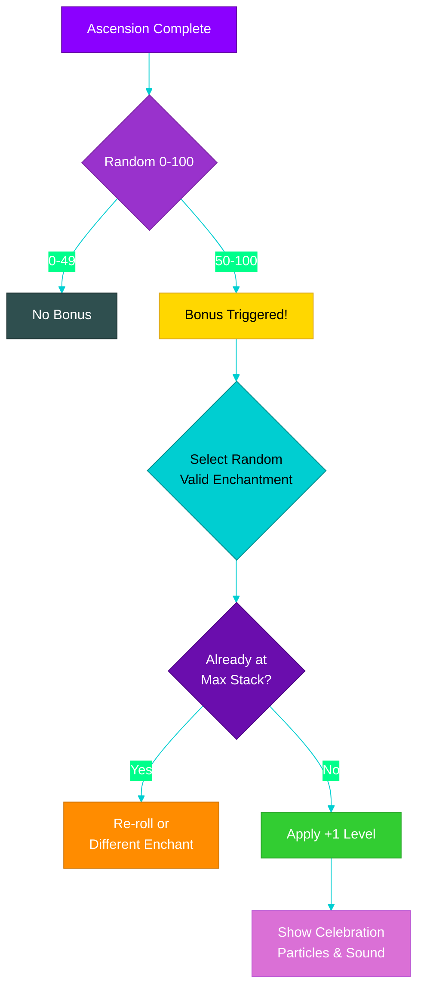

---

## 📈 Level Thresholds (100 Levels)

### XP Scaling Formula

XP requirements follow a **quadratic curve** to ensure long-term engagement:

```
XP_required(level) = base_xp × (level ^ 1.5) + (level × 50)
```

Where `base_xp = 100`

### Level Milestones

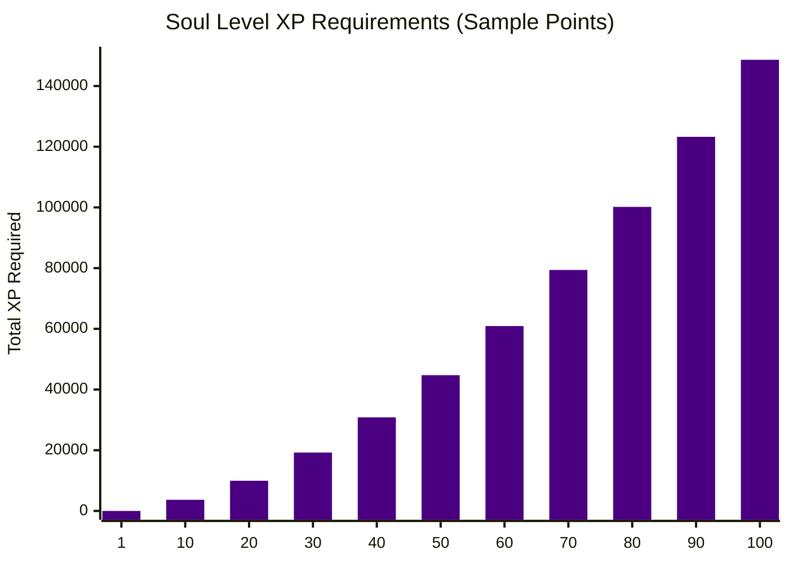

### Level Title Progression

| Level Range | Era | Example Titles | Color |
|-------------|-----|----------------|-------|
| 1-15 | **Awakening** | Stirring, Aware, Hungry, Eager | §7→§a |
| 16-30 | **Growth** | Devoted, Bonded, Attuned, Resonant | §e→§b |
| 31-50 | **Maturity** | Legendary, Mythical, Ancient, Venerable | §9→§d |
| 51-70 | **Mastery** | Exalted, Sovereign, Paramount, Supreme | §5→§6 |
| 71-90 | **Transcendence** | Divine, Celestial, Eternal, Infinite | §6→§c |
| 91-100 | **Apotheosis** | Godslayer, Worldbreaker, Primordial, Omega | §c + Glint |

### Full Level Table (Key Milestones)

| Level | XP Required | Cumulative XP | Title | Ascension Tier |
|-------|-------------|---------------|-------|----------------|
| 1 | 0 | 0 | Awakened | Tier 1 |
| 5 | 618 | 1,518 | Eager | Tier 1 |
| 10 | 1,662 | 6,662 | Devoted | Tier 1 |
| 15 | 2,808 | 14,808 | **CAP - Ascend!** | Tier 1 MAX |
| 20 | 3,944 | 24,944 | Attuned | Tier 2 |
| 25 | 5,125 | 37,125 | **CAP - Ascend!** | Tier 3 MAX |
| 30 | 6,237 | 51,237 | Resonant | Tier 4 |
| 40 | 8,830 | 83,830 | Ancient | Tier 6 |
| 50 | 11,221 | 122,221 | Legendary | Tier 8 |
| 60 | 13,909 | 166,909 | Exalted | Tier 10 |
| 70 | 16,894 | 218,394 | Supreme | Tier 12 |
| 80 | 20,175 | 276,775 | Eternal | Tier 14 |
| 90 | 23,254 | 342,754 | Infinite | Tier 16 |
| 100 | 28,631 | 420,631 | **OMEGA** | Tier 18 FINAL |

---

## 🏷️ Dynamic Tooltip System

### Lore Format

The item's lore will dynamically update based on its soul state, including ascension tier and level cap:

**Normal State (Still Leveling)**
```
┌─────────────────────────────────────┐
│  ⚔ Diamond Sword                    │
│                                     │
│  §d✦ Soul: §f"Vexbane"              │
│  §7Level: §e47§7/§e50 §8(Tier VII)  │
│  §7XP: §a12,850§7/§a14,221          │
│  ▓▓▓▓▓▓▓▓▓░ §790%                   │
│                                     │
│  §8"The blood of a thousand foes    │
│  §8 flows through my edge..."       │
│                                     │
│  §5✧ Bonus: Sharpness +2, Looting +1│
│  §6Soul Embodied §8• §7Kills: 2,847 │
└─────────────────────────────────────┘
```

**Ready for Ascension (At Level Cap)**
```
┌─────────────────────────────────────┐
│  ⚔ Diamond Sword                    │
│                                     │
│  §d✦ Soul: §f"Vexbane"              │
│  §6§l⚡ LEVEL 50 - READY TO ASCEND! │
│  §7Tier: §eVII §8→ §aVIII           │
│  §7Stored XP: §a+4,200 §8(waiting)  │
│                                     │
│  §e"I yearn to break these chains   │
│  §e and reach new heights..."       │
│                                     │
│  §5✧ Bonus: Sharpness +2, Looting +1│
│  §6Soul Embodied §8• §7Kills: 2,847 │
└─────────────────────────────────────┘
```

**After Ascension (Bonus Received!)**
```
┌─────────────────────────────────────┐
│  ⚔ Diamond Sword                    │
│                                     │
│  §d✦ Soul: §f"Vexbane"              │
│  §7Level: §e50§7/§a55 §8(Tier VIII) │
│  §a§l★ ASCENSION BONUS: Looting +1! │
│  §7XP: §a0§7/§a15,409               │
│                                     │
│  §d"A new horizon opens before me..."│
│                                     │
│  §5✧ Bonus: Sharpness +2, Looting +2│
│  §6Soul Embodied §8• §7Kills: 2,847 │
└─────────────────────────────────────┘
```

**Maximum Level Achieved (Level 100)**
```
┌─────────────────────────────────────┐
│  §6§l⚔ Diamond Sword §6§l⚔          │
│                                     │
│  §d§l✦ Soul: §f§l"VEXBANE"          │
│  §c§l★ LEVEL 100 - OMEGA ★          │
│  §5Transcendent Soul §8• §7Tier XVIII│
│                                     │
│  §6"I am become death, destroyer    │
│  §6 of worlds. My edge knows no     │
│  §6 equal in this realm or any."    │
│                                     │
│  §5✧ Sharpness +3, Looting +3,      │
│  §5  Sweeping Edge +2, Unbreaking +3│
│  §c§lAPOTHEOSIS §8• §7Kills: 15,847 │
└─────────────────────────────────────┘
```

### Lore Generation Flow

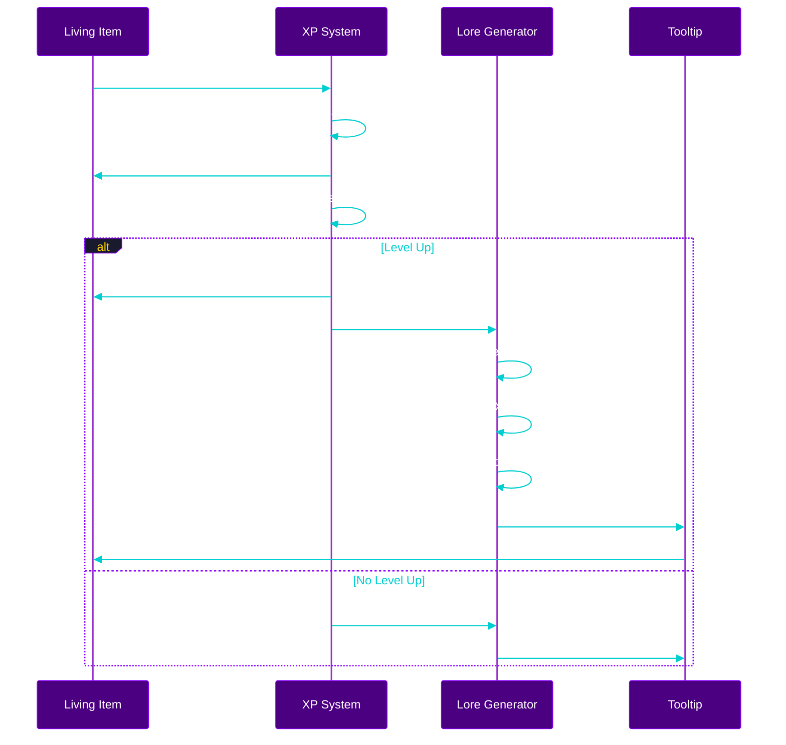

---

## 🗂️ Data Storage Schema

### Item Custom Data Structure

```json
{
  "minecraft:custom_data": {
    "soul_embodied": true,
    "soul_name": "Vexbane",
    "soul_level": 47,
    "soul_xp": 12850,
    "soul_xp_total": 98420,
    "soul_type": "sword",
    "soul_personality": 3,
    "soul_created": 1702500000,
    "soul_ascension_tier": 7,
    "soul_level_cap": 50,
    "soul_bonus_enchants": 4,
    "soul_ready_ascend": false,
    "soul_kills": 2847,
    "soul_blocks_broken": 0,
    "soul_ascension_history": [
      {"tier": 1, "timestamp": 1702500000, "bonus": false},
      {"tier": 2, "timestamp": 1702600000, "bonus": true},
      {"tier": 3, "timestamp": 1702700000, "bonus": false},
      {"tier": 4, "timestamp": 1702800000, "bonus": true},
      {"tier": 5, "timestamp": 1702900000, "bonus": false},
      {"tier": 6, "timestamp": 1703000000, "bonus": true},
      {"tier": 7, "timestamp": 1703100000, "bonus": true}
    ]
  }
}
```

### Data Field Descriptions

| Field | Type | Description |
|-------|------|-------------|
| `soul_embodied` | boolean | Marks item as a living weapon |
| `soul_name` | string | Generated/assigned soul name |
| `soul_level` | int | Current level (1-100) |
| `soul_xp` | int | XP toward next level |
| `soul_xp_total` | int | Lifetime XP earned |
| `soul_type` | string | Tool category (sword/pickaxe/etc) |
| `soul_personality` | int | Index into personality quotes |
| `soul_created` | long | Unix timestamp of awakening |
| `soul_ascension_tier` | int | Current tier (1-18) |
| `soul_level_cap` | int | Current max level (15/20/25/.../100) |
| `soul_bonus_enchants` | int | Count of bonus enchants received |
| `soul_ready_ascend` | boolean | True when at cap & can ascend |
| `soul_kills` | int | Mob kills (swords/axes) |
| `soul_blocks_broken` | int | Blocks broken (tools) |
| `soul_ascension_history` | array | Log of all ascensions |

### Scoreboard Objectives (Datapack)

| Scoreboard | Purpose |
|------------|---------|
| `rituals.soul_xp` | Temporary XP accumulator (per-tick) |
| `rituals.soul_level` | Cache for level checks |
| `rituals.soul_tier` | Current ascension tier |
| `rituals.soul_cap` | Current level cap |
| `rituals.soul_action` | Action type being performed |
| `rituals.soul_bonus` | Random roll result (0-100) |
| `rituals.soul_temp` | Temporary calculations |

### Storage Namespace

```
rituals:soul_data
├── pending_update       # Item awaiting lore refresh
├── level_thresholds[]   # XP required per level (100 entries)
├── tier_caps[]          # Level cap per tier [15,20,25,...,100]
└── bonus_chance         # Configurable bonus % (default: 50)

rituals:soul_config
├── names[]              # Pool of 500+ soul names (user-editable)
├── lore_awakening[]     # Quotes for levels 1-15
├── lore_growth[]        # Quotes for levels 16-30
├── lore_maturity[]      # Quotes for levels 31-50
├── lore_mastery[]       # Quotes for levels 51-70
├── lore_transcendence[] # Quotes for levels 71-90
├── lore_apotheosis[]    # Quotes for levels 91-100
├── titles[]             # 100 level titles
└── colors[]             # Hex colors per level range
```

### Config File Structure

Soul names and lore are stored in an external JSON config for user customization:

```
config/rituals/
├── soul_names.json        # 500+ soul names
├── soul_lore.json         # Personality quotes by era
├── soul_titles.json       # 100 level titles
└── soul_settings.json     # Bonus chance, XP multipliers
```

#### soul_settings.json Example

```json
{
  "ascension_bonus_chance": 50,
  "xp_base_multiplier": 1.0,
  "level_cap_increment": 5,
  "initial_level_cap": 15,
  "max_level": 100,
  "max_ascension_tier": 18
}
```

---

## 📝 Configurable Names & Lore System

### Overview

Soul names and personality lore are stored in **external config files** that users can modify to add their own content. This allows:

1. **Server customization** - Admins can add server-specific names/lore
2. **Mod pack integration** - Pack creators can theme soul weapons
3. **Localization** - Translate to other languages
4. **Expansion** - Community can contribute more content

### Config File Locations

```
config/rituals/
├── soul_names.json          # 500+ base names, user-expandable
├── soul_lore.json           # Personality quotes organized by era
├── soul_titles.json         # Level titles (100 entries)
└── soul_settings.json       # System configuration
```

### soul_names.json Structure

```json
{
  "_comment": "Soul names pool - add your own below the defaults!",
  "format_version": 1,
  "names": {
    "sword": [
      "Vexbane", "Soulreaver", "Grimfang", "Bloodthirst", "Nightfall",
      "... 500+ names ..."
    ],
    "pickaxe": [
      "Earthshatter", "Orebiter", "Stoneheart", "Deepdelver", "Crystalmaw",
      "... 500+ names ..."
    ],
    "axe": [
      "Timberghast", "Splinterfury", "Barkrender", "Grovekeeper", "Hewnbane",
      "... 500+ names ..."
    ],
    "shovel": [
      "Gravedigger", "Dustwalker", "Sandsorrow", "Earthwhisper", "Loamseeker",
      "... 500+ names ..."
    ],
    "hoe": [
      "Harvestwarden", "Cropkeeper", "Fieldbound", "Growthsinger", "Soilblessed",
      "... 500+ names ..."
    ],
    "bow": [
      "Skypierce", "Windseeker", "Hawkstrike", "Silentsting", "Farsight",
      "... 500+ names ..."
    ],
    "crossbow": [
      "Boltreaper", "Ironwhistle", "Deathclick", "Springfury", "Mechanawrath",
      "... 500+ names ..."
    ],
    "trident": [
      "Tidecaller", "Stormfork", "Depthwarden", "Wavecrusher", "Seasorrow",
      "... 500+ names ..."
    ],
    "generic": [
      "Soulbound", "Spiritforged", "Essencekeeper", "Voidtouched", "Eternum",
      "... fallback names for any tool type ..."
    ]
  }
}
```

### soul_lore.json Structure

Lore quotes are organized by **era** (level range) and **mood/personality**:

```json
{
  "_comment": "Personality quotes displayed on soul items",
  "format_version": 1,
  "eras": {
    "awakening": {
      "description": "Levels 1-15 - The soul is newly born",
      "moods": {
        "eager": [
          "I sense great potential in you, wielder.",
          "Together, we shall carve our legend.",
          "Each strike teaches me more of this world.",
          "... many more quotes ..."
        ],
        "curious": [
          "What mysteries await us beyond the horizon?",
          "I feel the warmth of your grip. It comforts me.",
          "There is much I do not yet understand.",
          "... many more quotes ..."
        ],
        "fierce": [
          "Point me at your enemies. I will not disappoint.",
          "I hunger for the taste of battle.",
          "Let none stand before us!",
          "... many more quotes ..."
        ]
      }
    },
    "growth": {
      "description": "Levels 16-30 - Growing stronger together",
      "moods": { "..." }
    },
    "maturity": {
      "description": "Levels 31-50 - A seasoned companion",
      "moods": { "..." }
    },
    "mastery": {
      "description": "Levels 51-70 - Approaching legendary status",
      "moods": { "..." }
    },
    "transcendence": {
      "description": "Levels 71-90 - Beyond mortal limits",
      "moods": { "..." }
    },
    "apotheosis": {
      "description": "Levels 91-100 - Godlike power achieved",
      "moods": { "..." }
    }
  },
  "ascension_quotes": {
    "ready": [
      "I strain against my limits. Free me!",
      "The chains of mortality bind me still...",
      "I sense greater power just beyond reach."
    ],
    "success": [
      "YES! I feel the barriers crumbling!",
      "A new horizon opens before me!",
      "My essence expands. Thank you, wielder."
    ],
    "bonus_received": [
      "The ritual has blessed us both!",
      "Power flows through my very being!",
      "Fortune favors the bold!"
    ]
  }
}
```

### soul_titles.json Structure

```json
{
  "_comment": "Level titles displayed on the tooltip",
  "format_version": 1,
  "titles": {
    "1": "Awakened",
    "2": "Stirring",
    "3": "Aware",
    "...": "...",
    "15": "Unbound",
    "16": "Ascended",
    "...": "...",
    "50": "Legendary",
    "...": "...",
    "99": "Infinite",
    "100": "OMEGA"
  },
  "tier_names": {
    "1": "Awakening",
    "2": "Ascension I",
    "3": "Ascension II",
    "...": "...",
    "18": "Transcendence"
  }
}
```

### Loading Priority

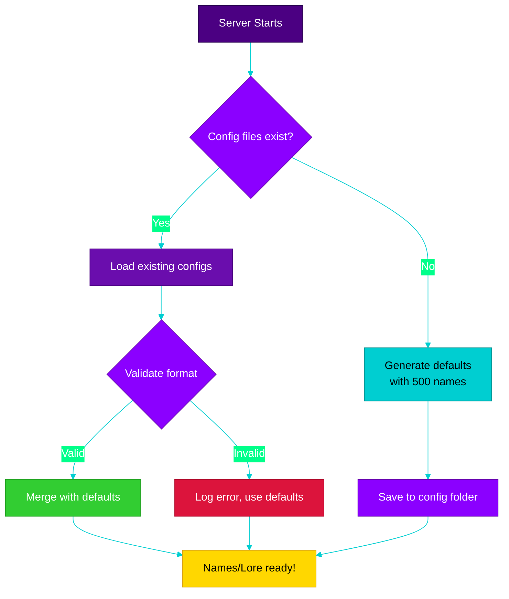

### Adding Custom Names (User Guide)

1. Navigate to `config/rituals/soul_names.json`
2. Find the appropriate tool category
3. Add your names to the array:

```json
"sword": [
  "... existing names ...",
  "MyCustomSword",
  "AnotherCoolName",
  "ServerSpecialBlade"
]
```

4. Reload with `/rituals admin reload_soul_config`

### Name Generation Rules

When a soul is awakened, the name is selected:

1. **Check tool type** (sword, pickaxe, etc.)
2. **Random selection** from that tool's name pool
3. **Fallback** to "generic" pool if tool type has no names
4. **Uniqueness check** - avoid recent names on same server

---

## 🔧 Implementation Plan

### Phase 1: Ritual Foundation

```mermaid
%%{init: {'theme': 'base', 'themeVariables': { 'primaryColor': '#8b00ff', 'primaryTextColor': '#ffffff', 'primaryBorderColor': '#6a0dad', 'secondaryColor': '#00CED1', 'tertiaryColor': '#FF4500', 'lineColor': '#9932CC', 'textColor': '#ffffff', 'mainBkg': '#1a1a2e', 'sectionBkgColor': '#2F4F4F', 'sectionBkgColor2': '#4B0082', 'altSectionBkgColor': '#1a1a2e', 'gridColor': '#4B0082', 'todayLineColor': '#FFD700'}}}%%
gantt
    title Phase 1: Ritual Foundation
    dateFormat X
    axisFormat %s
    
    section Detection
    Create tool item tags          :a1, 0, 2
    Pattern detection function     :a2, after a1, 3
    Central item validation        :a3, after a1, 2
    
    section Activation
    Fire sacrifice integration     :b1, after a2, 2
    Soul awakening function        :b2, after b1, 3
    Initial data injection         :b3, after b2, 2
    
    section Visuals
    Activation particles           :c1, after b2, 2
    Sound effects                  :c2, after b2, 1
    Success messaging              :c3, after c1, 1
```

#### Files to Create

**Datapack Functions:**
```
data/rituals/function/ritual/patterns/star/
├── detect_soul_embodiment.mcfunction     # Pattern detection
├── check_central_tool.mcfunction         # Validate tool item
├── activate_soul_embodiment.mcfunction   # Awakening logic
└── awaken_item.mcfunction                # Apply soul data

data/rituals/function/soul/
├── initialize.mcfunction                 # Setup scoreboards/storage
├── generate_name.mcfunction              # Random soul name
└── create_lore.mcfunction                # Build initial tooltip
```

**Item Tags:**
```
data/rituals/tags/item/
├── awakeable_tools.json      # All valid tool types
├── soul_swords.json          # Sword variants
├── soul_pickaxes.json        # Pickaxe variants
├── soul_axes.json            # Axe variants
└── soul_all.json             # Combined tag
```

### Phase 2: XP Tracking System

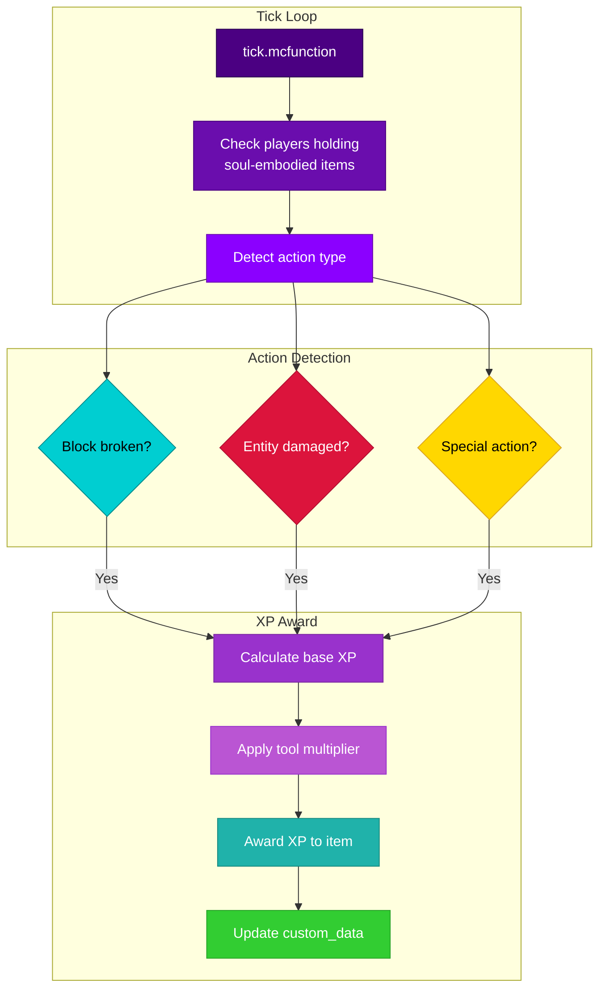

#### Files to Create

**Datapack Functions:**
```
data/rituals/function/soul/
├── tick.mcfunction                 # Main tick loop for soul items
├── detect_action.mcfunction        # Identify what player is doing
├── award_xp.mcfunction             # Add XP to item
├── check_level_up.mcfunction       # Threshold checks
├── apply_level_up.mcfunction       # Level transition
└── actions/
    ├── mining.mcfunction           # Block break XP
    ├── combat.mcfunction           # Damage XP
    ├── chopping.mcfunction         # Wood XP
    ├── digging.mcfunction          # Dirt/sand XP
    ├── harvesting.mcfunction       # Crop XP
    └── ranged.mcfunction           # Bow/crossbow XP
```

**Advancements (Hidden Trackers):**
```
data/rituals/advancement/soul/
├── track_mining.json       # Triggers on block break
├── track_combat.json       # Triggers on entity hurt
└── track_harvest.json      # Triggers on crop harvest
```

### Phase 3: Dynamic Tooltip Updates

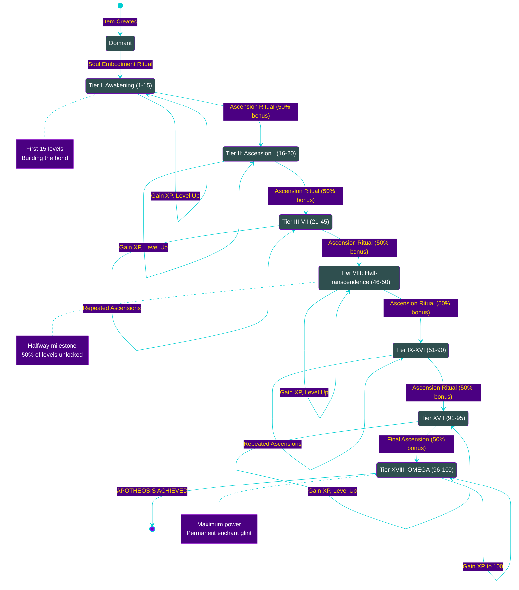

#### Tooltip Update Mechanism

**Challenge**: Minecraft's datapack system cannot directly modify held items' NBT in a player's inventory without item replacement.

**Solutions:**

1. **Mod-Assisted (Preferred for Fabric wrapper)**
   - Fabric mod listens for XP threshold events
   - Directly modifies item component in player's inventory
   - Instant, seamless tooltip updates

2. **Datapack-Only (Pure datapack compatibility)**
   - Store pending updates in storage
   - When item placed on totem/anvil, refresh tooltip
   - Use advancement rewards with `item` type to replace
   - Slight delay but no mod dependency

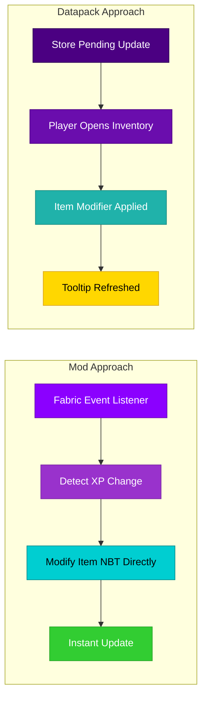

### Phase 4: Fabric Mod Integration

#### Mod Enhancements

```java
// SoulWeaponManager.java
public class SoulWeaponManager {
    // Track soul items and update tooltips in real-time
    public void onItemUsed(PlayerEntity player, ItemStack stack);
    public void updateSoulLore(ItemStack stack, int level, int xp);
    public String generateSoulName();
}

// Commands
/rituals soul info          - Show soul item stats
/rituals soul rename <name> - Rename your soul weapon
/rituals soul leaderboard   - Top soul weapons on server
```

#### New Commands (Mod)

| Command | Description | Permission |
|---------|-------------|------------|
| `/rituals soul info` | Display detailed soul stats | Player |
| `/rituals soul rename <name>` | Rename soul item (1x per level) | Player |
| `/rituals soul leaderboard` | Server-wide top souls | Player |
| `/rituals admin soul reset <player>` | Reset a player's soul item | Admin |
| `/rituals admin soul setlevel <level>` | Set soul level (debug) | Admin |

---

## 🎨 Visual & Audio Design

### Particle Effects

| Event | Particle | Color | Description |
|-------|----------|-------|-------------|
| Awakening | `soul_fire_flame` + `enchant` | Purple/Blue | Swirling soul energy |
| Level Up | `totem_of_undying` | Multi | Celebration burst |
| XP Gain | `enchanted_hit` | Green | Subtle feedback |
| Max Level | `end_rod` + `dragon_breath` | Gold/Purple | Permanent aura |

### Sound Effects

| Event | Sound | Pitch |
|-------|-------|-------|
| Awakening | `entity.wither.spawn` | 0.5 |
| Level Up | `entity.player.levelup` | 1.0 + (level * 0.1) |
| XP Gain | `entity.experience_orb.pickup` | 1.5 |
| Max Level | `ui.toast.challenge_complete` | 1.0 |

---

## 🧩 Modded Tool Support

### Extensibility Design

The system is designed to easily support modded tools:

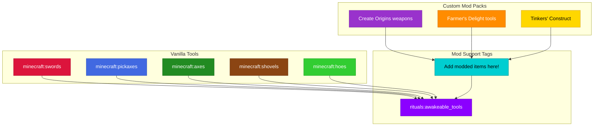

### Adding Modded Tool Support

Server admins can add modded tools by editing:

```json
// data/rituals/tags/item/awakeable_tools.json
{
  "replace": false,
  "values": [
    "#minecraft:swords",
    "#minecraft:pickaxes",
    "#minecraft:axes",
    "#minecraft:shovels",
    "#minecraft:hoes",
    "#minecraft:tridents",
    "minecraft:bow",
    "minecraft:crossbow",
    // Add modded items below:
    "create:wrench",
    "farmersdelight:netherite_knife",
    "origins:orb_of_origin"
  ]
}
```

---

## ⚠️ Technical Considerations

### Performance

| Concern | Mitigation |
|---------|------------|
| Tick overhead | Only check players holding soul items (not all players) |
| NBT operations | Batch updates, only write on significant changes |
| Entity scanning | Use efficient selectors with `nbt` predicates |

### Edge Cases

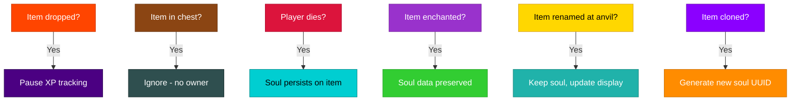

### Data Persistence

- All soul data stored in `custom_data` component
- Survives: death, ender chest, shulker boxes, item frames
- Soul UUID prevents duplication exploits
- Level/XP validated on every access

---

## 📁 Complete File Structure

```
data/rituals/
├── function/
│   ├── ritual/
│   │   └── patterns/
│   │       └── star/
│   │           ├── detect_soul_embodiment.mcfunction
│   │           ├── check_central_tool.mcfunction
│   │           ├── activate_soul_embodiment.mcfunction
│   │           ├── detect_soul_ascension.mcfunction
│   │           └── activate_ascension.mcfunction
│   │
│   └── soul/
│       ├── init.mcfunction
│       ├── tick.mcfunction
│       ├── awaken_item.mcfunction
│       ├── generate_name.mcfunction
│       ├── award_xp.mcfunction
│       ├── check_level_up.mcfunction
│       ├── check_ready_ascend.mcfunction
│       ├── apply_ascension.mcfunction
│       ├── roll_bonus_enchant.mcfunction
│       ├── apply_bonus_enchant.mcfunction
│       ├── update_lore.mcfunction
│       ├── create_lore.mcfunction
│       ├── load_config.mcfunction
│       ├── actions/
│       │   ├── mining.mcfunction
│       │   ├── combat.mcfunction
│       │   ├── chopping.mcfunction
│       │   ├── digging.mcfunction
│       │   ├── harvesting.mcfunction
│       │   └── ranged.mcfunction
│       └── lib/
│           ├── get_level_title.mcfunction
│           ├── get_tier_name.mcfunction
│           ├── get_xp_threshold.mcfunction
│           └── calculate_level_cap.mcfunction
│
├── tags/
│   └── item/
│       ├── awakeable_tools.json
│       ├── soul_swords.json
│       ├── soul_pickaxes.json
│       ├── soul_axes.json
│       ├── soul_shovels.json
│       ├── soul_hoes.json
│       ├── soul_ranged.json
│       └── soul_embodied.json
│
├── advancement/
│   ├── guide/
│   │   └── soul_embodiment.json
│   └── hidden/
│       └── soul/
│           ├── first_awakening.json
│           ├── first_ascension.json
│           ├── level_25.json
│           ├── level_50.json
│           ├── level_75.json
│           ├── level_100.json
│           ├── bonus_enchant.json
│           └── all_bonuses.json
│
└── predicate/
    ├── holding_soul_item.json
    ├── soul_ready_ascend.json
    └── soul_at_max.json

config/rituals/
├── soul_names.json              # 500+ soul names (user-editable)
├── soul_lore.json               # Personality quotes by era
├── soul_titles.json             # 100 level titles
└── soul_settings.json           # System configuration

src/main/java/com/rituals/
├── soul/
│   ├── SoulWeaponManager.java
│   ├── SoulData.java
│   ├── SoulAscensionHandler.java
│   ├── SoulBonusEnchant.java
│   ├── SoulNameGenerator.java
│   ├── SoulTooltipBuilder.java
│   └── SoulConfigLoader.java
└── commands/
    ├── SoulCommands.java
    └── SoulAdminCommands.java
```

---

## 🔗 Navigation

- **[← Back to Documentation Index](README.md)**
- **[← Back to Main README](../README.md)**
- **[🔮 Pattern Rituals Guide](PATTERN_RITUALS_GUIDE.md)** - Multi-totem patterns
- **[🔥 Fire Sacrifice Guide](FIRE_SACRIFICE_GUIDE.md)** - Ritual activation
- **[📦 Installation Guide](INSTALLATION.md)** - Setup instructions

---

## ✅ Implementation Checklist

- [x] **Phase 1: Ritual Foundation (Awakening)** ✅ COMPLETE
  - [x] Create `awakeable_tools.json` item tag
  - [x] Create `detect_soul_embodiment.mcfunction`
  - [x] Create `check_central_tool.mcfunction` (integrated into detect)
  - [x] Create `activate_soul_embodiment.mcfunction`
  - [x] Create `awaken_item.mcfunction`
  - [x] Add to `detect_central_ritual.mcfunction`
  - [x] Set initial level cap to 15
  - [ ] Test ritual activation

- [x] **Phase 2: XP Tracking (100 Levels)** ✅ COMPLETE
  - [x] Create `soul/init.mcfunction` (scoreboards/storage)
  - [x] Create `soul/tick.mcfunction`
  - [x] Create action detection functions (`check_player_action.mcfunction`)
  - [x] Create `award_xp.mcfunction`
  - [x] Create `check_level_up.mcfunction`
  - [x] Implement quadratic XP curve for 100 levels (in `init.mcfunction`)
  - [x] Add level cap enforcement
  - [x] Create `mark_ready_ascend.mcfunction`
  - [ ] Test XP accumulation with caps

- [x] **Phase 3: Ascension Ritual System** ✅ COMPLETE
  - [x] Create `detect_soul_ascension.mcfunction`
  - [x] Create `activate_soul_ascension.mcfunction`
  - [x] Implement tier increment (+5 levels)
  - [x] Add 50% bonus enchantment roll
  - [x] Create `apply_bonus_enchant.mcfunction`
  - [x] Ascension history tracked in item NBT
  - [ ] Test full ascension flow (Tier 1→18)

- [x] **Phase 4: Dynamic Tooltips** ✅ COMPLETE
  - [x] Create `names/generate.mcfunction`
  - [x] Create `lore/generate.mcfunction`
  - [x] Create `lore/update_tooltip.mcfunction`
  - [x] Add "Ready to Ascend" state display
  - [x] Add bonus enchant display
  - [x] Add tier/cap display
  - [ ] Test all tooltip states

- [x] **Phase 5: Config System** ✅ COMPLETE
  - [x] Create config file structure (`config/rituals/`)
  - [x] Create `soul_settings.json`
  - [x] Create `soul_names.json` (500+ names)
  - [x] Create `soul_lore.json`
  - [x] Create `soul_titles.json`
  - [x] Config reload via `/rituals config reload`
  - [x] Hot-reload supported by existing system

- [x] **Phase 6: Fabric Mod Integration** ✅ COMPLETE
  - [x] Create `SoulWeaponManager.java`
  - [x] Real-time XP tracking via events
  - [x] Real-time tooltip updates
  - [x] Create `SoulCommands.java`
  - [x] Add `/rituals soul` commands (`info`, `rename`)
  - [x] Config reload via `/rituals config reload`

- [x] **Phase 7: Polish & Content** ✅ COMPLETE
  - [x] Add particles and sounds for ascension
  - [x] Create advancements (first soul, level 50, level 100)
  - [x] Update guidebook with soul system
  - [x] Documentation updates (SOUL_EMBODIMENT_PLAYER_GUIDE.md)

- [x] **Phase 8: Names & Lore Content** ✅ COMPLETE
  - [x] Generate 500+ immersive soul names (per tool type)
  - [x] Write lore quotes for Awakening era (1-15)
  - [x] Write lore quotes for Growth era (16-30)
  - [x] Write lore quotes for Maturity era (31-50)
  - [x] Write lore quotes for Mastery era (51-70)
  - [x] Write lore quotes for Transcendence era (71-90)
  - [x] Write lore quotes for Apotheosis era (91-100)
  - [x] Write ascension quotes (ready/success/bonus)
  - [x] Final review & testing ✅

---

## ⚡ Soul Buffs & Debuffs System

When a soul weapon levels up, it gains a **random buff**! There's also a **30% chance** to receive a debuff as a balancing cost. These effects are active while the soul weapon is held.

### ⚔️ STACKING MECHANIC

**Buffs and debuffs can STACK!** If you roll the same buff/debuff multiple times:

- **Stackable effects** (Haste, Glow, Magnetic, Reach, Repair, Lucky, Swift, Strong, Tough, etc.) will **UPGRADE** and become more powerful
- **Non-stackable effects** (Fractured, Chatty, Reserved) can only occur once
- Each stack typically adds **+1 to the effect's level**, making it more potent
- This creates potential for **wacky combinations** - imagine a weapon with Soul Speed III, Soul Strength V, AND Magnetic Pull II!

**Max Stack Examples:**
| Buff | Per Stack | Max Stacks | At Max |
|------|-----------|------------|--------|
| Soul Haste | +10% mining speed | 3 | +30% total |
| Soul Strength | +0.5 attack damage | 4 | +2 damage |
| Magnetic Pull | +2 block radius | 2 | 7 block pull |
| Soul Speed | +3% movement | 3 | +9% speed |

### ⚔️ BUFF/DEBUFF INCOMPATIBILITIES

Certain buffs and debuffs **cannot coexist** on the same weapon. If you roll an incompatible effect, it will be **blocked**:

| Effect | Incompatible With | Reason |
|--------|-------------------|--------|
| Swift | Heavy | Movement bonuses cancel out |
| Lucky | Unlucky | Luck bonuses cancel out |
| Repair/Unbreaking | Fragile | Durability effects conflict |
| Saturation | Hungry | Hunger effects conflict |
| Reserved | Chatty | Personality traits conflict |
| Fire Resist | Soulfire, Waterbreath | Elemental conflicts |

**Strategy:** Having a buff **protects** you from getting its opposing debuff!

### 🟢 Available Buffs (20 Total) - BALANCED

| Buff | Effect | Max Level | Type | Incompatible With |
|------|--------|-----------|------|-------------------|
| **Soul Haste** | +10% mining speed per level | 3 | Attribute | — |
| **Soul Sight** | Nearby entities glow (10 blocks) | 1 | Special | — |
| **Magnetic Pull** | Items attracted (5/7 blocks) | 2 | Special | — |
| **Extended Reach** | +0.5 block range per level | 3 | Attribute | — |
| **Soul Mending** | 0.5% chance/tick to repair per level | 3 | Special | Fragile |
| **Fortune's Favor** | +0.5 luck per level | 2 | Attribute | Unlucky |
| **Soul Speed** | +3% movement speed per level | 3 | Attribute | Heavy |
| **Soul Strength** | +0.5 attack damage per level | 4 | Attribute | — |
| **Soul Armor** | +1 armor per level | 3 | Attribute | — |
| **Featherweight** | Jump Boost I | 1 | Potion | — |
| **Soul Flame** | 10% ignite chance per level | 2 | Special | Fire Resist |
| **Soul Leech** | 5% damage healed per level | 2 | Special | — |
| **Soul Wisdom** | +10% XP per level | 2 | Special | — |
| **Soul Harvest** | Extra drops (Looting I per level) | 2 | Special | — |
| **Eternal Edge** | 25% less durability loss per level | 2 | Special | Fragile |
| **Dark Vision** | Night Vision (15s refresh) | 1 | Potion | — |
| **Aquatic Soul** | Water Breathing (10s refresh) | 1 | Potion | Fire Resist |
| **Flame Ward** | Fire Resistance (10s refresh) | 1 | Potion | Waterbreath, Soulfire |
| **Soul Sustenance** | Tiny saturation chance | 2 | Special | Hungry |
| **Reserved Soul** | Soul speaks less (8-75 min) | 1 | Personality | Chatty |

### 🔴 Available Debuffs (11 Total, 30% Chance) - BALANCED

| Debuff | Effect | Max Level | Type | Incompatible With |
|--------|--------|-----------|------|-------------------|
| **Ravenous Soul** | 0.25%/tick hunger per level | 2 | Special | Saturation |
| **Burdened** | -3% movement per level | 2 | Attribute | Swift |
| **Cursed Aura** | Rare Bad Omen (~5 min avg) | 1 | Special | — |
| **Brittle Edge** | +25% durability loss per level | 2 | Special | Repair, Unbreaking |
| **Restless Soul** | Alerts nearby mobs | 1 | Special | — |
| **Clumsy Grip** | Mining fatigue chance | 2 | Special | — |
| **Misfortune** | -0.5 luck per level | 2 | Attribute | Lucky |
| **Soul Hunger** | +20% XP needed per level | 2 | Special | — |
| **Paranoid Soul** | Random spooky sounds (~1/min) | 1 | Special | — |
| **Bloodthirst** | 1 damage/30s if no combat | 1 | Special | — |
| **Chatty Soul** | Soul speaks more (2-35 min) | 1 | Personality | Reserved |

### ⚠️ CATASTROPHIC: Fractured Soul (10% Chance)

> **WARNING:** This is a PERMANENT, devastating debuff that cannot be undone!

On each level up, there is a **10% chance** that the soul will **FRACTURE**. When this happens:

| Effect | Description |
|--------|-------------|
| **Permanent** | Cannot be removed by any means |
| **No Ascension** | The weapon can NEVER increase its maximum level |
| **Frozen Tier** | Stuck at current tier forever |
| **The soul is broken** | Dramatic audio/visual effects announce the tragedy |

**Lore Implication:** The soul pushed too hard, too fast, and shattered under the strain. The weapon is forever marked by this catastrophe. Some say a fractured weapon weeps in the dead of night...

**Strategic Note:** High-risk, high-reward! Players who want to push their weapons to maximum potential must accept this 10% chance of permanent loss each time they level up. This creates meaningful tension and makes each level-up a gamble.

### Effect Application

- **Attributes** are applied via attribute modifiers and removed when item is unequipped
- **Potions** are applied every tick with short duration (seamless while held)
- **Special** effects have custom implementations per buff type

### Configuration

Buff and debuff chances can be configured in `config/rituals/soul_settings.json`.

### 🔧 Vanilla Enchantment Compatibility

**Soul weapons are FULLY COMPATIBLE with vanilla Minecraft enchantments!**

You can freely:
- ✅ Enchant soul weapons at an enchanting table
- ✅ Apply enchanted books on an anvil
- ✅ Combine soul weapons with other enchanted items
- ✅ Use grindstones to remove enchantments (soul data preserved)
- ✅ Repair soul weapons on anvils

**Technical Details:**
- Soul data is stored in the `minecraft:custom_data` component
- Vanilla enchantments are stored in the separate `minecraft:enchantments` component
- Our system **only modifies** `custom_data`, `custom_name`, and `lore` - never touching enchantments
- This means a Soul Weapon can have **both** soul buffs AND vanilla enchantments like Sharpness V + Fire Aspect II + Soul Strength III!

---

## 🔮 Scrying Glass - Portable Soul Sync

The **Scrying Glass** is a special item that allows syncing soul weapon progress without needing a totem!

### Crafting Recipe

```
    [A]
  [A][S][A]
    [A]

A = Amethyst Shard
S = Spyglass
```

### How to Use

1. Hold your **Soul Weapon** in your **OFFHAND**
2. Hold the **Scrying Glass** in your **MAINHAND**
3. **Look through the glass** (right-click and hold like normal spyglass)
4. Soul syncs automatically!

### Properties

| Property | Value |
|----------|-------|
| Uses | 5 per glass |
| Base Item | Vanilla Spyglass |
| Custom Data | `rituals_scrying_glass: 1b` |
| Use Tracking | `scrying_uses: 5` (decrements) |

### Technical Details

- Detects `using_item: 1b` on player entity
- Checks for soul weapon in offhand slot (-106)
- Modifies offhand item NBT directly
- Triggers level up and buff rolls
- Glass breaks when uses reach 0

---

## 💬 Soul Comments System

Soul weapons will occasionally speak to their wielders with quirky comments! This adds personality and atmosphere.

### How It Works

- Random cooldown between comments: **5-60 minutes** (6000-72000 ticks)
- **Reserved Soul** buff: Extends to **8-75 minutes** (quieter, more introspective)
- **Chatty Soul** debuff: Reduces to **2-35 minutes** (more talkative, annoying?)
- Comments are context-aware (mining, combat, general)
- 150+ unique comments across 10 categories

### Comment Categories

| Category | Count | Theme |
|----------|-------|-------|
| General | 20 | Random musings |
| Mining | 15 | Tool-specific observations |
| Philosophical | 15 | Deep thoughts |
| Sarcastic | 15 | Dry humor |
| Encouraging | 15 | Positive reinforcement |
| Creepy | 15 | Dark/unsettling |
| Random | 15 | Non-sequiturs |
| Meta | 15 | Fourth-wall breaking |
| Compliments | 15 | Player praise |
| Combat | 15 | Battle cries |

### Customization

Comments can be customized in `config/soul_comments.json`. The file is organized by category for easy editing. You can add, remove, or modify phrases as desired.

---

**May your weapons awaken and your souls burn bright, young ritualist!** ⚔️✨🔮

