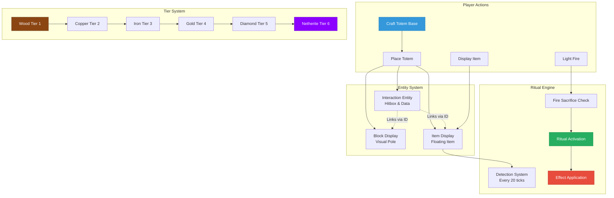
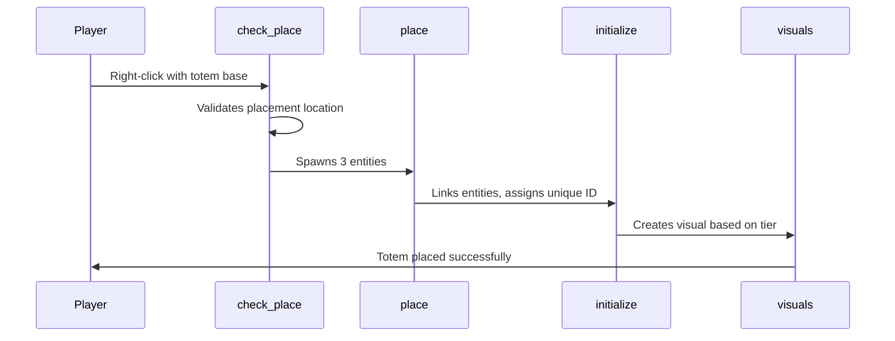
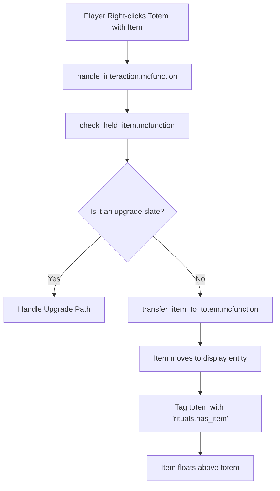
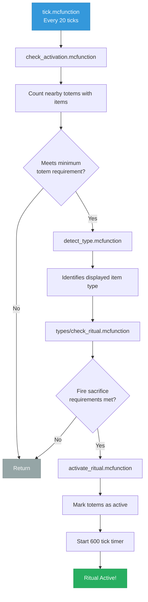
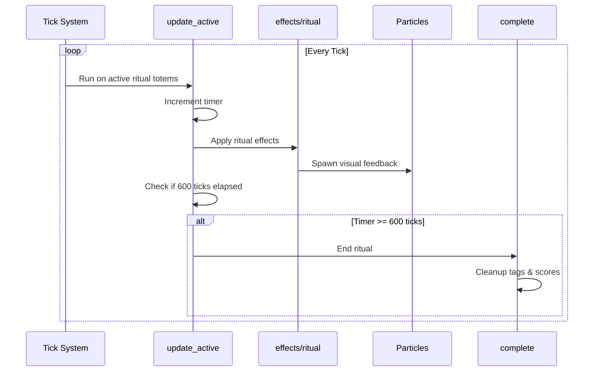

# Totem Rituals - System Overview

Complete technical overview of how everything works! 🧙‍♂️

## Core Concept

Players craft mystical totem bases, place them in the world, display items on them, and powerful rituals activate! Single-totem mode is enabled by default, but you can configure it to require multiple totems.

### System Architecture Overview



---

## System Components

### 1. Totem Bases (Items)
- **Item Type**: Warped Fungus on a Stick (with `custom_model_data`)
- **6 Tiers**: Wood (1), Copper (2), Iron (3), Gold (4), Diamond (5), Netherite (6)
- **Placement**: Right-click on ground
- **Visual in Hand**: Custom model (via resource pack)

### 2. Placed Totems (Entities)
Each placed totem consists of **3 entities**:
1. **Interaction Entity** (`interaction`) - Hitbox, data storage, main controller
2. **Block Display** (`block_display`) - Visual stone wall pole
3. **Item Display** (`item_display`) - Floating item on top

All linked by unique ID stored in `rituals.id` scoreboard

### 3. Ritual System
- **Detection**: Checks every 20 ticks for 1+ totems with same item
- **Range**: 32 blocks between totems (for multi-totem mode)
- **Single-Totem Mode**: Enabled by default (configurable)
- **Duration**: 600 ticks (30 seconds)
- **Effect Area**: Tier-based ranges from 2×2×6 (Wood) to 7×7×16 (Netherite)
- **Power Scaling**: Higher tiers have larger ranges and stronger/faster effects

### 4. Upgrade System
- **Slates**: Crafted with paste + totem base
- **Usage**: Right-click placed totem with slate
- **Validation**: Checks tier difference = exactly +1
- **Visual Update**: Replaces block_display with new tier

---

## Technical Architecture

### Scoreboards
```
rituals.data     - Constants and global values
rituals.timer    - Cooldowns and durations
rituals.tier     - Totem tier (1-3)
rituals.effect   - Active ritual type (1-5)
rituals.temp     - Temporary calculations
rituals.id       - Entity linking system
```

### Entity Tags
```
rituals.totem              - Main interaction entity
rituals.totem_visual       - Block display visual
rituals.totem_display      - Item display holder
rituals.has_item           - Totem with displayed item
rituals.active_ritual      - Totem in active ritual
rituals.[type]_ritual      - Specific ritual type marker
```

### Custom Data Structure
```json
{
  "rituals_totem": 1,        // Marks totem base items
  "totem_tier": 1-3,         // Tier level
  "rituals_paste": 1,        // Marks paste items
  "rituals_upgrade": 1,      // Marks upgrade slates
  "upgrade_to_tier": 2-3     // Target tier for upgrade
}
```

---

## Data Flow

### Totem Placement



### Item Display



### Ritual Activation Flow



### Ritual Effects Application



### Totem Upgrade Process


---

## Performance Optimizations

1. **Tick Optimization**: Checks run every 20 ticks, not every tick
2. **Conditional Execution**: Early returns prevent unnecessary processing
3. **Targeted Selectors**: Specific entity tags reduce search scope
4. **Box Selectors**: `dx/dy/dz` more efficient than `distance=..`
5. **Entity Linking**: ID system prevents scanning all entities

---

## Visual Tiers

### Wood (Tier 1)
- **Range**: 2×2 horizontal, 3 up/down
- **Particles**: Minimal
- **Power**: Basic

### Copper (Tier 2)
- **Range**: 3×3 horizontal, 4 up/down
- **Particles**: Copper-colored
- **Power**: Improved

### Iron (Tier 3)
- **Range**: 4×4 horizontal, 5 up/down
- **Particles**: Silver dust
- **Power**: Strong

### Gold (Tier 4)
- **Range**: 5×5 horizontal, 6 up/down
- **Particles**: Golden dust
- **Power**: Very Strong

### Diamond (Tier 5)
- **Range**: 6×6 horizontal, 7 up/down
- **Particles**: Cyan dust
- **Power**: Powerful

### Netherite (Tier 6)
- **Range**: 7×7 horizontal, 8 up/down
- **Particles**: Purple dust
- **Power**: Maximum

---

## Ritual Effects Detailed

### Growth (Emerald)
- **Frequency**: 300 to 60 ticks based on tier (15s to 3s)
- **Action**: Random block in tier-based range, 30% chance
- **Targets**: Crops (wheat, carrot, potato, beetroot, cocoa, berries, stems)
- **Scaling**: Faster checks at higher tiers

### Strength (Diamond)
- **Frequency**: 40 to 15 ticks based on tier (2s to 0.75s)
- **Buffs**: Strength + Resistance
- **Targets**: Players in tier-based range
- **Scaling**: Level increases with tier

### Prosperity (Gold)
- **Frequency**: Every 20 ticks
- **Action**: Pull items, spawn XP
- **Targets**: Items in 5×5×6 box
- **Scaling**: Pull speed increases with tier

### Protection (Iron)
- **Frequency**: Every 20 ticks
- **Damage**: 2/3/4 per second
- **Targets**: Hostile mobs in 5×5×6 box
- **Scaling**: Damage increases with tier

### Healing (Nether Star)
- **Frequency**: Every 40 ticks
- **Effect**: Regeneration (+ Absorption at tier 3)
- **Targets**: Players and animals in 5×5×6 box
- **Scaling**: Level increases with tier

---

## File Structure

### Datapack
```
data/rituals/
├── function/
│   ├── load.mcfunction
│   ├── tick.mcfunction
│   ├── give/          (Item distribution)
│   ├── totem/         (Placement, interaction)
│   ├── ritual/        (Detection, effects)
│   └── admin/         (Management tools)
├── recipe/            (Crafting)
├── predicate/         (Conditions)
├── item_modifier/     (Item manipulation)
└── tags/              (Entity/item groups)
```

### Resource Pack
```
resourcepack/
├── pack.mcmeta
└── assets/
    ├── minecraft/models/item/    (Vanilla overrides)
    └── rituals/
        ├── models/item/           (Custom models)
        └── textures/item/         (Custom textures)
```

---

## Expansion Points

The system is designed to be easily expandable:

1. **New Rituals**: Add to `detect_type.mcfunction`
2. **New Tiers**: Add tier 4+ with new visuals
3. **Range Upgrades**: Modify box size in effect functions
4. **New Items**: Add recipes with custom_data tags
5. **Multi-Item Rituals**: Check multiple item types

---

**For implementation details, see the inline comments in each function file!** 📚

