# Soul Embodiment System - Technical Design Document

**Version:** 1.0.0  
**Target:** Minecraft 1.21.11  
**Platform:** Datapack + Optional Fabric Mod  

---

## 1. Executive Summary

The Soul Embodiment system transforms vanilla Minecraft tools and weapons into persistent, leveling "living items" that track player actions via vanilla statistics, accumulate experience, and gain randomized buffs/debuffs through a progression system spanning 100 levels across 18 ascension tiers.

This document provides complete technical specifications for developers, server administrators, and contributors.

---

## 2. System Architecture

### 2.1 High-Level Overview


### 2.2 Data Flow


---

## 3. Data Storage Schema

### 3.1 Item Custom Data Structure

```json
{
  "minecraft:custom_data": {
    // Core identification
    "soul_embodied": true,
    "soul_type": "sword",
    
    // Identity
    "soul_name": "Grimfang",
    "soul_display_name": "Grimfang",
    
    // Progression
    "soul_level": 47,
    "soul_xp": 12850,
    "soul_xp_total": 98420,
    "soul_ascension_tier": 7,
    "soul_level_cap": 50,
    
    // Buff/Debuff tracking
    "soul_buff_levels": {
      "haste": 2,
      "strength": 3,
      "magnetic": 1
    },
    "soul_debuff_levels": {
      "hungry": 1
    },
    
    // State flags
    "soul_ready_ascend": false,
    "soul_fractured": false,
    
    // Statistics
    "soul_kills": 2847,
    "soul_blocks_broken": 15420
  }
}
```

### 3.2 Scoreboard Objectives

| Objective | Type | Purpose |
|-----------|------|---------|
| `rituals.soul_xp_gain` | dummy | Pending XP to sync |
| `rituals.soul_holder` | dummy | Marks soul item holders |
| `rituals.pickaxe_mined` | dummy | Running total for pickaxe |
| `rituals.shovel_mined` | dummy | Running total for shovel |
| `rituals.axe_mined` | dummy | Running total for axe |
| `rituals.hoe_mined` | dummy | Running total for hoe |
| `rituals.sword_kills` | dummy | Running total for sword |
| `rituals.prev_mined` | dummy | Previous value for delta |
| `rituals.soul_speak_cd` | dummy | Comment cooldown timer |
| `rituals.m_*` | minecraft.mined:* | 500+ block tracking |
| `rituals.k_*` | minecraft.killed:* | 50+ mob tracking |

### 3.3 Storage Namespace

```
rituals:soul
├── level_thresholds[]     # XP required per level (100 entries)
├── tier_caps[]            # Level cap per tier [15,20,25,...,100]
├── fallback_names[]       # Default soul names
├── bonus_chance           # Ascension bonus % (default: 50)
└── xp_values{}            # Base XP multipliers

rituals:temp
├── soul_type              # Current operation soul type
├── lore_level             # Level for lore generation
└── buff_roll              # Random roll result
```

---

## 4. XP Tracking System

### 4.1 Statistics-Based Tracking

The system uses vanilla `minecraft.mined:*` and `minecraft.killed:*` statistics instead of durability tracking. This ensures:
- Unbreaking enchantment doesn't slow XP gain
- Netherite tools gain XP at the same rate as iron
- Accurate tracking even with efficiency enchantments

### 4.2 Block XP Mapping


#### Pickaxe Blocks (400+ blocks tracked)

| Category | XP Value | Examples |
|----------|----------|----------|
| Basic Stone | 1 | Stone, Cobblestone, Deepslate variants |
| Processed Stone | 1 | Bricks, Terracotta, Concrete |
| Prismarine/Quartz | 2 | All prismarine variants, quartz blocks |
| End Blocks | 2 | End stone, Purpur |
| Coal/Copper Ore | 2 | Including deepslate variants |
| Iron Ore | 3 | Including deepslate variants |
| Redstone/Quartz Ore | 3 | Nether quartz ore |
| Gold/Lapis Ore | 4 | Including nether gold |
| Diamond Ore | 10 | Including deepslate variants |
| Emerald Ore | 12 | Including deepslate variants |
| Ancient Debris | 25 | Netherite source |
| Obsidian | 3 | Regular and crying |

#### Mob XP Mapping (50+ mobs tracked)

| Tier | XP Value | Examples |
|------|----------|----------|
| Passive | 2 | Pig, Cow, Sheep, Chicken |
| Common | 5 | Zombie, Skeleton, Spider, Creeper |
| Uncommon | 10 | Enderman, Witch, Piglin |
| Dangerous | 15 | Blaze, Ghast, Wither Skeleton |
| Elite | 25 | Evoker, Ravager, Elder Guardian |
| Warden | 100 | Ancient City guardian |
| Boss | 500 | Wither, Ender Dragon |

### 4.3 Delta Calculation

```mcfunction
# Calculate XP gained since last check
scoreboard players operation @s rituals.pickaxe_mined = #total rituals.soul_temp
scoreboard players operation #xp_gain rituals.soul_temp = @s rituals.pickaxe_mined
scoreboard players operation #xp_gain rituals.soul_temp -= @s rituals.prev_mined

# Award XP if positive delta
execute if score #xp_gain rituals.soul_temp matches 1.. run function rituals:soul/award_xp
scoreboard players operation @s rituals.prev_mined = @s rituals.pickaxe_mined
```

---

## 5. Leveling System

### 5.1 XP Curve Formula

```
XP_required(level) = base_xp × (level ^ 1.5) + (level × 50)
```

Where `base_xp = 100`

### 5.2 Level Thresholds

| Level | XP Required | Cumulative | Tier |
|-------|-------------|------------|------|
| 1 | 0 | 0 | 1 |
| 15 | 2,808 | 14,808 | 1 MAX |
| 20 | 3,944 | 24,944 | 2 |
| 50 | 11,221 | 122,221 | 8 |
| 75 | 16,894 | 218,394 | 13 |
| 100 | 28,631 | 420,631 | 18 MAX |

### 5.3 Tier Progression


---

## 6. Buff/Debuff System

### 6.1 Architecture

```mermaid
flowchart TD
    A[Level Up Triggered] --> B{Roll Buff}
    B --> C[Select Random Buff]
    C --> D{Already Have Buff?}
    D -->|No| E[Apply New Buff]
    D -->|Yes| F{At Max Stack?}
    F -->|No| G[Increment Stack Level]
    F -->|Yes| H[Re-roll Different Buff]
    
    A --> I{Roll Debuff<br/>30% chance}
    I -->|No| J[No Debuff]
    I -->|Yes| K[Select Random Debuff]
    K --> L{Check Incompatibility}
    L -->|Blocked| M[Debuff Blocked]
    L -->|OK| N{Already Have Debuff?}
    N -->|No| O[Apply New Debuff]
    N -->|Yes| P{At Max Stack?}
    P -->|No| Q[Increment Stack Level]
    P -->|Yes| R[Re-roll]
    
    A --> S{Roll Fracture<br/>10% chance}
    S -->|Yes| T[SOUL FRACTURED<br/>Permanent]
```



### 6.2 Buff Registry

| ID | Name | Max Level | Per Level | Type |
|----|------|-----------|-----------|------|
| `haste` | Soul Haste | 3 | +10% mining speed | Attribute |
| `glow` | Soul Sight | 1 | Glowing 10 blocks | Effect |
| `magnetic` | Magnetic Pull | 2 | +2 block radius | Special |
| `reach` | Extended Reach | 3 | +0.5 block reach | Attribute |
| `repair` | Soul Mending | 3 | 0.5% repair/tick | Special |
| `lucky` | Fortune's Favor | 2 | +0.5 luck | Attribute |
| `swift` | Soul Speed | 3 | +3% movement | Attribute |
| `strong` | Soul Strength | 4 | +0.5 attack damage | Attribute |
| `tough` | Soul Armor | 3 | +1 armor | Attribute |
| `jump` | Featherweight | 1 | Jump Boost I | Potion |
| `flame` | Soul Flame | 2 | 10% ignite chance | Special |
| `leech` | Soul Leech | 2 | 5% lifesteal | Special |
| `wisdom` | Soul Wisdom | 2 | +10% XP gain | Special |
| `harvest` | Soul Harvest | 2 | Looting I per level | Special |
| `unbreaking` | Eternal Edge | 2 | 25% less durability | Special |
| `nightvis` | Dark Vision | 1 | Night Vision (15s) | Potion |
| `waterbreath` | Aquatic Soul | 1 | Water Breathing (10s) | Potion |
| `fireresist` | Flame Ward | 1 | Fire Resist (10s) | Potion |
| `saturation` | Soul Sustenance | 2 | Tiny saturation | Special |
| `reserved` | Reserved Soul | 1 | 8-75 min comments | Personality |

### 6.3 Debuff Registry

| ID | Name | Max Level | Per Level | Type |
|----|------|-----------|-----------|------|
| `hungry` | Ravenous Soul | 2 | 0.25%/tick hunger | Special |
| `heavy` | Burdened | 2 | -3% movement | Attribute |
| `cursed` | Cursed Aura | 1 | Rare Bad Omen | Special |
| `fragile` | Brittle Edge | 2 | +25% durability loss | Special |
| `restless` | Restless Soul | 1 | Alerts nearby mobs | Special |
| `clumsy` | Clumsy Grip | 2 | Mining fatigue chance | Special |
| `unlucky` | Misfortune | 2 | -0.5 luck | Attribute |
| `xp_hungry` | Soul Hunger | 2 | +20% XP needed | Special |
| `paranoid` | Paranoid Soul | 1 | Random spooky sounds | Special |
| `bloodthirst` | Bloodthirst | 1 | 1 dmg/30s if no combat | Special |
| `chatty` | Chatty Soul | 1 | 2-35 min comments | Personality |

### 6.4 Incompatibility Matrix


---

## 7. File Structure

```
data/rituals/function/
├── soul/
│   ├── init.mcfunction              # System initialization
│   ├── tick.mcfunction              # Per-tick processing
│   ├── awaken_item.mcfunction       # Item transformation
│   ├── check_player_action.mcfunction # Route to tool handlers
│   ├── award_xp.mcfunction          # XP accumulation
│   ├── sync_from_totem.mcfunction   # Apply pending XP
│   ├── process_level_up.mcfunction  # Level threshold check
│   ├── do_level_up.mcfunction       # Apply level increase
│   ├── mark_ready_ascend.mcfunction # Cap reached flag
│   │
│   ├── actions/
│   │   ├── mining.mcfunction        # Pickaxe XP (400+ blocks)
│   │   ├── digging.mcfunction       # Shovel XP
│   │   ├── chopping.mcfunction      # Axe XP (blocks)
│   │   ├── harvesting.mcfunction    # Hoe XP
│   │   ├── combat.mcfunction        # Sword XP
│   │   ├── axe_combat.mcfunction    # Axe XP (mobs)
│   │   └── ranged.mcfunction        # Bow/Crossbow XP
│   │
│   ├── scoreboards/
│   │   ├── load.mcfunction          # Master loader
│   │   ├── pickaxe.mcfunction       # 400+ block objectives
│   │   ├── shovel.mcfunction        # Shovel block objectives
│   │   ├── axe.mcfunction           # Axe block objectives
│   │   ├── hoe.mcfunction           # Hoe block objectives
│   │   └── combat.mcfunction        # Mob kill objectives
│   │
│   ├── buffs/
│   │   ├── init.mcfunction          # Registry initialization
│   │   ├── roll_on_levelup.mcfunction
│   │   ├── roll_buff.mcfunction
│   │   ├── roll_debuff.mcfunction
│   │   ├── apply_buff.mcfunction
│   │   ├── apply_debuff.mcfunction
│   │   └── apply_effects.mcfunction # Apply held item effects
│   │
│   ├── lore/
│   │   ├── build_full.mcfunction    # Construct lore array
│   │   └── apply_full.mcfunction    # Write to item
│   │
│   ├── name/
│   │   ├── apply_display.mcfunction # Set custom_name
│   │   └── detect_anvil_rename.mcfunction
│   │
│   └── comments/
│       └── try_speak.mcfunction     # Random comment trigger
│
├── ritual/patterns/star/
│   ├── detect_soul_embodiment.mcfunction
│   ├── activate_soul_embodiment.mcfunction
│   ├── detect_soul_ascension.mcfunction
│   ├── activate_soul_ascension.mcfunction
│   └── route_soul_ritual.mcfunction
│
└── config/
    ├── load.mcfunction              # Main config loader
    └── soul_xp/
        ├── load.mcfunction          # XP config loader
        ├── pickaxe_blocks.mcfunction
        ├── shovel_blocks.mcfunction
        ├── axe_blocks.mcfunction
        └── hoe_blocks.mcfunction
```

---

## 8. Configuration

### 8.1 XP Rates

Located in `data/rituals/function/config/load.mcfunction`:

```mcfunction
# Base XP per action type
data modify storage rituals:soul xp_values set value {
    block_mined: 1,
    ore_mined: 5,
    mob_killed: 10,
    boss_killed: 100
}

# Ascension bonus chance (0-100)
data modify storage rituals:soul bonus_chance set value 50

# Debuff chance (0-100)  
data modify storage rituals:soul debuff_chance set value 30

# Fracture chance (0-100)
data modify storage rituals:soul fracture_chance set value 10
```

### 8.2 Block XP Configuration

Located in `data/rituals/function/config/soul_xp/*.mcfunction`:

```mcfunction
# Example: pickaxe_blocks.mcfunction
# Diamond ore = 10 XP
data modify storage rituals:soul_xp pickaxe.diamond_ore set value 10
data modify storage rituals:soul_xp pickaxe.deepslate_diamond_ore set value 10

# Ancient debris = 25 XP
data modify storage rituals:soul_xp pickaxe.ancient_debris set value 25
```

### 8.3 JSON Configs

Located in `config/rituals/`:

| File | Purpose |
|------|---------|
| `soul_names.json` | 500+ names per tool type |
| `soul_comments.json` | 150+ random comments |
| `soul_settings.json` | System parameters |

---

## 9. Performance Considerations

### 9.1 Optimizations Implemented

1. **Statistics-based tracking** - No per-tick durability checks
2. **Delta calculation** - Only process XP changes, not absolute values
3. **Cooldown-based comments** - Not probability per tick
4. **Batched lore updates** - Only on sync, not continuous
5. **Conditional tick execution** - Skip players without soul items

### 9.2 Tick Complexity

| Operation | Frequency | Complexity |
|-----------|-----------|------------|
| Soul holder check | Every tick | O(players) |
| XP tracking | Every tick (if holding) | O(1) per player |
| Lore update | On sync only | O(1) |
| Comment roll | Cooldown-based | O(1) |
| Buff effects | Every tick (if holding) | O(buffs) |

---

## 10. Compatibility

### 10.1 Vanilla Minecraft

- ✅ Enchanting table fully functional
- ✅ Anvil repairs preserve soul data
- ✅ Grindstone removes enchants, keeps soul
- ✅ Anvil renaming preserves decorators
- ✅ All vanilla enchantments compatible

### 10.2 Data Storage Isolation

```
Item Components:
├── minecraft:custom_data     ← Soul system uses ONLY this
├── minecraft:enchantments    ← Vanilla enchantments (untouched)
├── minecraft:custom_name     ← Formatted display name
├── minecraft:lore            ← Dynamic tooltip
└── minecraft:damage          ← Durability (untouched)
```

---

## 11. Known Limitations

1. **Item stacking** - Soul items cannot stack (unique data per item)
2. **Creative mode** - XP tracking uses survival statistics only
3. **Silk Touch mining** - Ore XP based on block broken, not drops
4. **Mob farms** - All kills count regardless of kill method
5. **Item cloning** - Duplicated items share soul identity (by design)

---

## 12. Future Enhancements

- [ ] Per-player soul weapon leaderboards
- [ ] Soul weapon trading/gifting system
- [ ] Custom particle effects for high-level souls
- [ ] Soul fusion (combine two soul weapons)
- [ ] Achievement system for soul milestones

---

## 13. References

- [Minecraft Wiki - Statistics](https://minecraft.wiki/w/Statistics)
- [Minecraft Wiki - Item Components](https://minecraft.wiki/w/Data_component_format)
- [Rituals Datapack Documentation](../README.md)

---

*Document maintained by the Rituals development team.*

