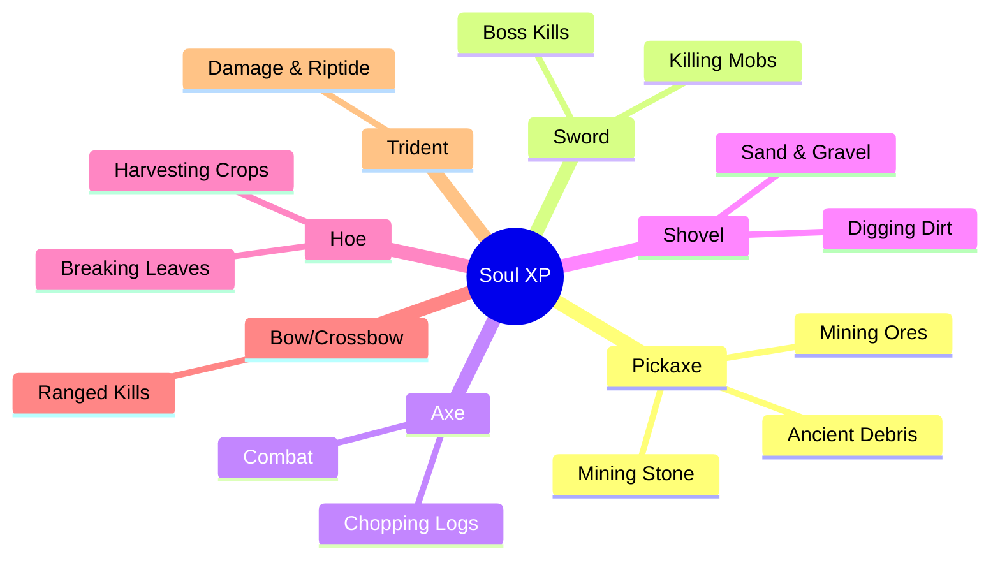
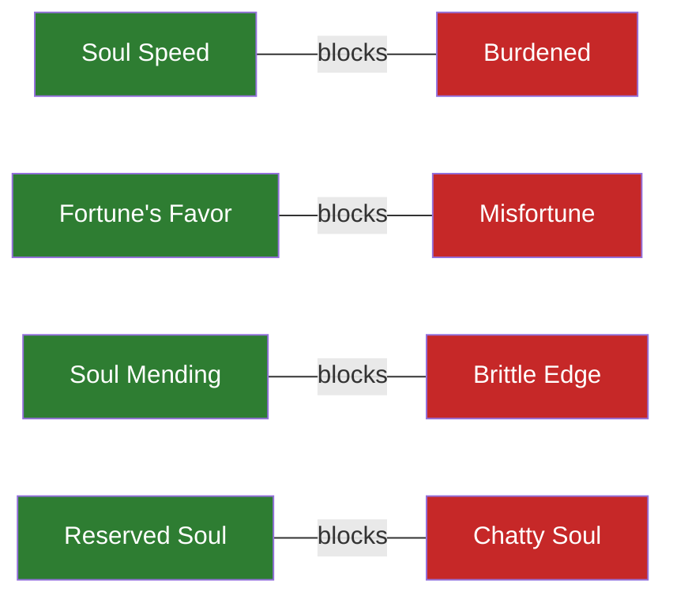
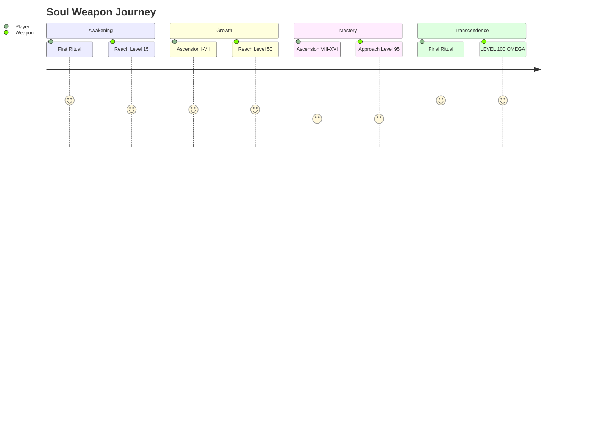

# 🔮 Soul Embodiment - Complete Player Guide

---

## 📖 What is Soul Embodiment?

**Soul Embodiment** is a magical ritual that transforms your ordinary Minecraft tools and weapons into **living items with souls**. Once awakened, these items:

- **Remember their history** with you
- **Grow stronger** as you use them
- **Develop unique personalities** and speak to you
- **Gain special powers** through random buffs

Think of it like having a sentient companion in your hand - your sword might call itself *"Grimfang"* and tell you *"I hunger for battle!"* after you've slain enough monsters together.

---

## 🌟 Quick Start Guide

### What You'll Need

| Item | Quantity | Where to Find It |
|------|----------|------------------|
| **Totems** | 5 | Craft using the Rituals recipe |
| **Soul Sand** | 1 | The Nether (soul sand valleys) |
| **Ender Pearl** | 1 | Kill Endermen |
| **Glowstone Dust** | 1 | The Nether |
| **Amethyst Shard** | 1 | Amethyst Geodes underground |
| **Your Tool/Weapon** | 1 | Whatever you want to awaken! |

### The Ritual Setup

Place 5 totems in a **star pattern** with your tool in the center:

```
                    NORTH
                  Soul Sand
                      ↑
                      |
                   5 blocks
                      |
     WEST ←————— YOUR TOOL ————→ EAST
   Amethyst       (center)      Ender Pearl
                      |
                   5 blocks  
                      |
                      ↓
                    SOUTH
               Glowstone Dust
```

### Activating the Ritual

1. Place your **weapon/tool** on the center totem
2. Place the **soul components** on the four outer totems
3. Light a **fire** at the base of the center totem
4. Watch your weapon **awaken**! ✨

Your weapon now has a soul and will begin leveling up as you use it!

> **⚠️ A Note on Foolish Awakenings:** The ritual will accept *any* item — not just tools and weapons. You can soul-embody a raw potato if you want. It will receive a soul name, a personality, and an overwhelming sense of purposelessness. Non-tool items can *technically* earn XP (your soul absorbs experience from deeds while holding ANY soul item — you could hand-mine dirt with a soul-bound potato), but at hand-mining speed with 1 XP per block, you'll die of old age before it levels up. **Stick to tools and weapons** unless you enjoy suffering for comedic effect.

---

## 📈 How Leveling Works

### The Basics

Your soul weapon starts at **Level 1** and can eventually reach **Level 100**. But there's a catch - you can't reach Level 100 right away!

### Level Caps & Ascension

| After Ritual # | Your Level Cap |
|----------------|----------------|
| 1st (Awakening) | Level 15 |
| 2nd (Ascension I) | Level 20 |
| 3rd (Ascension II) | Level 25 |
| ... | +5 each time |
| 18th (Transcendence) | Level 100 |

When you hit your level cap, you'll need to perform the **Soul Ascension Ritual** (same setup as awakening) to increase it!

### Bonus Enchantments

Every time you perform an Ascension Ritual, you have a **50% chance** to receive a **random bonus enchantment** from the entire pool of 40 vanilla enchantments! The enchantment is type-agnostic — any enchantment can land on any soul item. Over 18 rituals, lucky players could gain up to 9 extra enchantment levels! Some may be "illegal" combinations (Feather Falling on a sword, Sharpness on boots), but they're earned through ritual fire and yours to keep.

---

## ⚔️ Earning Experience

When you hold a soul weapon and perform deeds — mining, killing, harvesting — **your soul absorbs the experience**. The energy stays within you until channeled into the weapon via a conduit (totem or Scrying Glass). Different actions yield different amounts of soul energy:

### Tool XP Sources



### XP Values by Action

| Action | XP Per Block/Kill |
|--------|-------------------|
| Stone/Dirt/Wood | 1-2 XP |
| Iron Ore | 3 XP |
| Gold/Lapis Ore | 4 XP |
| Diamond Ore | 10 XP |
| Emerald Ore | 12 XP |
| Ancient Debris | 25 XP |
| Common Mobs | 5 XP |
| Dangerous Mobs | 15 XP |
| Elite Mobs | 25 XP |
| Warden | 100 XP |
| Bosses | 500 XP |

### Channeling Your Soul Energy

Your soul absorbs experience as you act, but the energy must be **channeled into the weapon** to strengthen its bond:

1. **Totem Conduit** — Place your weapon on any totem. The totem channels your stored soul energy into the weapon.
2. **Scrying Glass** — A portable conduit. Hold the soul weapon in your offhand and look through the glass to channel energy without a totem.

---

## ⚡ Buffs & Debuffs

Every time your soul weapon levels up, something special happens!

### You Always Get a Buff! 🟢

Random positive effect chosen from 20 possibilities:

| Buff | What It Does |
|------|--------------|
| **Soul Haste** | Mine faster (+10% per level, max III) |
| **Soul Strength** | Hit harder (+0.5 damage per level, max IV) |
| **Magnetic Pull** | Items fly to you (5-7 block radius) |
| **Soul Speed** | Move faster (+3% per level, max III) |
| **Soul Mending** | Auto-repairs over time |
| **Dark Vision** | See in the dark |
| **Aquatic Soul** | Breathe underwater |
| **Flame Ward** | Fire resistance |
| *...and 12 more!* | |

### You Might Get a Debuff! 🔴

30% chance per level up to receive a downside:

| Debuff | The Downside |
|--------|--------------|
| **Ravenous Soul** | Get hungrier faster |
| **Burdened** | Move slower |
| **Brittle Edge** | Durability loss increased |
| **Chatty Soul** | Weapon talks TOO much |
| **Bloodthirst** | Takes damage if unused |
| *...and 6 more!* | |

### Buffs Can Stack! 📊

Roll the same buff twice? It **upgrades**!

```
Soul Haste I → Soul Haste II → Soul Haste III
   (+10%)         (+20%)          (+30%)
```

### Protection System

Some buffs **block** their opposing debuffs:



**Strategy Tip:** Getting good buffs early protects you from bad debuffs later!

### ⚠️ The Fractured Soul

**DANGER!** Each level up has a **10% chance** to **FRACTURE** your soul!

If this happens:
- ❌ Weapon can **NEVER** ascend beyond current tier
- ❌ Permanently stuck at that level cap
- 💔 The soul is **BROKEN FOREVER**

This creates exciting tension - every level up is a gamble!

---

## 🔭 The Scrying Glass

Don't want to return to your totem every time? **Craft a Scrying Glass!**

### Crafting Recipe

```
      [Amethyst]
  [Amethyst][Spyglass][Amethyst]
      [Amethyst]
```

### How to Use

1. Put your **soul weapon** in your **OFFHAND** (press F)
2. Hold the **Scrying Glass** in your **MAINHAND**
3. **Right-click** and look through it like a normal spyglass
4. Your weapon syncs automatically! ✨

The glass has **5 uses** before it breaks - use wisely!

---

## 💬 Soul Comments

Your weapon has a personality and will **speak to you** randomly!

### How It Works

- Comments appear in chat every **5-60 minutes** (random)
- **150+ unique comments** across 10 categories
- Comments change based on what you're doing (mining, combat, idle)

### Sample Comments

> *"I sense great potential in you, wielder."*

> *"Point me at your enemies. I will not disappoint."*

> *"The blood of our foes sustains me..."*

> *"I wonder what lies beyond the horizon?"*

### Personality Modifiers

| Buff/Debuff | Effect on Comments |
|-------------|-------------------|
| **Reserved Soul** | Talks less often (8-75 minutes) |
| **Chatty Soul** | Talks MORE often (2-35 minutes) |

---

## 🔧 Vanilla Enchantments

**Good news!** Soul weapons work perfectly with normal Minecraft enchantments!

| Action | Works? |
|--------|--------|
| ⚒️ Enchanting Table | ✅ YES |
| 📖 Anvil + Enchanted Books | ✅ YES |
| 🔨 Anvil Repairs | ✅ YES |
| 🪓 Grindstone (removes enchants) | ✅ YES (keeps soul!) |
| ✏️ Anvil Renaming | ✅ YES (keeps decorators!) |

**Maximum Power Combo:**
- Sharpness V + Fire Aspect II + Looting III (vanilla)
- PLUS Soul Strength IV + Soul Flame II + Soul Speed III (soul buffs)

---

## 📊 The Journey to Level 100



### By The Numbers

| Statistic | Value |
|-----------|-------|
| **Maximum Level** | 100 |
| **Total Rituals Needed** | 18 |
| **Total XP Required** | ~420,000 |
| **Potential Bonus Enchants** | Up to 9 |
| **Estimated Time** | Many hours of gameplay! |

---

## ❓ Frequently Asked Questions

### "What if my weapon BREAKS?!"
If durability hits zero, the soul is **LOST FOREVER**. Use Mending and Unbreaking!

### "Can I awaken ANY tool?"
Works on: Swords, Pickaxes, Axes, Shovels, Hoes, Bows, Crossbows, Tridents

### "Can I rename my soul weapon?"
Yes! Rename in an anvil - the soul decorators (✦ prefix, [Lv.X] suffix) are preserved!

### "Do ascension bonuses stack with existing enchants?"
YES! Sharpness III + bonus Sharpness = Sharpness IV! Each enchantment stacks up to its vanilla max level. "Illegal" enchantments (ones that don't normally apply to that item type) are kept too — you earned them through ritual fire.

### "What's the best strategy for buffs?"
Get movement/utility buffs early to block opposing debuffs. Pray you don't fracture!

---

## 🏆 Tips for Success

1. **Protect your investment** - Always keep Mending and Unbreaking on soul weapons
2. **Sync regularly** - Don't let XP pile up for too long
3. **Plan your ascensions** - Have materials ready when you hit level cap
4. **Embrace the RNG** - Buffs, debuffs, and fractures are part of the journey!
5. **Enjoy the personality** - Your weapon's comments make it feel alive

---

## 🔗 More Information

- **Technical Documentation**: See [SOUL_EMBODIMENT_DESIGN.md](../technical/SOUL_EMBODIMENT_DESIGN.md) for developer details
- **Configuration**: See `config/rituals/` for customizable settings
- **In-Game Help**: Use `/rituals guide` for the in-game guidebook

---

*May your souls burn bright and your weapons grow legendary!* ⚔️✨

