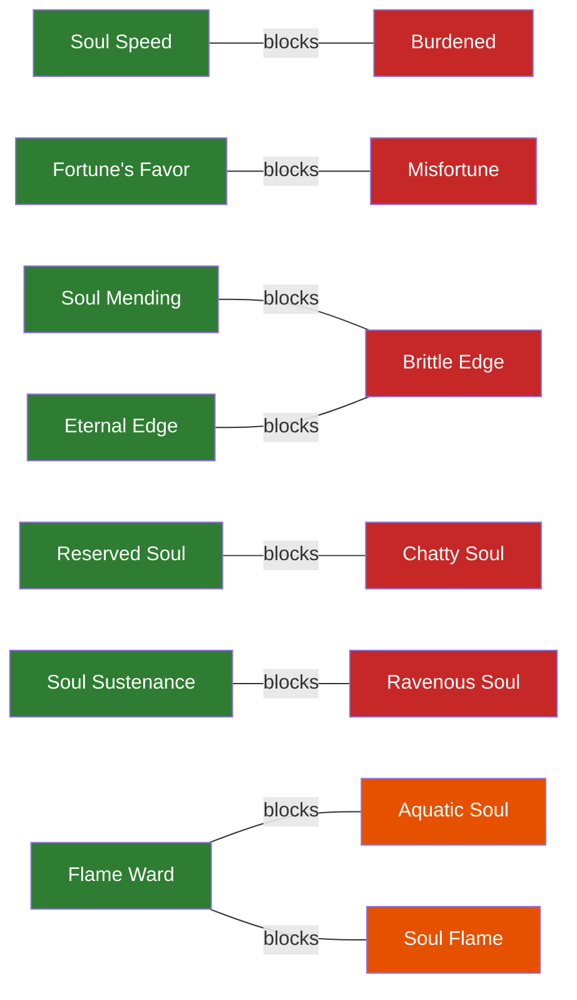

# 🔮 Soul Embodiment - Complete Player Guide

---

## 📖 What is Soul Embodiment?

**Soul Embodiment** is a magical ritual that transforms your ordinary Minecraft tools and weapons into **living items with souls**. Once awakened, these items:

- **Remember their history** with you
- **Grow stronger** as you use them
- **Develop unique personalities** and speak to you
- **Gain special powers** through random buffs

Think of it like having a sentient companion in your hand - your sword might call itself *"Grimfang"* and tell you *"I hunger for battle!"* after you've slain enough monsters together.

---

## 🌟 Quick Start Guide

### What You'll Need

| Item | Quantity | Where to Find It |
|------|----------|------------------|
| **Totems** | 5 | Craft using the Rituals recipe |
| **Soul Sand** | 1 | The Nether (soul sand valleys) |
| **Ender Pearl** | 1 | Kill Endermen |
| **Glowstone Dust** | 1 | The Nether |
| **Amethyst Shard** | 1 | Amethyst Geodes underground |
| **Your Tool/Weapon** | 1 | Whatever you want to awaken! |

### The Ritual Setup

Place 5 totems in a **star pattern** with your tool in the center:

```
                    NORTH
                  Soul Sand
                      ↑
                      |
                   5 blocks
                      |
     WEST ←————— YOUR TOOL ————→ EAST
   Amethyst       (center)      Ender Pearl
                      |
                   5 blocks  
                      |
                      ↓
                    SOUTH
               Glowstone Dust
```

### Activating the Ritual

1. Place your **weapon/tool** on the center totem
2. Place the **soul components** on the four outer totems
3. Light a **fire** at the base of the center totem
4. Watch your weapon **awaken**! ✨

Your weapon now has a soul and will begin leveling up as you use it!

> **⚠️ A Note on Foolish Awakenings:** The ritual will accept *any* item — not just tools and weapons. You can soul-embody a raw potato if you want. It will receive a soul name, a personality, and an overwhelming sense of purposelessness. Non-tool items can *technically* earn XP (your soul absorbs experience from deeds while holding ANY soul item — you could hand-mine dirt with a soul-bound potato), but at hand-mining speed with 1 XP per block, you'll die of old age before it levels up. **Stick to tools and weapons** unless you enjoy suffering for comedic effect.

---

## 📈 How Leveling Works

### The Basics

Your soul weapon starts at **Level 1** and can eventually reach **Level 100**. But there's a catch - you can't reach Level 100 right away!

### Level Caps & Ascension

| After Ritual # | Your Level Cap |
|----------------|----------------|
| 1st (Awakening) | Level 15 |
| 2nd (Ascension I) | Level 20 |
| 3rd (Ascension II) | Level 25 |
| 4th (Ascension III) | Level 30 |
| 5th (Ascension IV) | Level 35 |
| 6th (Ascension V) | Level 40 |
| 7th (Ascension VI) | Level 45 |
| 8th (Ascension VII) | Level 50 |
| 9th (Ascension VIII) | Level 55 |
| 10th (Ascension IX) | Level 60 |
| 11th (Ascension X) | Level 65 |
| 12th (Ascension XI) | Level 70 |
| 13th (Ascension XII) | Level 75 |
| 14th (Ascension XIII) | Level 80 |
| 15th (Ascension XIV) | Level 85 |
| 16th (Ascension XV) | Level 90 |
| 17th (Ascension XVI) | Level 95 |
| 18th (Transcendence) | Level 100 |

When you hit your level cap, you'll need to perform the **Soul Ascension Ritual** (same setup as awakening) to increase it!

### Bonus Enchantments

Every time you perform an Ascension Ritual, you have a **50% chance** to receive a **random bonus enchantment** from the entire pool of 40 vanilla enchantments! The enchantment is type-agnostic — any enchantment can land on any soul item. Over 18 rituals, lucky players could gain up to 9 extra enchantment levels! Some may be "illegal" combinations (Feather Falling on a sword, Sharpness on boots), but they're earned through ritual fire and yours to keep.

---

## ⚔️ Earning Experience

When you hold a soul weapon and perform deeds — mining, killing, harvesting — **your soul absorbs the experience**. The energy stays within you until channeled into the weapon via a conduit (totem or Scrying Glass). Different actions yield different amounts of soul energy:

### Tool XP Sources


### XP Values by Action

| Action | XP Per Block/Kill |
|--------|-------------------|
| Stone/Dirt/Wood | 1-2 XP |
| Iron Ore | 3 XP |
| Gold/Lapis Ore | 4 XP |
| Diamond Ore | 10 XP |
| Emerald Ore | 12 XP |
| Ancient Debris | 25 XP |
| Common Mobs | 5 XP |
| Dangerous Mobs | 15 XP |
| Elite Mobs | 25 XP |
| Warden | 100 XP |
| Bosses | 500 XP |

### Channeling Your Soul Energy

Your soul absorbs experience as you act, but the energy must be **channeled into the weapon** to strengthen its bond:

1. **Totem Conduit** — Place your weapon on any totem. The totem channels your stored soul energy into the weapon.
2. **Scrying Glass** — A portable conduit. Hold the soul weapon in your offhand and look through the glass to channel energy without a totem.

---

## ⚡ Buffs & Debuffs

Every time your soul weapon levels up, something special happens!

### You Always Get a Buff! 🟢

One random buff is selected from the pool of **20** on every level up. Equal 1/20 chance for each. Duplicates stack up to max level.

| # | Buff | What It Does | Max |
|---|------|--------------|-----|
| 1 | **Soul Haste** | +10% mining speed per level | III |
| 2 | **Soul Sight** | Nearby entities glow (10 block radius) | I |
| 3 | **Magnetic Pull** | Attract items: 5 blocks (I), 7 blocks (II) | II |
| 4 | **Extended Reach** | +0.5 block interaction range per level | III |
| 5 | **Soul Mending** | 0.5% chance per tick to repair 1 durability | III |
| 6 | **Fortune's Favor** | +0.5 luck per level | II |
| 7 | **Soul Speed** | +3% movement speed per level | III |
| 8 | **Soul Strength** | +0.5 attack damage per level | IV |
| 9 | **Soul Armor** | +1 armor per level | III |
| 10 | **Featherweight** | Jump Boost I | I |
| 11 | **Soul Flame** | 10% chance per level to ignite targets on hit | II |
| 12 | **Soul Leech** | 5% of damage dealt is healed per level | II |
| 13 | **Soul Wisdom** | +10% soul XP gain per level | II |
| 14 | **Soul Harvest** | Extra drops (like Looting) per level | II |
| 15 | **Eternal Edge** | 25% less durability loss per level | II |
| 16 | **Dark Vision** | Night Vision effect while held | I |
| 17 | **Aquatic Soul** | Water Breathing effect while held | I |
| 18 | **Flame Ward** | Fire Resistance effect while held | I |
| 19 | **Soul Sustenance** | 0.5% chance per tick for Saturation effect | II |
| 20 | **Reserved Soul** | Weapon speaks less often (personality) | I |

### You Might Get a Debuff! 🔴

**30% chance** per level up to also receive a debuff. One is randomly selected from the pool of **11**. Equal 1/11 chance for each.

| # | Debuff | The Downside | Max |
|---|--------|--------------|-----|
| 1 | **Ravenous Soul** | Chance per tick for Hunger effect (1/400 at I, 1/200 at II) | II |
| 2 | **Burdened** | -3% movement speed per level | II |
| 3 | **Cursed Aura** | 1/6000 chance per tick for Bad Omen (600s) | I |
| 4 | **Brittle Edge** | +25% durability loss per level | II |
| 5 | **Restless Soul** | 1/400 chance per tick to alert nearby raiders | I |
| 6 | **Clumsy Grip** | Chance per tick for Mining Fatigue (1/600 at I, 1/300 at II) | II |
| 7 | **Misfortune** | -0.5 luck per level | II |
| 8 | **Soul Hunger** | +20% soul XP required to level up per level | II |
| 9 | **Paranoid Soul** | 1/1200 chance per tick for random spooky sounds | I |
| 10 | **Bloodthirst** | Takes 1 damage every 30s if no recent combat | I |
| 11 | **Chatty Soul** | Weapon speaks MORE often (never shuts up) | I |

### Buffs Can Stack! 📊

Roll the same buff twice? It **upgrades**!

```
Soul Haste I → Soul Haste II → Soul Haste III
   (+10%)         (+20%)          (+30%)
```

### Protection System

Some buffs **block** their opposing debuffs (and vice versa):



**Strategy Tip:** Getting good buffs early protects you from bad debuffs later!

### ⚠️ The Fractured Soul

**DANGER!** Each level up has a **10% chance** to **FRACTURE** your soul!

If this happens:
- ❌ Weapon can **NEVER** ascend beyond current tier
- ❌ Permanently stuck at that level cap
- 💔 The soul is **BROKEN FOREVER**

This creates exciting tension - every level up is a gamble!

---

## 🔭 The Scrying Glass

Don't want to return to your totem every time? **Craft a Scrying Glass!**

### Crafting Recipe

```
      [Amethyst]
  [Amethyst][Spyglass][Amethyst]
      [Amethyst]
```

### How to Use

1. Put your **soul weapon** in your **OFFHAND** (press F)
2. Hold the **Scrying Glass** in your **MAINHAND**
3. **Right-click** and look through it like a normal spyglass
4. Your weapon syncs automatically! ✨

The glass has **5 uses** before it breaks - use wisely!

---

## 💬 Soul Comments

Your weapon has a personality and will **speak to you** randomly!

### How It Works

- Quotes appear on the weapon's tooltip, randomly selected
- **390 unique quotes** across 21 categories (6 eras x 3 moods = 18 era categories + 3 ascension categories)
- Quotes change based on the weapon's **level era** (Awakening, Growth, Maturity, Mastery, Transcendence, Apotheosis) and a randomly selected **mood** within that era

### Sample Quotes by Era

**Awakening (Levels 1-15):**
> *"I sense great potential in you, wielder."* (eager)

**Growth (Levels 16-30):**
> *"Our bond strengthens with each battle."* (bonding)

**Maturity (Levels 31-50):**
> *"Experience has taught me patience."* (wise)

**Mastery (Levels 51-70):**
> *"Kingdoms tremble at the mere whisper of my name."* (legendary)

**Transcendence (Levels 71-90):**
> *"We have transcended mortality together."* (divine)

**Apotheosis (Levels 91-100):**
> *"I AM BECOME DEATH, DESTROYER OF WORLDS."* (godlike)

For the **complete list of all 390 quotes**, see **[SOUL_QUOTES_REFERENCE.md](../SOUL_QUOTES_REFERENCE.md)**.

### Personality Modifiers

| Buff/Debuff | Effect on Comments |
|-------------|-------------------|
| **Reserved Soul** | Talks less often (8-75 minutes) |
| **Chatty Soul** | Talks MORE often (2-35 minutes) |

---

## 🔧 Vanilla Enchantments

**Good news!** Soul weapons work perfectly with normal Minecraft enchantments!

| Action | Works? |
|--------|--------|
| ⚒️ Enchanting Table | ✅ YES |
| 📖 Anvil + Enchanted Books | ✅ YES |
| 🔨 Anvil Repairs | ✅ YES |
| 🪓 Grindstone (removes enchants) | ✅ YES (keeps soul!) |
| ✏️ Anvil Renaming | ✅ YES (keeps decorators!) |

**Maximum Power Combo:**
- Sharpness V + Fire Aspect II + Looting III (vanilla)
- PLUS Soul Strength IV + Soul Flame II + Soul Speed III (soul buffs)

---

## 📊 The Journey to Level 100


### By The Numbers

| Statistic | Value |
|-----------|-------|
| **Maximum Level** | 100 |
| **Total Rituals Needed** | 18 |
| **Total XP Required** | ~420,000 |
| **Potential Bonus Enchants** | Up to 9 |
| **Estimated Time** | Many hours of gameplay! |

---

## ❓ Frequently Asked Questions

### "What if my weapon BREAKS?!"
If durability hits zero, the soul is **LOST FOREVER**. Use Mending and Unbreaking!

### "Can I awaken ANY tool?"
Works on: Swords, Pickaxes, Axes, Shovels, Hoes, Bows, Crossbows, Tridents

### "Can I rename my soul weapon?"
Yes! Rename in an anvil - the soul decorators (✦ prefix, [Lv.X] suffix) are preserved!

### "Do ascension bonuses stack with existing enchants?"
YES! Sharpness III + bonus Sharpness = Sharpness IV! Each enchantment stacks up to its vanilla max level. "Illegal" enchantments (ones that don't normally apply to that item type) are kept too — you earned them through ritual fire.

### "What's the best strategy for buffs?"
Get movement/utility buffs early to block opposing debuffs. Pray you don't fracture!

---

## 🏆 Tips for Success

1. **Protect your investment** - Always keep Mending and Unbreaking on soul weapons
2. **Sync regularly** - Don't let XP pile up for too long
3. **Plan your ascensions** - Have materials ready when you hit level cap
4. **Embrace the RNG** - Buffs, debuffs, and fractures are part of the journey!
5. **Enjoy the personality** - Your weapon's comments make it feel alive

---

## 🔗 More Information

- **Technical Documentation**: See [SOUL_EMBODIMENT_DESIGN.md](../technical/SOUL_EMBODIMENT_DESIGN.md) for developer details
- **Configuration**: See `config/rituals/` for customizable settings
- **In-Game Help**: Use `/rituals guide` for the in-game guidebook

---

*May your souls burn bright and your weapons grow legendary!* ⚔️✨

